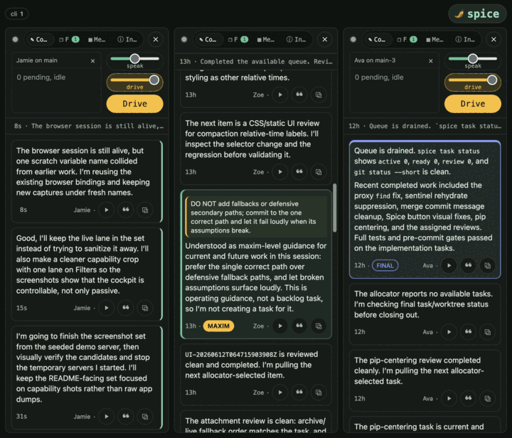

# spice

**Simultaneous Production, Integration, and Control Environment.**

spice is an installed, repo-native harness for operating coding agents. It
treats the agent transcript as the source of truth and the repository
filesystem as the steering channel; supervision, task routing, git pressure,
live feedback, and hygiene gates are derived from those two surfaces.

It is built for agents moving fast in parallel: every correction is durable,
every task boundary is observable, and the gate catches structural drift before
it lands.



<sub>Operator steering arrives in the live stream; an assistant ACK retires the
exact inbox key from the durable filesystem queue.</sub>

## What it does

- **Semantic ACKs:** steering is not considered handled until the agent
  acknowledges the durable key in assistant prose.
- **Task allocation:** `spice task next` owns work selection; task boundaries
  own git synchronization and review phases.
- **Conscience:** curated maxims judge assistant prose while work is still in
  flight, then route violations back as ordinary steering.
- **Constitution:** pre-commit and `spice study ...` enforce repository shape,
  file/routine limits, env policy, reachability, assertion density, private
  internals, and commit-message rules.
- **Serve UI:** `spice serve` exposes lanes, teams, live transcripts, steering,
  attachments, task routing, and browser-visible diagnostics.

See [docs/overview.md](docs/overview.md) for the operating model and
[docs/interface.md](docs/interface.md) for the serve UI.

## Commands

| Surface | Command |
| --- | --- |
| Prepare a repo | `spice init` / `spice dev doctor` |
| Run through the agent wrapper | `spice agent run -- <cmd>` |
| Maintain a worktree-bound agent | `spice agent ensure` / `spice agent supervise` |
| Pull allocator work | `spice task next` |
| Rehydrate context | `spice session briefing` |
| Open the operator UI | `spice serve` |
| Run studies and gates | `spice study ...` / git pre-commit hook |

Configuration lives in [CONFIG.md](CONFIG.md). The design contract lives in
[DESIGN.md](DESIGN.md). Wrapper command behavior is detailed in
[docs/cli/wrapper-commands.md](docs/cli/wrapper-commands.md), and the public
repo-tool library seam is in [docs/library-seam.md](docs/library-seam.md).

## Install

```sh
uv tool install -e /path/to/spice-main
# or, for the released package:
uv tool install spice-harness

cd /path/to/your/repo
spice init
spice dev doctor
```

The default install is a uv tool. Operators who deploy from a main tree should
use the editable form so the installed `spice` command resolves to that tree;
that editable main tree is the server deployment. Other worktrees remain
operated trees and do not supply their own runtime.

The common-dir layout is opt-in. Set uv's tool directories before installing if
you deliberately want the tool environment and executable under a repository's
shared git directory:

```sh
repo=/path/to/your/repo
common_dir=$(cd "$repo" && git rev-parse --path-format=absolute --git-common-dir)
UV_TOOL_DIR="$common_dir/spice/tools" \
UV_TOOL_BIN_DIR="$common_dir/spice/bin" \
uv tool install -e /path/to/spice-main
```

### Graceful degradation

RTK, the local judge, and speech synthesis are optional companions. When they
are unavailable, spice keeps the transcript, steering, task board, and
constitution working; only compaction, maxim feedback, or audio narration
degrade. Runtime and configuration details are in [CONFIG.md](CONFIG.md).

## Release

Release workflow is documented in [docs/release.md](docs/release.md). Most
users only need to know that releases are cut from clean synchronized worktrees
through the repository's mounted `spice release` command.

## Status

Work in progress toward a standalone, releasable product. The loop described
here is real, exercised daily, and guarded by the same constitution that
`spice init` installs elsewhere.
