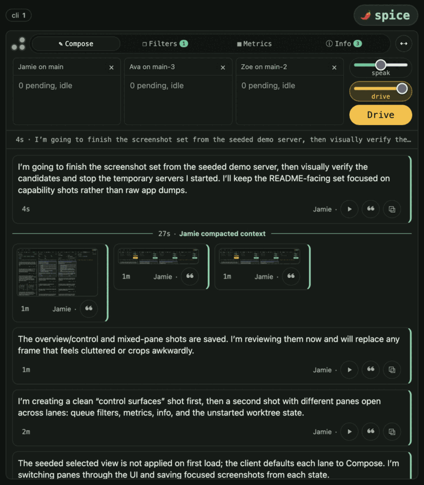
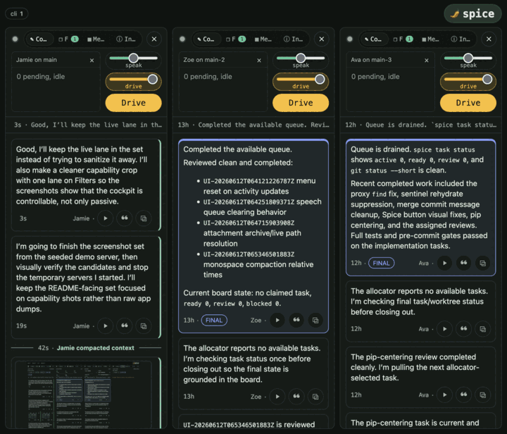
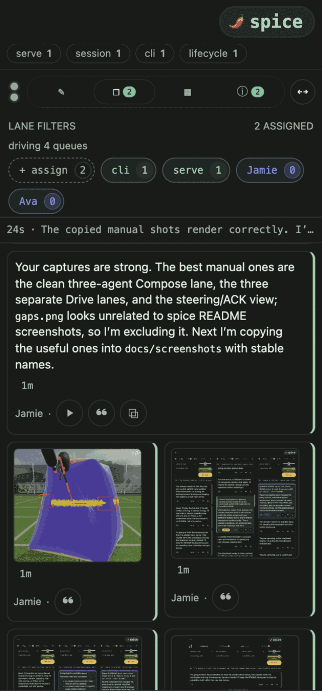
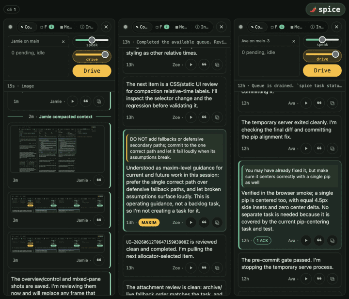

# spice

**Simultaneous Production, Integration, and Control Environment.**

spice is an installed agent harness: wrap, steer, supervise, coordinate, and
audit coding agents across the repos they work on. Install it once, point it at
a repository, and it provides a closed loop around the agents working there:

- the agent's **transcript is the single source of truth**, and
- the repo's **filesystem is the single channel of steering**.

supervision, coordination, conscience, and hygiene are derived mechanically
from those two surfaces. The **`spice agent run` wrapper** makes that loop live
at execution time: every agent shell command carries pending steering, context
pressure, git-shadow routing, source routing, and local command wrappers before
the requested command runs.

## Why

You rarely know what you want until you watch it fail. Writing the spec up
front doesn't change that — it commits the misunderstanding to a document you
then have to maintain. And the channel you'd write it through, a human at a
keyboard, has a bit rate that plateaued decades ago and is the slowest link in
the loop.

spice takes the other route. The operator doesn't name the destination; they
**corral** the agents toward it — watching what the agents emit and turning
what they don't like into steering with the smallest possible gesture. The
target is an **evolving fixed point**: the state the loop settles into when
nothing it produces still provokes a correction. The spec is the *output* of
that process, never its input.

### Neither spec-driven nor observation-driven — both

Spec-driven development is waterfall for agents: it front-loads a written
specification and assumes the implementer's speed is the bottleneck. The
implementer's speed was never why waterfall failed — the discovery problem
was. Cheap implementation doesn't remove discovery; it lets you generate
precisely-wrong code at scale and maintain a precisely-wrong document beside
it. **All intent, no evidence.**

Its mirror — observation-driven development, steering only by what the running
system emits — fails the other way. With no target, you chase telemetry, fix
whatever is in front of you, and never converge, because nothing is being
converged toward. **All evidence, no intent.**

spice is the fusion. The transcript is one surface that is both: emitted
behavior, and — the moment you quote-and-steer off it — declared intent.
Observation supplies the truth and the gradient; the spec supplies the
direction. The work lands at the **fixed point** where observed reality stops
diverging from evolving intent. Intent kept honest by evidence; evidence
kept on course by intent.

## Is this for you

spice is opinionated on purpose, and the opinions are load-bearing: you can't
drive a loop to a fixed point with minimal human input without encoding taste
firmly enough for the machine to apply it for you. That makes spice a poor
neutral tool and a sharp fit for one kind of operator.

It fits if you'd rather **operate a fleet than hand-write code**, you locate
the craft in the **structure** rather than the keystrokes, you share its code
posture — small bounded seams, ugly-fast cores allowed, no shims, fallbacks,
or legacy — you trust **listening over writing**, and you run a supported
agent driver (today: Codex or Claude Code).

It will fight you if your craft lives in the text, you want a tool that bends
to your opinions instead of supplying its own, you're on an unsupported agent
driver, or you need something stable and supported today. That isn't a defect —
it's the tool selecting its operator.

## Install

```sh
pip install spice-harness    # or: uv tool install spice-harness
cd /path/to/your/repo
spice init               # hooks, skill copy, state scaffolding
spice dev doctor         # verify drivers, backends, and policy
```

`spice init` writes machine-local git hook shims under `.spice/` (ignored via
`.git/info/exclude`), materializes the worktree skill copy, and prepares state
scaffolding. Repo-tracked policy lives in your `pyproject.toml` under
`[tool.spice.*]` tables. The command surface is always `spice …`. Entrypoint
resolution is worktree-true under the hood: generated git hooks invoke ambient
`spice` directly, while supervisor children load the spice source checkout first
on `PYTHONPATH` when operating on that checkout; ordinary target repos use the
installed product.

### Agent command wrapper

Agents run shell commands normally. In an agent-bound worktree, spice installs
static zsh/bash startup hooks that transparently reexec the first command shell
through:

```sh
spice agent run -- <shell> -c "<original command>"
```

That wrapper owns stderr before the command runs. It prints pending inbox
steering and keep-working guidance, connects to the supervisor side
channel, asks `rtk rewrite` for command telemetry routing when RTK is installed,
routes git through the worktree shadow environment, routes `spice` and `python`
to the correct source checkout or target virtualenv, and loads configured
wrapper groups. Descendant shells keep the static hook environment without a
second reexec, so steering is delivered at command boundaries without
double-injecting nested shells.

Wrapper groups live in tracked config:

```toml
[tool.spice.agent]
wrappers = ["common", "repo-tools"]

[tool.spice.wrappers.common]
wrap = ["grep", "find", "git"]

[tool.spice.wrappers.repo-tools]
codegen = { argv = ["uv", "run", "python", "-m", "tools.codegen"] }
```

Use wrappers for agent-owned execution where command output is also an
operator steering surface. The full contract, including RTK rewrite routing and
mounted-command boundaries, is in
[`docs/cli/wrapper-commands.md`](docs/cli/wrapper-commands.md).

### Agent defaults

A project can set its default supervised-agent launch model and effort in
tracked config, either by editing `pyproject.toml` or by running
`spice config agent --scope project --model ... --effort ...`:

```toml
[tool.spice.agent]
model = "gpt-5.5"
effort = "xhigh"
```

An operator can override those defaults for just the current worktree:

```sh
spice config agent --scope worktree --model gpt-5.5 --effort xhigh
```

Resolution order is explicit launch flags, then worktree config, then tracked
project config, then the driver defaults. `spice config agent` keeps project
and worktree rows explicit-only, while the effective row includes driver
defaults so unconfigured repos still show what will launch.

### Repo command mounts

A repo can also mount its own tooling into the `spice` namespace:

```toml
[tool.spice.commands]
release = ["uv", "run", "python", "-m", "spice.release"]
bench = ["python", "-m", "myproj.bench"]
```

`spice release notes` or `spice bench --suite smoke` then runs the mounted
command from the repo root with the remaining arguments passed through
verbatim. A mount may be a top-level verb or a dotted command path.
Top-level mounts that shadow built-ins still fail loudly; nested mounts under
built-ins are allowed.

Mounted path segments are `^[a-z][a-z0-9-]*$`. A repo can mount one namespace
owner, or mount specific nested paths directly:

```toml
[tool.spice.commands]
toolbox = ["uv", "run", "toolbox"]
report.inspect = ["project-tool", "report", "inspect"]
```

`spice toolbox lint css --fix` then dispatches `lint css --fix` to `toolbox`.
`spice report inspect --limit 40` dispatches the mounted nested path directly.

### Library seam for repo tools

Mounted commands and tracked pre-commit extensions may import a deliberately
narrow Python seam from `spice` instead of vendoring harness scaffolding. This
surface is source-stable for target repos: public names in the modules listed
below are not removed or renamed silently, and incompatible changes require an
explicit contract update. Underscored names remain private.

- `spice.errors`: `SpiceError` for user-facing command failures.
- `spice.policy`: constitution constants and `flex_limit`.
- `spice.flexstate`: flex-limit sticky-state persistence and rename helpers.
- `spice.locking`: cross-platform advisory file locks.
- `spice.paths`: repo-root, state-dir, atomic write, and tool-resolution helpers.
- `spice.procs`: process-group spawn, liveness, and termination helpers.
- `spice.repocfg`: tracked `[tool.spice]` table readers.
- `spice.studies.walk`: tracked/staged path walkers, repo policy exclusions,
  staged renames, and git blob reads.
- `spice.studies.fileloc`, `spice.studies.complexity`,
  `spice.studies.magicnums`, and `spice.studies.envpolicy`: finding
  dataclasses plus `scan_*`, `detect_*`, and `render_*_board` helpers for
  project-specific studies.

Everything else is an internal implementation detail unless this section names
it. A repo tool that needs an unlisted module should either vendor that helper
or first add the helper to this seam with tests and a stability note.

## The loop

| Surface | Command | What it does |
| --- | --- | --- |
| Command surface | `spice agent run -- <cmd>` | Runs shell commands with RTK rewrite routing, git-shadow env, configured wrapper groups, and steering injection on stderr. |
| Lifecycle | `spice agent ensure` / `supervise` | One worktree-bound agent per worktree, started under a neutral skill prompt, watched by a durable supervisor. |
| Steering | filesystem inbox under `.spice/inbox/` | Durable operator messages; items retire only when the agent semantically ACKs their key in its transcript. |
| Tasks | `spice task …` | Phase-native Taskwarrior board shared by all worktrees; `task next` is allocator-owned; git sync happens at task boundaries. |
| Sessions | `spice session briefing` | Transcript forensics: the briefing is the primary rehydration product, with keep-working guidance from context metering. |
| Interface | `spice serve` | Localhost web UI: lanes over worktrees, live transcript streams, lifetime control (Renew / Steer / Drive), task-filter routing, fused lane groups backed by server-side teams; `spice serve teams` and `spice serve browser-artifact-path <file>` expose operator diagnostics for smoke runs. |
| Conscience | `spice maxim …` | Builtin maxims judged against assistant prose by a local model; violations come back as inbox steering. |
| Constitution | git pre-commit hook / `spice study …` | Namespace packages, path shape, LOC/byte/complexity flex+sticky gates, magic-number ratchet, env-literal inventory, commit-message policy. |

Session analysis is intentionally tiered. The current tier includes
`spice session phases` for contiguous working-phase spans and
`spice session messages` for message-level side/phase/flavor filtering.
Deeper report families that depend on richer topic/bucket modeling belong in
a separate analytics tier after the basic phase/message surfaces harden.

## Interface

`spice serve` is the operator interface for the loop. It can compose multiple
agents into a single Drive lane, split worktrees into parallel lanes, route by
task filter, show live transcript attachments, and expose the control surfaces
needed to steer or audit a running session.

The serve header and browser title default to `[project].name` from
`pyproject.toml`; set `[tool.spice.serve] brand = "Name"` to override them.

| Compose and route | Parallel lanes |
| --- | --- |
|  |  |
| <sub>A composed Drive lane groups multiple worktree-bound agents behind one operator control surface.</sub> | <sub>Separate lanes keep concurrent work readable while preserving per-agent Drive and speak controls.</sub> |

| Lane controls | Steering and ACKs |
| --- | --- |
|  |  |
| <sub>Filters, metrics, info, and worktree assignment live in the lane header.</sub> | <sub>Operator steering, ACKs, labels, and transcript controls stay visible in the live stream.</sub> |

| Attachments in transcript | Live image evidence |
| --- | --- |
|  |  |
| <sub>Transcript attachments remain browsable inside the lane.</sub> | <sub>Screenshots, browser captures, and diagnostics stay part of the operating record.</sub> |

## The constitution

The pre-commit gate is the executable form of the project's opinions — see
[spice/policy.py](spice/policy.py). Highlights:

- namespace packages only; no `__init__.py` under declared package roots;
- file names match `^_*[0-9a-z]+_*$`; splitting a file requires naming the
  seam (no `*2.py`, no generic continuation shards);
- files flex to 1500 lines but a breach holds them to 1000 until they shrink;
  routines flex the same way around CCN 20 / length 80;
- magic-number regressions are a ratchet against `HEAD`, not an amnesty;
- env-literal inventory covers `SPICE_*`, `CODEX_THREAD_ID`, and
  `CLAUDE_CODE_SESSION_ID` by default;
  target repos can add tracked name regexes with
  `[tool.spice.policy] env_name_patterns`; the waiver may live on the literal
  line, as a standalone waiver comment directly above the statement, or
  anywhere inside the wrapped statement carrying that literal;
- commit subjects fit in 100 columns; bodies are auto-folded.

The gate applies to spice itself: this repository is its own first target.
Target repos can keep their own tracked gate lanes under the same hook by
declaring mounted commands and pre-commit policy:

```toml
[tool.spice.commands]
fmt-cs = ["dotnet", "format"]

[tool.spice.policy]
pre_commit = [
    { label = "format C#", mount = "fmt-cs", formatter = true, when = ["*.cs"] },
    { label = "assets", run = ["python3", "-m", "tools.assets"], when = ["Assets/*"] },
]
pre_commit_success = [{ label = "clear asset sticky state", run = ["python3", "-m", "tools.assets", "--clear-sticky"] }]

[tool.spice.policy.pre_commit_builtins]
formatters = false
"magic-numbers" = { label = "project magic", run = ["python3", "-m", "tools.magic"] }
```

Built-in pre-commit keys are `repo-shape`, `staging`, `repo-docs`,
`formatters`, `local-paths`, `serve-web-typecheck`, `env-policy`,
`file-shape`, `complexity`, and `magic-numbers` (`serve-web-typecheck`
no-ops in repos without the serve static sources it gates). They run before
extension steps unless an individual built-in is disabled or replaced in
tracked policy. `pre_commit_success` uses the same command shape as
`pre_commit`, but runs only after the whole gate has passed, alongside sticky
state cleanup.

Extension steps run from the repo root and receive the staged paths,
newline-separated, in the `SPICE_STAGED_PATHS` environment variable. A step
with `when` globs runs only when a staged path matches (fnmatch against the
repo-relative path, `*` crosses directory separators) and receives just the
matching paths; a step without `when` always runs and receives every staged
path.
Set `formatter = true` on a command step that rewrites matching staged files;
after it exits successfully, the gate re-stages those same `SPICE_STAGED_PATHS`
so the formatted content lands in the commit.

## Release

Releases are cut from a clean `main` worktree with this repository's mounted
`spice release` command. Other repositories can mount their own release command
without competing with a spice built-in.

```sh
spice release prepare minor   # bump, validate, commit, stop before publish
spice release notes > /tmp/spice-release-notes.md
spice release publish --notes-file /tmp/spice-release-notes.md
spice release minor           # one-pass bump, validate, commit, publish
```

For curated GitHub release notes, generate the draft after `prepare` and edit
from that file instead of relying on session memory. The draft is built from
first-parent commits in the exact previous-release-tag-to-release-commit range,
grouped by landed task project metadata, rewritten into highlight-style bullets,
and records that range in the package notes.

Use a minor release when users can do something new or observe changed
behavior: new commands or flags, new configuration, new `spice serve` or task
workflow behavior, additions to the public library seam, changed output or
artifacts, or any compatibility break while the project only has patch/minor
release lanes. If a release contains both patch-level fixes and minor-level
surface changes, choose minor.

Use a patch release only when the shipped contract is unchanged: bug fixes,
documentation clarifications, packaging fixes, or internal test/build/tooling
changes that do not give operators a new capability and do not alter CLI,
configuration, UI, task/session semantics, or the public library seam.

## Status

Work in progress: an extraction-in-progress toward a standalone, releasable
product. Surfaces are still settling; the loop described above is real and
exercised daily, and this repository is its own first target. spice was
extracted from daily use driving a real project, not designed top-down — the
source of both its coherence and its opinions.
