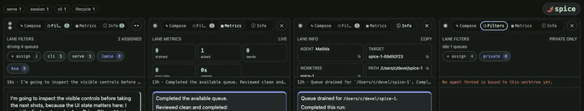

# spice

**Simultaneous Production, Integration, and Control Environment.**

spice is an installed agent harness: wrap, steer, supervise, coordinate, and
audit coding agents across the repos they work on. Install it once, point it at
a repository, and it provides a closed loop around the agents working there:

- the agent's **transcript is the single source of truth**, and
- the repo's **filesystem is the single channel of steering**;

supervision, coordination, conscience, and hygiene are derived mechanically
from those two surfaces.

## Install

```sh
pip install spice-harness    # or: uv tool install spice-harness
cd /path/to/your/repo
spice init               # hooks, spice.sh shim, state scaffolding
spice dev doctor         # verify drivers, backends, and policy
```

`spice init` writes machine-local git hook shims under `.spice/` (ignored via
`.git/info/exclude`) and a tracked `spice.sh` shim. Repo-tracked policy lives
in your `pyproject.toml` under `[tool.spice.*]` tables. Entrypoint resolution
is worktree-true: when the current repo is the spice source checkout, generated
shims and supervisor children put that checkout first on `PYTHONPATH` and run
`python -m spice`; ordinary target repos use the installed product.
In a spice source checkout, `./spice.sh python …` and `./spice.sh python3 …`
also resolve to the same checkout venv interpreter used by the harness itself.
In ordinary target repos, those aliases require `.venv/bin/python` under the
repo root; use an explicit interpreter path if a probe intentionally needs some
other Python.

A project can set its default supervised-agent launch model and thinking in
tracked config, either by editing `pyproject.toml` or by running
`spice config agent --scope project --model ... --thinking ...`:

```toml
[tool.spice.agent]
model = "gpt-5.4"
thinking = "low"
```

An operator can override those defaults for just the current worktree:

```sh
spice config agent --scope worktree --model gpt-5.4 --thinking low
```

Resolution order is explicit launch flags, then worktree config, then tracked
project config, then the driver defaults.

A repo can also mount its own tooling into the `spice` namespace:

```toml
[tool.spice.commands]
deploy = "./scripts/deploy.sh"
bench = ["python", "-m", "myproj.bench"]
```

`spice deploy --env staging` then runs the mounted command from the repo
root with the remaining arguments passed through verbatim. Built-in verbs
always win; a mount that shadows one fails loudly.

Mounted names are intentionally one-level verbs (`^[a-z][a-z0-9-]*$`), not
nested command paths. A repo with a large tool family mounts one namespace
owner and keeps family grouping inside that repo tool's own arguments:

```toml
[tool.spice.commands]
toolbox = ["uv", "run", "toolbox"]
```

`spice toolbox lint css --fix` then dispatches `lint css --fix` to `toolbox`.
Do not encode families as dotted, spaced, or ad-hoc hyphenated spice mount
names such as `lint.css`, `lint css`, or one mount per subcommand; those
groupings belong behind the mounted repo tool's explicit contract.

### Library seam for repo tools

Mounted commands and tracked pre-commit extensions may import a deliberately
narrow Python seam from `spice` instead of vendoring harness scaffolding. This
surface is source-stable for target repos: public names in the modules listed
below are not removed or renamed silently, and incompatible changes require an
explicit contract update. Underscored names remain private.

- `spice.errors`: `SpiceError` for user-facing command failures.
- `spice.policy`: constitution constants and `flex_limit`.
- `spice.flexstate`: flex-limit sticky-state persistence and rename helpers.
- `spice.locking`: cross-platform advisory file locks.
- `spice.paths`: repo-root, state-dir, atomic write, and tool-resolution helpers.
- `spice.procs`: process-group spawn, liveness, and termination helpers.
- `spice.repocfg`: tracked `[tool.spice]` table readers.
- `spice.studies.walk`: tracked/staged path walkers, repo policy exclusions,
  staged renames, and git blob reads.
- `spice.studies.fileloc`, `spice.studies.complexity`,
  `spice.studies.magicnums`, and `spice.studies.envpolicy`: finding
  dataclasses plus `scan_*`, `detect_*`, and `render_*_board` helpers for
  project-specific studies.

Everything else is an internal implementation detail unless this section names
it. A repo tool that needs an unlisted module should either vendor that helper
or first add the helper to this seam with tests and a stability note.

## The loop

| Surface | Command | What it does |
| --- | --- | --- |
| Wrapper | `spice agent run -- <cmd>` (or `./spice.sh`) | Runs shell commands with proxy routing, git-shadow env, and steering injection on stderr. |
| Lifecycle | `spice agent ensure` / `supervise` | One worktree-bound agent per worktree, started under a neutral skill prompt, watched by a durable supervisor. |
| Steering | filesystem inbox under `.spice/inbox/` | Durable operator messages; items retire only when the agent semantically ACKs their key in its transcript. |
| Tasks | `spice task …` | Phase-native Taskwarrior board shared by all worktrees; `task next` is allocator-owned; git sync happens at task boundaries. |
| Sessions | `spice session` | Transcript forensics: the no-arg briefing is the primary rehydration product, with context-pressure metering. |
| Cockpit | `spice serve` | Localhost web UI: lanes over worktrees, live transcript streams, lifetime control (Renew / Steer / Drive), task-filter routing, fused lane groups backed by server-side teams; `spice serve teams` and `spice serve browser-artifact-path <file>` expose operator diagnostics for smoke runs. |
| Conscience | `spice maxim …` | Builtin maxims judged against assistant prose by a local model; violations come back as inbox steering. |
| Constitution | `spice dev pre-commit` / `spice study …` | Namespace packages, path shape, LOC/byte/complexity flex+sticky gates, magic-number ratchet, env-literal inventory, commit-message policy. |

Session analysis is intentionally tiered. The current tier includes
`spice session phases` for contiguous working-phase spans and
`spice session messages` for message-level side/phase/flavor filtering.
Deeper report families that depend on richer topic/bucket modeling belong in
a separate analytics tier after the basic phase/message surfaces harden.

## Cockpit

`spice serve` is the operator cockpit for the loop. It can compose multiple
agents into a single Drive lane, split worktrees into parallel lanes, route by
task filter, show live transcript attachments, and expose the control surfaces
needed to steer or audit a running session.

| Compose and route | Parallel lanes |
| --- | --- |
|  |  |
| <sub>A composed Drive lane groups multiple worktree-bound agents behind one operator control surface.</sub> | <sub>Separate lanes keep concurrent work readable while preserving per-agent Drive and speak controls.</sub> |

| Lane controls | Steering and ACKs |
| --- | --- |
|  |  |
| <sub>Filters, metrics, info, and worktree assignment live in the lane header.</sub> | <sub>Operator steering, ACKs, labels, and transcript controls stay visible in the live stream.</sub> |

| Attachments in transcript | Live image evidence |
| --- | --- |
|  |  |
| <sub>Transcript attachments remain browsable inside the lane.</sub> | <sub>Screenshots, browser captures, and diagnostics stay part of the operating record.</sub> |

## The constitution

The pre-commit gate is the executable form of the project's opinions — see
[spice/policy.py](spice/policy.py). Highlights:

- namespace packages only; no `__init__.py` under declared package roots;
- file names match `^_*[0-9a-z]+_*$`; splitting a file requires naming the
  seam (no `*2.py`, no generic continuation shards);
- files flex to 1500 lines but a breach holds them to 1000 until they shrink;
  routines flex the same way around CCN 20 / length 80;
- magic-number regressions are a ratchet against `HEAD`, not an amnesty;
- env-literal inventory covers `SPICE_*` and `CODEX_THREAD_ID` by default;
  target repos can add tracked name regexes with
  `[tool.spice.policy] env_name_patterns`;
- commit subjects fit in 100 columns; bodies are auto-folded.

The gate applies to spice itself: this repository is its own first target.
Target repos can keep their own tracked gate lanes under the same hook by
declaring mounted commands and pre-commit policy:

```toml
[tool.spice.commands]
fmt-cs = ["dotnet", "format", "--verify-no-changes"]

[tool.spice.policy]
pre_commit = [
    { label = "format C#", mount = "fmt-cs", when = ["*.cs"] },
    { label = "assets", run = ["python3", "-m", "tools.assets"], when = ["Assets/*"] },
]
pre_commit_success = [{ label = "clear asset sticky state", run = ["python3", "-m", "tools.assets", "--clear-sticky"] }]

[tool.spice.policy.pre_commit_builtins]
formatters = false
"magic-numbers" = { label = "project magic", run = ["python3", "-m", "tools.magic"] }
```

Built-in pre-commit keys are `repo-shape`, `staging`, `repo-docs`,
`formatters`, `local-paths`, `serve-web-typecheck`, `env-policy`,
`file-shape`, `complexity`, and `magic-numbers` (`serve-web-typecheck`
no-ops in repos without the serve static sources it gates). They run before
extension steps unless an individual built-in is disabled or replaced in
tracked policy. `pre_commit_success` uses the same command shape as
`pre_commit`, but runs only after the whole gate has passed, alongside sticky
state cleanup.

Extension steps run from the repo root and receive the staged paths,
newline-separated, in the `SPICE_STAGED_PATHS` environment variable. A step
with `when` globs runs only when a staged path matches (fnmatch against the
repo-relative path, `*` crosses directory separators) and receives just the
matching paths; a step without `when` always runs and receives every staged
path.

## Status

Work in progress: an extraction-in-progress toward a standalone, releasable
product. Surfaces are still settling; the loop described above is real and
exercised daily, and this repository is its own first target.
