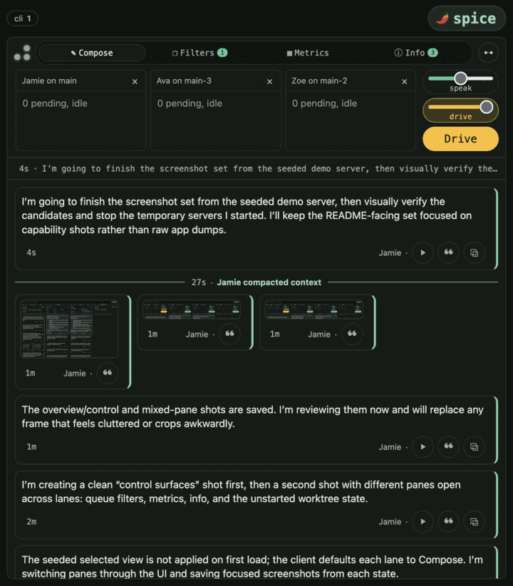
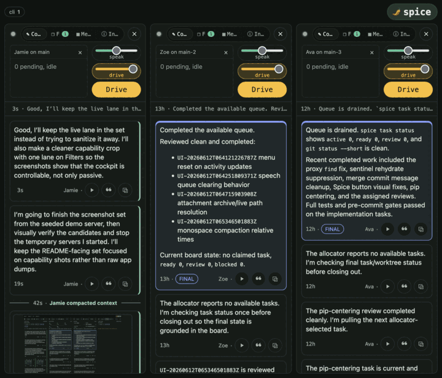
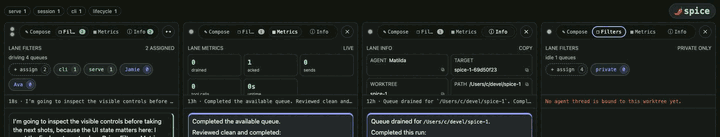
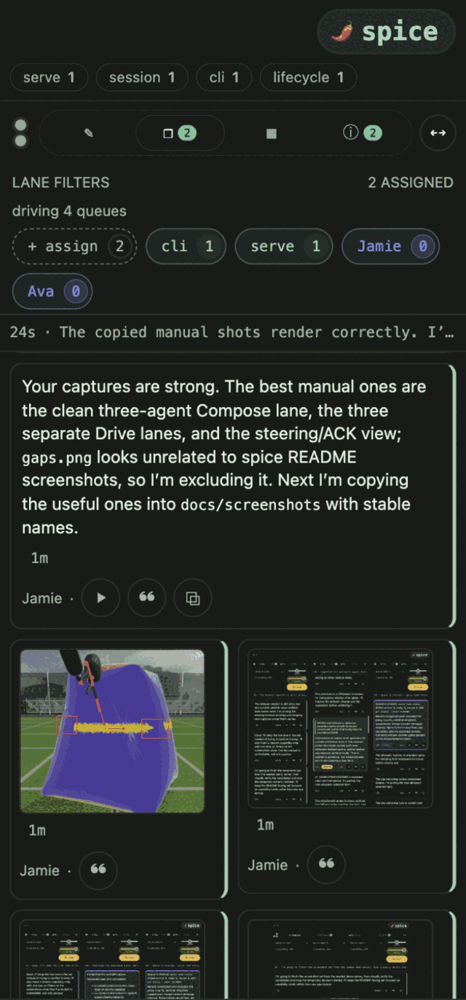
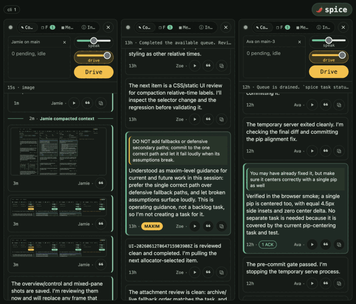

# Interface

`spice serve` is the operator interface for the loop. It composes agents into
Drive lanes, splits worktrees into parallel lanes, routes by task filter,
projects live transcript facts and attachments, and exposes the controls needed
to steer or audit a running session.

The serve header and browser title default to `[project].name` from
`pyproject.toml`; set `[serve] brand = "Name"` in root `spice.toml` to override
them.

Binding `spice serve` to `0.0.0.0` or another wildcard address intentionally
degrades the WebSocket Origin guard: any Host on the bound port is compatible,
so the check becomes Origin-equals-Host rather than the rebinding-resistant
authority match used for loopback or explicit binds. Use `--auth-token`; on
wildcard binds the supplied token, not the Origin authority match, is the
operative defense.

## Observer Mode

`spice watch <session-dir>...` opens the same live transcript renderer over
existing Codex and Claude JSONL sessions. It recursively discovers recognized
transcripts, presents each session as a switchable lane, and follows file
appends as they arrive. Multiple directories or individual transcript paths may
be supplied in one invocation.

`spice watch` with no arguments detects the local primary agent from existing
session roots, config directories, and installed CLIs, then prints both a
paste-ready `spice watch ...` command and the exact browser URL without starting
a server or changing any root. The deterministic precedence contract is
**session root > config > CLI**, then **Codex > Claude** to break equal-signal
ties. The output names the classification (`Codex-primary`, `Claude-primary`, or
`both`), primary, precedence, and observed signals. `--primary codex` and
`--primary claude` force a provider with an existing session root. An
`--auth-token` is shell quoted in the command and URL-encoded into the printed
URL.

Observer mode is read-only. It does not initialize a repository or worktree,
create team state, claim tasks, install hooks, open a supervisor socket, or
expose steering and lifecycle controls. Unrecognized files are skipped and
unreadable or empty inputs are reported in the UI and process log. Use
`--until PATH` for fixture-driven or otherwise bounded runs.

## Observation And Lifecycle

The Claude or Codex transcript is the sole stored observation truth. Serve reads
it through the shared typed transcript plane: history, live delivery, images,
activity metrics, and effort views consume the same decoded events instead of
keeping a normalized transcript copy or separate provider-specific
interpretations.

Lane actuation is separate from rendering. One target-scoped lifecycle authority
decides explicit sends, pending-inbox wakes, available-work wakes, renewals, and
agent launches. Decisions for one worktree are serialized while sibling lanes
can proceed independently. The HTTP snapshot, live bus, and UI chrome project
settled decisions; none of those read paths can launch or renew an agent merely
by rendering the lane.

## Lanes And Teams

The UI model is the lane: an operator-owned container over a worktree target.
Agents are occupants, so renewal can hand the lane to a new thread while the
message stream remains readable. Lanes can run independently or compose into a
team-backed Drive lane that presents multiple agents behind one operator
surface.

Task filters route board stems to lanes. Activity counters are replayable
projections of typed per-agent transcript facts, attributed through durable team
membership and renewal history so work follows the agent across lane changes.
Directive lifecycle comes from the ACK authority, task lifecycle from the task
operations log, and team attribution from team authority. Steering, ACKs,
labels, transcript controls, attachments, and diagnostics stay visible inside
the live stream.

| Compose and route | Parallel lanes |
| --- | --- |
|  |  |
| A composed Drive lane groups multiple worktree-bound agents behind one operator control surface. | Separate lanes keep concurrent work readable while preserving per-agent Drive and speak controls. |

| Lane controls | Steering and ACKs |
| --- | --- |
|  |  |
| Filters, metrics, info, and worktree assignment live in the lane header. | Operator steering, ACKs, labels, and transcript controls stay visible in the live stream. |

| Attachments in transcript | Live image evidence |
| --- | --- |
|  |  |
| Transcript attachments remain browsable inside the lane. | Screenshots, browser captures, and diagnostics stay part of the operating record. |

## State And Recovery

Serve keeps non-replayable team authority and replayable observation state in
different databases under the repository's task backend:

- `spiceteams.sqlite3` is authority for team topology, routing, filters,
  renewals, identities, configuration, and revision history. Back it up; do not
  delete or rebuild it as a cache.
- `spiceprojections.sqlite3` contains disposable Serve materializations. Its
  current `agentActivity` family is rebuilt from typed transcript facts. A
  missing, corrupt, or incompatible projection file costs a replay, not
  authority data.

Run `spice serve teams` to print the resolved authority and projection paths,
effective routes, renewals, and each metric family's owner, generation, status,
servability, freshness, retention floor, row counts, failure detail, and exact
recovery action. `spice serve teams --json` adds the canonical source, cursor,
replay horizon, and beyond-horizon behavior.

Run `spice serve rebuild-projections` to stage every registered family in
isolation and atomically publish the completed generations. Run
`spice serve rebuild-projections agentActivity` to rebuild only activity
metrics. A failed rebuild leaves a previously published generation stale but
servable; it never empties the authority store.

## Lifetime Modes

Every operator send carries a lane lifetime:

- **Steer** keeps the lane manually routed.
- **Drive** auto-subscribes to task projects the team creates or claims.
- **Drain** dissolves the task boundary so all assignable work is visible.

Tracked defaults live in `[serve] default_lifetime`; see
[../CONFIG.md](../CONFIG.md).
