# Checks

The checks that can refuse a commit. Other parts of the product determine how
work moves; these determine what may be committed.

The appliance can run without these checks, with fewer protections. When the
checks are installed, they apply to every commit.

The invariant register owns every cross-document label; local statements are
identified by their language and enclosing section.

---

## The gate

### What it is

A fixed roster of steps, run in a fixed order at commit time, over the staged
change. Their settings live in one place; every hook, study, document, and test
reads that one place, so changing a value changes the check everywhere at once.

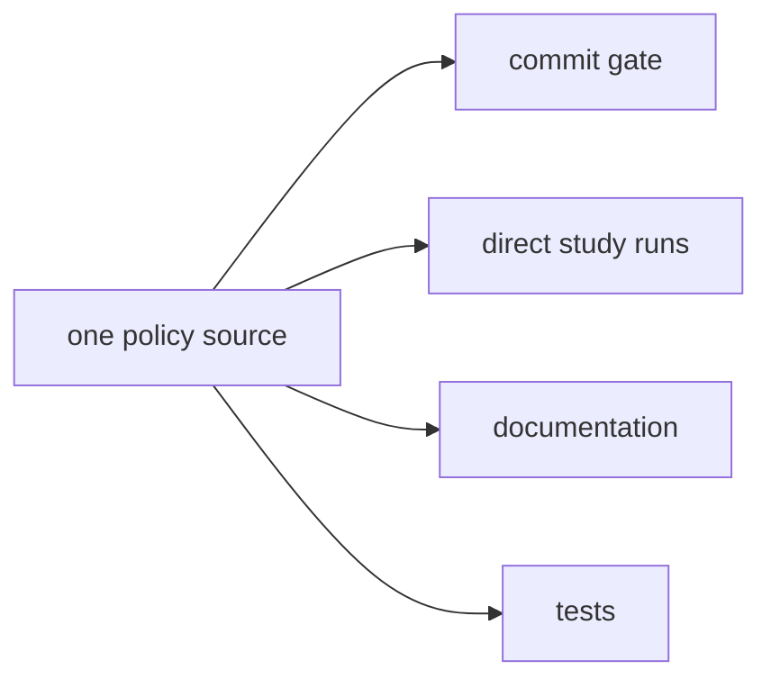

**Invariant —** Direct study runs may take flags for focused investigation; the
commit gate runs the defaults. Investigation is negotiable, enforcement is not.

**Invariant —** The roster is ordered, and the order is part of the contract:
integrity before shape, shape before staging, staging before anything that reads
staged content.

### The verdict is collected, not short-circuited

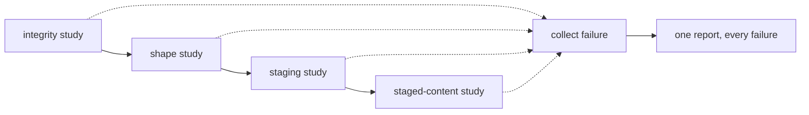

**Invariant —** Each step's failure is caught and recorded, and the run
continues. One commit attempt reports the whole picture rather than the first
thing that went wrong.

**Invariant —** A clean run prints nothing at all. Silence is the success
signal; anything printed is either a finding or an informational redirect.

### Three outcomes, never conflated

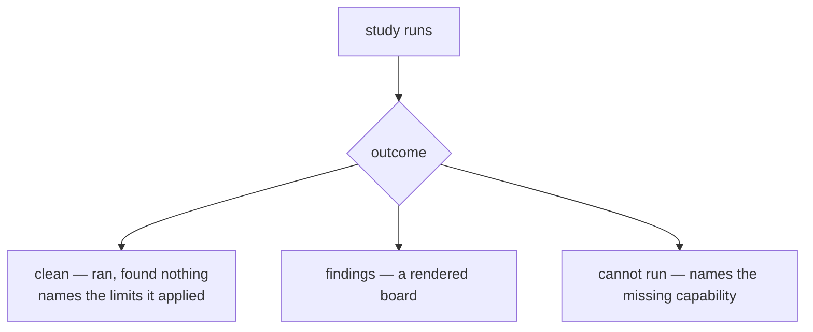

**Invariant —** A study that cannot execute raises, naming the capability it
needs. It never returns zero findings. *Unknown is not clear* — the same rule
that governs the rewind guard governs every instrument here.

**Invariant —** A clean result echoes the limits it actually applied, so a pass
is evidence about which thresholds were in force rather than a bare assertion.

**Invariant —** A study with no applicable input passes silently. Empty scope
and empty findings are the same verdict, and both differ from *cannot run*.

**Invariant —** Direct runs are tri-state: clean, findings, cannot-run. The
commit gate collapses findings and cannot-run into one refusal, because from the
committer's side both mean the same thing.

### The ledger follows the verdict

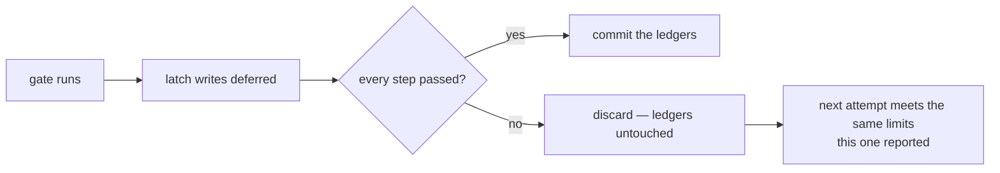

**Invariant —** Every latch write made during a run is held until the whole run
is accepted. A refused commit leaves the pressure ledgers exactly as it found
them, so the author's next attempt meets the limits this one reported.

**Invariant —** Steps contributed by configuration are skipped entirely unless
the staging step passed, so an extension never runs against a half-staged tree.

---

## Pressure

The mechanism shared by every measure that has a limit rather than a rule.

### Base, flex, latch

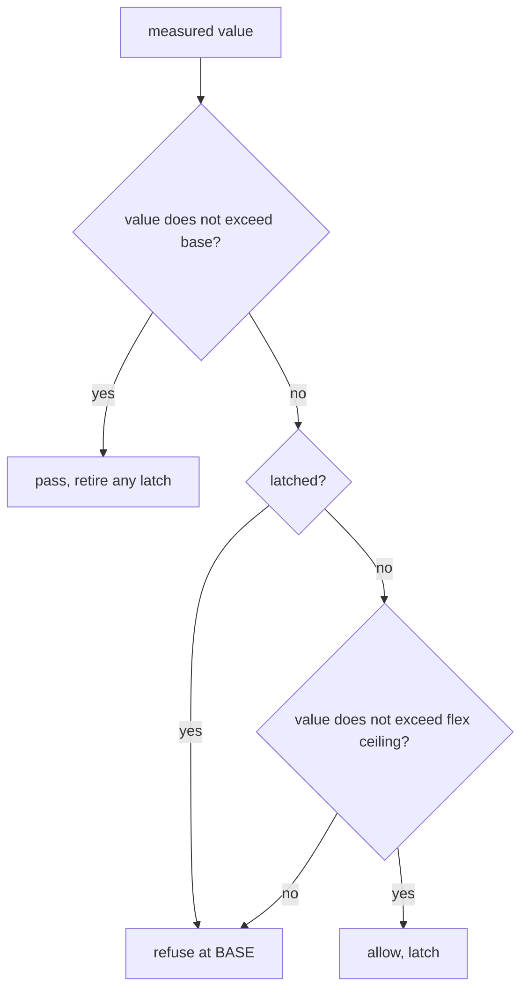

**Invariant —** Flex is headroom, not a second limit. The first breach latches
the subject to its base limit until it measures back under.

**Invariant —** The flex ceiling is an exact integer ratio over the base,
computed with integer arithmetic so it is the same number on every machine.

**Invariant —** A refusal that is due to a latch rather than to the value says
so, and names the ledger holding it. "Over the limit" and "held at base" are
different diagnoses.

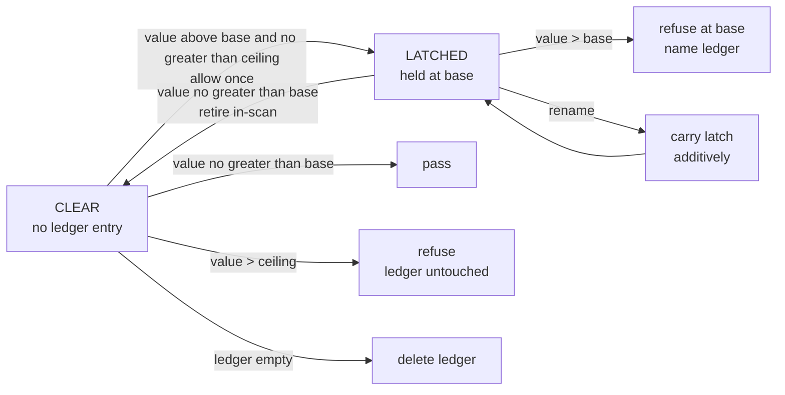

The flex ceiling is deterministic per path and published author, as described in
[Jitter is seeded by authorship](#jitter-is-seeded-by-authorship). Latch writes
wait for whole-run acceptance under the whole-run ledger rule, while retirement
happens in-scan under the immediate-retirement rule even if another finding
refuses the run.

### Retirement is immediate and in-scan

**Invariant —** A latch is retired the moment any scan measures its subject at
or under base — including during a run that fails for other reasons. The gate
forgives exactly when the code earns it.

**Invariant —** An emptied ledger is deleted rather than left as an empty file,
so a fully healed subject leaves no trace.

**Invariant —** Latches follow renames additively: a renamed subject carries its
latch to the new name without the old name being silently dropped.

### Jitter is seeded by authorship

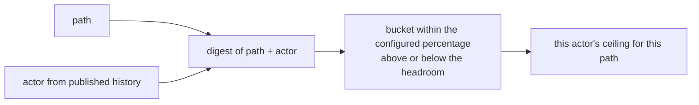

**Invariant —** The ceiling is jittered per path and per actor, over the
*headroom* rather than over the limit, so no two agents share an exact edge and
none of them can drift below base.

**Invariant —** The seed is **who authored the content**, resolved from
published history — not who is running the scan. Two agents reading the same
file see the same ceiling; the ceiling moves only when the content's authorship
does.

**Invariant —** Jitter is deterministic. The same path and actor always resolve
to the same ceiling, so a limit never appears to move under an unchanged file.

### Contested pressure informs rather than blocks

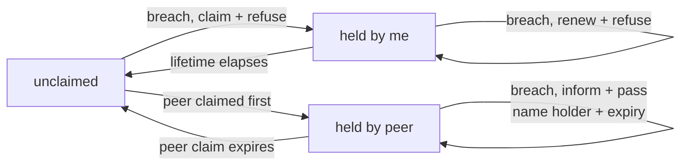

**Invariant —** A live breach on a shared hot subject is claimed, and claims are
repository-shared so peers see them. Latches are lane-local; claims are not.

**Invariant —** Claims are time-boxed and self-pruning. An abandoned claim
expires without anyone collecting it.

**Invariant —** The earliest claimant owns a contested subject, with a
deterministic tie-break, so ownership never depends on scan order.

**Invariant —** A finding whose subject is held by a peer **informs and passes**.
Only unclaimed findings block. The redirect names the holder and the expiry, so
the reader knows whether to wait or to move to another seam.

**Invariant —** Claiming requires a named actor. A read-only scan neither
records claims nor observes them, so investigation never perturbs the shared
state.

---

## The instruments

Each measure, what it counts, and how an exception is expressed. Thresholds are
policy; the shapes are the contract.

| instrument | measures | limit | waiver |
| --- | --- | --- | --- |
| file shape | lines and bytes per source file | base + flex, latching | scoped rule, or shrink |
| routine complexity | cyclomatic number and length per routine, comments included | base + flex, latching | scoped rule, or extract |
| repo-truth documents | characters in each product-truth document | base + flex, latching | scoped rule, or cut |
| magic numbers | bare literals in examine positions, above a magnitude floor | differential against a baseline | name the value |
| repo shape | namespace packages, path names, generic split names | none — any offender | generated-path exemption |
| staging | partially staged files | none — the fully-staged rule | stage the rest |
| merge integrity | a merge whose index still equals its first parent | none | not applicable |
| local paths | absolute machine-home path literals | none | none |
| environment literals | undeclared environment names in source | none | a marker comment at the site |
| environment ledger | the manifest of env names versus those observed | set equality | amend the manifest |
| reachability | code only the tests reach | a debt ceiling, default zero | named allowlist entry |
| unused symbols | top-level symbols with no production reference | zero | named exemption entry |
| assertion-free tests | tests that assert nothing | a debt ceiling, default zero | declare the assertion helper |
| private coupling | tests reaching into production internals | zero beyond the allowlist | named allowlist record |
| markdown links | tracked link targets that differ in case | none | none |
| taste | configured low-value words in prose | none | per-word disable, or scope |
| configuration integrity | key validity, disablement consumers, tracked trust | set equality | amend the declaration |
| type checking | the project's own package roots, and the browser scripts | zero errors | the checker's own suppression |
| suite seam | a landing that reaches past the tests it ran | binary | declare the seam |
| mutation coverage | whether tests constrain the code | differential against a ratchet | a reasoned standing entry |
| subsumption | tests whose coverage another test contains | none — reports | not applicable |

**Invariant —** A limit is either a **threshold** (a number a subject must stay
under), a **set equality** (declared versus observed), a **differential** (this
change versus a baseline), or **binary** (any occurrence). Nothing else is a
limit, and a study says which kind it is.

**Invariant —** A differential measure fails only on regression. A repository is
permitted to be imperfect; it is not permitted to get worse.

**Invariant —** Some ceilings are zero and stay there. Where "a little" is already
the whole problem — code only tests reach, tests that assert nothing — the debt
ceiling is not a dial to turn.

**Invariant —** A measure whose baseline cannot be read must not read as clean.
This is the one place where the *unknown is not clear* rule is most easily lost,
because a missing baseline and an empty baseline produce the same set.

Every instrument declares exactly one kind of limit and returns one of three
verdicts. The instrument table owns the exhaustive instrument-to-kind mapping; this
diagram owns the type structure.

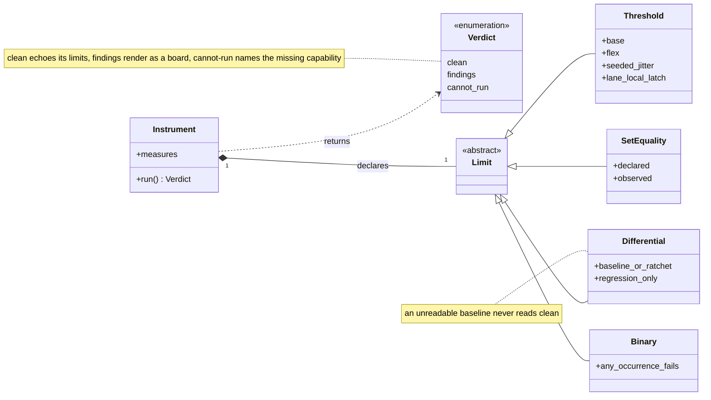

A waiver is independent of the limit taxonomy. It is tracked and enumerable,
and an instrument may admit none or many.

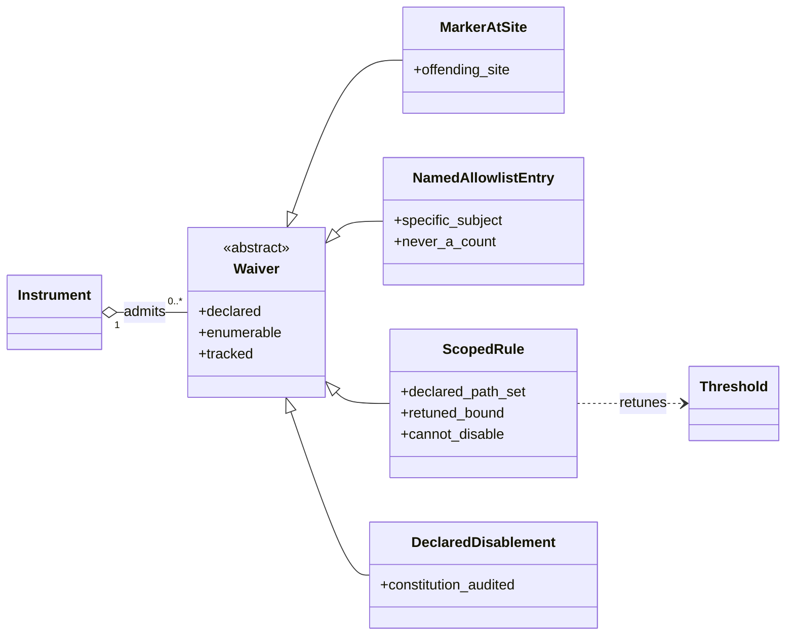

---

## Scope and waivers

### What a study sees

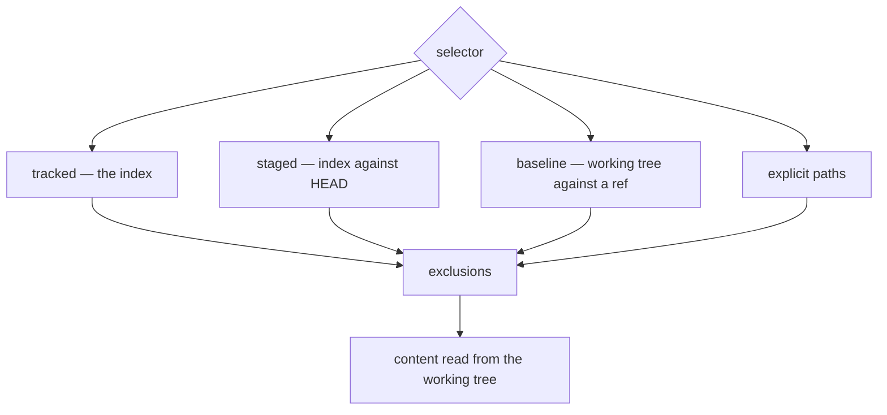

**Invariant —** Selectors name files; content is read from the working tree. A
name chosen from the index is scanned with whatever the file currently says, so
a study reports on the tree the author is actually looking at.

**Invariant —** The selectors are mutually exclusive. Ambiguous selection is
refused rather than resolved by precedence.

**Invariant —** Exclusions are applied to every selector, and the runtime state
directory is always excluded. A study can never take the appliance's own
bookkeeping as evidence about the repository.

**Invariant —** The fully-staged rule is the intersection of staged and unstaged
names: a file partly staged is refused, because every other measure would
otherwise judge a tree that is not the one being committed.

### The forms an exception may take

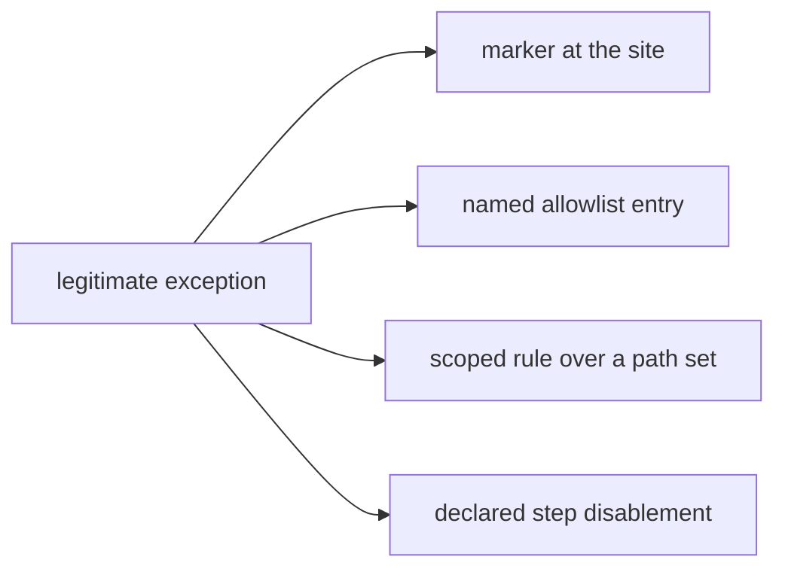

**Invariant —** Every waiver is **declared and enumerable**. There is no silent
suppression: each form leaves a record that can be listed, reviewed, and
attributed.

**Invariant —** A named allowlist names the specific thing it permits. A count
is never a waiver; permitting "three of these" permits the wrong three.

**Invariant —** A scoped rule retunes a bound over a declared path set. It
changes the limit, and it cannot disable the measure.

**Invariant —** A step may be disabled by configuration, and that disablement is
itself bounded: the check system audits its own disablements, so turning a gate
off is a visible act rather than an absence.

**Invariant —** Waivers are tracked, so every clone sees the same exceptions. An
exception that lives only on one machine is not an exception, it is a local
divergence.

---

## Findings become work

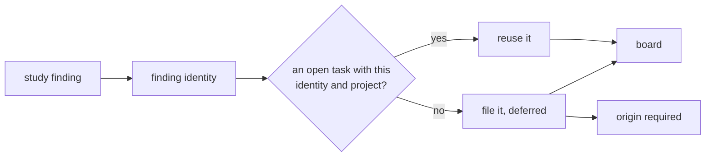

**Invariant —** Only registered instruments may file work, and only when asked.
A study cannot decide on its own to put something on the board.

**Invariant —** Filing is idempotent against a finding's identity within its
project. Re-running an instrument reuses the open task rather than filing a
second one.

**Invariant —** A finding's identity survives the board's own normalization, which
is what makes it usable as a key rather than a label.

**Invariant —** A completed predecessor never blocks re-filing. Recurrence files a
fresh task carrying an annotation that names the resolved one, so the link
between a recurrence and its prior fix is recorded rather than inferred.

**Invariant —** Study work is filed **deferred**, and a deferred row carries no
due date, so time spent parked does not consume the priority clock.

**Invariant —** A study task carries the same required origin as any other task,
inheriting the acting claim when none is given. Findings enter the board on the
same terms as everything else and compete for attention honestly.

**Invariant —** Findings and filed work are coextensive: an instrument reports
what it found, and dispatch decides what becomes a task. An instrument cannot
pre-seed or suppress its own filing.

---

## Isolation

Some measures must run the code to measure it. Those run nowhere near the
operator's tree.

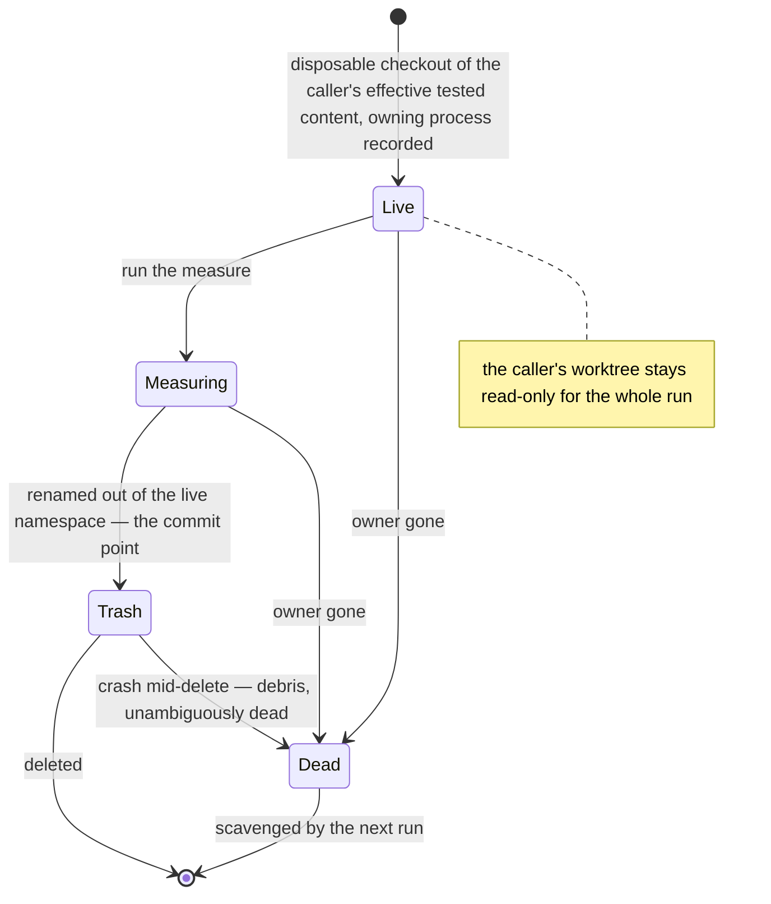

**Invariant —** The measured copy reproduces the caller's **effective tested
content** — what the tests would actually see — which is deliberately broader
than any commit-time selector.

**Invariant —** The caller's checkout is read-only for the whole run, so
concurrent control-plane commands and supervisor probes keep observing reality.

**Invariant —** Retirement is atomic by rename: a root is renamed out of the live
namespace before deletion, so a crash mid-delete leaves debris that is
unambiguously dead rather than a half-live run.

**Invariant —** Each root records its owning process, and the next run scavenges
roots whose owner is gone. Cleanup is a property of the next run rather than of
the crashed one.

---

## What is policy and what is shape

**Shape** — the gate's ordering and collect-all verdict, the three outcomes, the
deferred ledger, base-flex-latch, retirement, authorship-seeded jitter,
claim-based redirection, the four kinds of limit, the four forms of waiver,
idempotent filing, and isolation-by-disposable-copy.

**Policy** — the numbers, and the instrument set itself. File and routine sizes,
document budgets, debt ceilings, the flex ratio and jitter width, claim
lifetime, which literals count as magic, which words offend taste, which
languages a measure covers. A repository retunes these; the packaged values are
defaults, not the mechanism.

**The test:** if changing it would make a *different* kind of thing enforceable,
it is shape. If it only moves where the line sits for the same kind of thing, it
is policy.

**Invariant —** Configuration fails loudly. Unknown keys are rejected at load in
every layer, and a bound that is not a valid number is an error rather than a
fallback to the default.

**Invariant —** A gate is never closed by weakening it. The remedy for a blocked
commit is the source, or a declared waiver — never a quietly lowered limit.
