# Product model — documents, wire, extension, media

Task documents, the wire seam, extension surfaces, diagnostics, and the media
pipeline.

The invariant register owns every cross-document label; local statements are
identified by their language and enclosing section.

---

## Task documents — prose and board

### The idea

A task family is authorable as ordinary markdown and exportable back to it. The
document is not a form; it is a **normal form**.

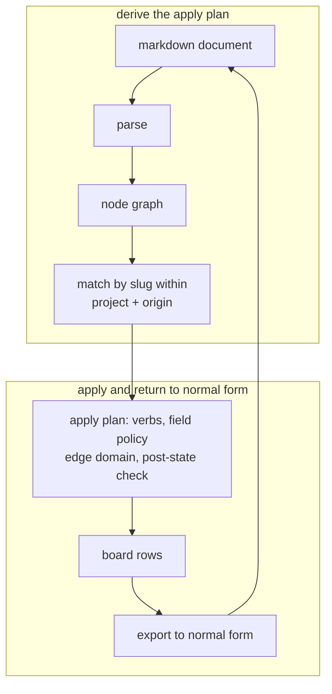

### Behavioral properties

These are tested as properties — a suite per property, not a suite per feature.

Every property is high-risk, verified by its own test suite.

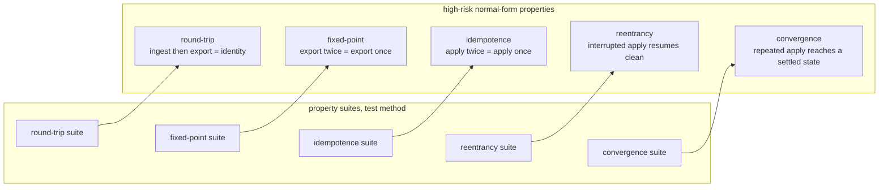

**Invariant —** **Determinism.** The same document produces the same graph,
every time, on any machine.

**Invariant —** **Never-raise.** The parser does not crash on hostile input. BOM,
CRLF, deep nesting, and pathological structures produce *refusals*, not stack
traces.

**Invariant —** **One escape rule, both directions.** Whatever escaping the
writer applies, the reader reverses exactly. A round trip cannot accumulate
backslashes.

**Invariant —** **Cycles are refused, not resolved.** A graph that cannot be a
DAG is rejected with the cycle named.

**Invariant —** **No creation defaults on apply.** Applying a document must not
silently invent field values that the document did not state. Absence means
"unchanged", never "reset to default".

**Invariant —** Writes are atomic and followed by a **settled re-check**. The
post-state is verified, not assumed.

**Invariant —** Ingest is **idempotent against identity**: re-ingesting a
document does not duplicate rows it already created.

### Identity within a document

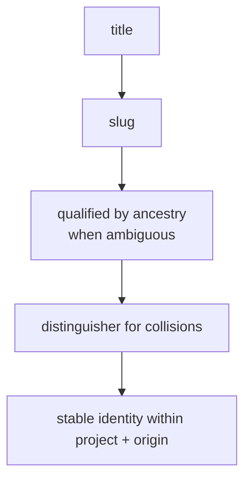

**Invariant —** Matching is scoped to a project **and** an origin. The same slug
in two families is two different things.

### Refusals and warnings as tables

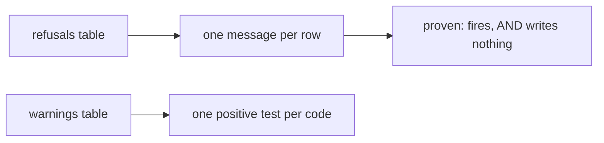

**Invariant —** Every refusal row has a test proving both that it fires **and
that it wrote nothing**. A refusal that half-applies is worse than no refusal.

**Invariant —** Author text is never parsed as attributes. The argument boundary
is explicit, so a task titled `priority: high` is a title.

---

## The wire seam

### One schema, every consumer

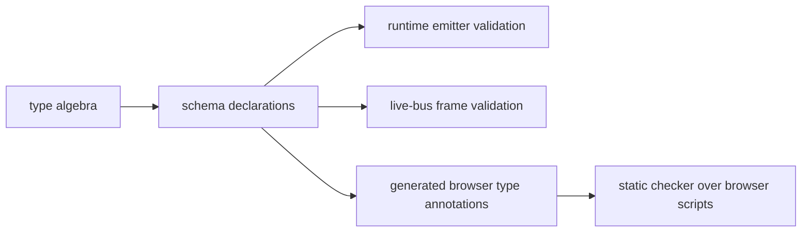

**Invariant —** The declarations are the single source. The browser's type
annotations are **generated** from them and verified in the gate — a drifted
generated artifact fails the build.

**Invariant —** Payloads are validated at their **emitters**, not only at their
readers. A producer that breaks the contract is caught where it lies.

### Unions discriminate on outcome

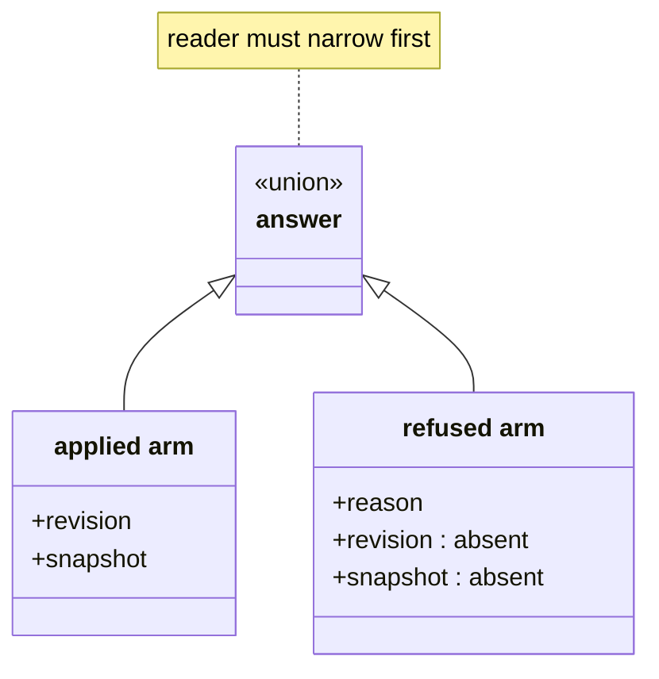

**Invariant —** An answer with two shapes is **two types**, not one type with
optional fields. Held as one object, a reader can take a revision off a refusal
that never had one.

**Invariant —** The discriminant is chosen by *meaning*, not convenience: an
agent-launch answer splits on **whether an agent is now running**, not on `ok` —
because a skip answers ok and starts nothing.

**Invariant —** A field one arm never carries is **declared as absent**, so the
reader is allowed to ask about it. A name missing from one arm is an error on the
union rather than a question.

### Absence has one spelling

**Invariant —** Omission and null are not two ways to say nothing. One spelling
is chosen and enforced mechanically, not by convention.

---

## Extension surfaces

### Mounted commands

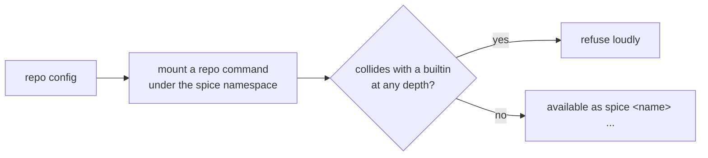

**Invariant —** Built-in verbs and registered actions win at **every depth**.
Shadowing fails loudly rather than silently overriding.

**Invariant —** Dotted mounts may extend a built-in verb only with a **novel**
action name.

### Entry-point extensions

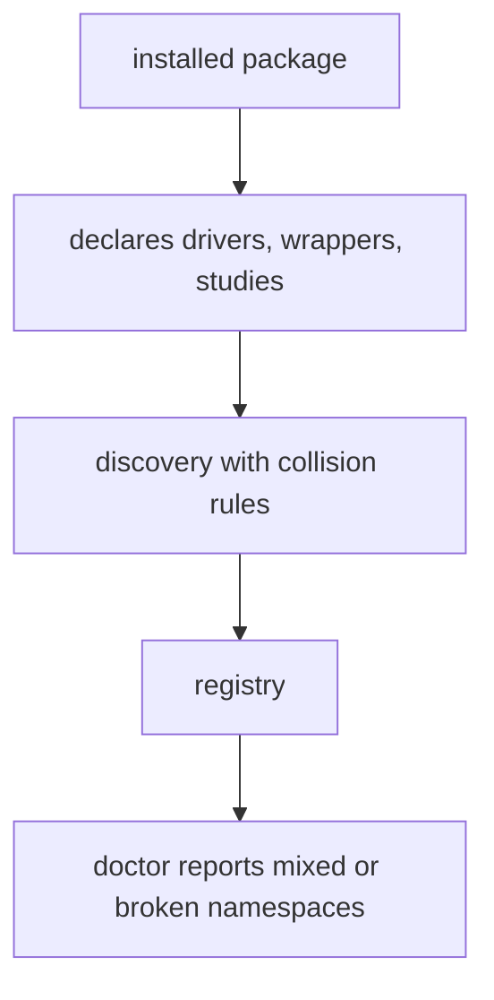

**Invariant —** A new driver, wrapper, or study is a **declared value**, never a
patch to a dispatcher.

### Universal scopes

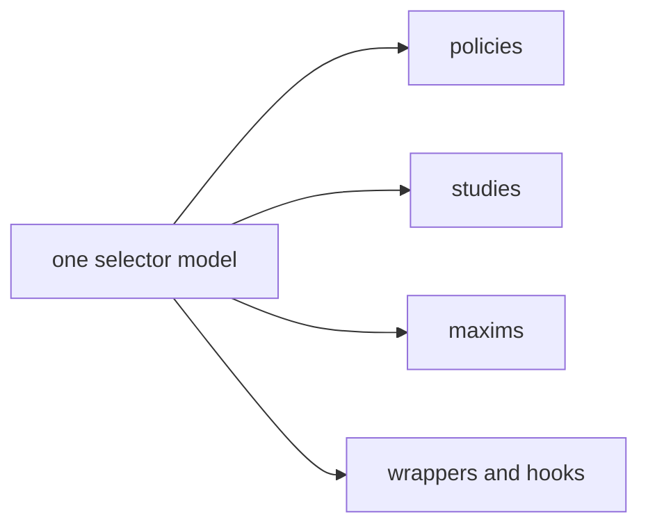

**Invariant —** Applicability is expressed once, in one selector language, and
reused by every subsystem that needs to say "here but not there". Driver, model,
worktree, and path all select through the same grammar.

---

## Diagnostics and discoverability

### Doctor

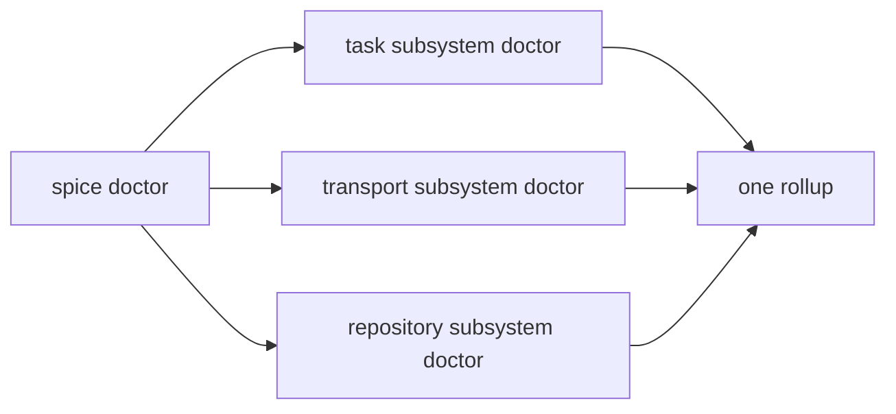

**Invariant —** One top-level rollup aggregates every subsystem doctor. "Check
everything" is a command, not a checklist in a document.

**Invariant —** Host-probing checks stay **out of hook verdicts**. Diagnosing the
environment and refusing a commit are different jobs.

### Demo

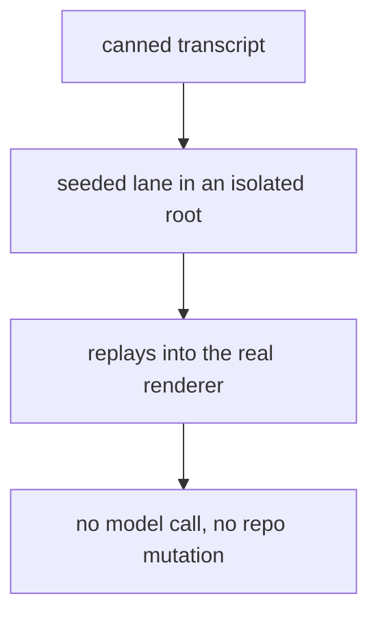

**Invariant —** The demo exercises the **real** rendering path with static data.
A demo that runs a different code path proves nothing.

**Invariant —** Nothing opens on the operator's display without an explicit
request. A demo or a test run that takes over the display disrupts the one
surface the operator is using to supervise everything else.

---

## Media pipeline

### Attachments

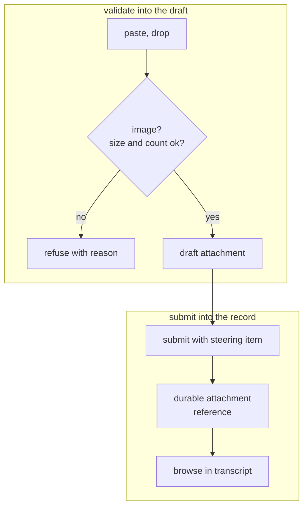

**Invariant —** An attachment becomes part of the **operating record**, not a
transient upload. Screenshots and captures stay browsable beside the message
they arrived with.

**Invariant —** Paired view-image tool output collapses to one rendered image
rather than duplicating.

### Speech

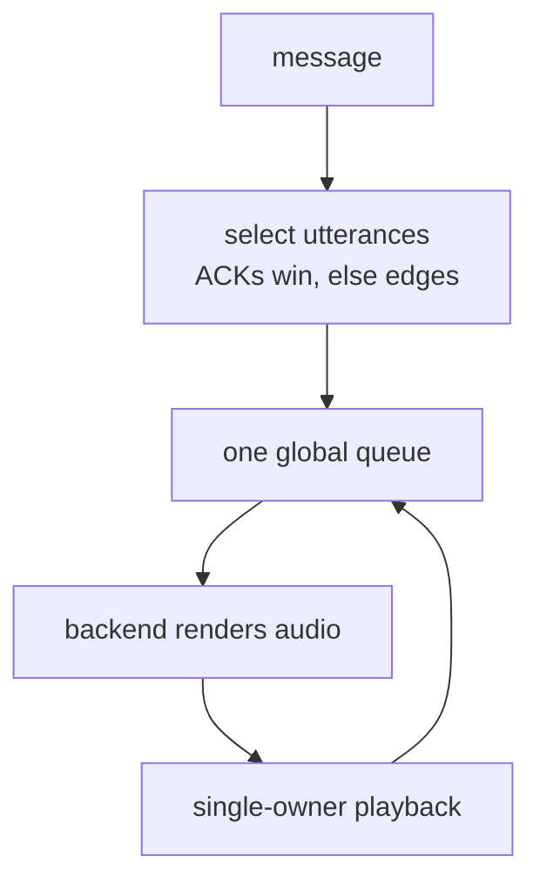

**Invariant —** Speech is **best-effort ear candy**. Failures degrade silently
and must never block the visible stream — the transcript remains the record.

**Invariant —** Every backend call is deadline-bounded. A hung synth cannot
wedge the queue.

**Invariant —** The clip is played back under the media type the backend
declared, never a guessed one.

---

## The shape in one diagram

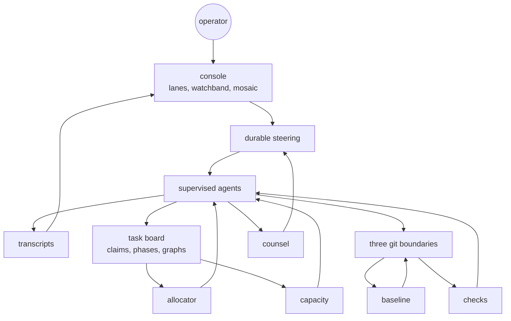

Six closed loops appear in one picture: **read** (the transcript feeds the
console, which informs the operator), **steer** (the operator creates steering,
which reaches the agent), **work** (the board feeds the allocator, which assigns
the agent, which updates the board), **land** (the agent writes git, which
advances the baseline, which refreshes the agent), **counsel** (the agent
requests counsel, which becomes steering, which reaches the agent), and
**staff** (the board exposes capacity, which wakes the agent, which updates the
board).

Every one of them closes. That is the product.
