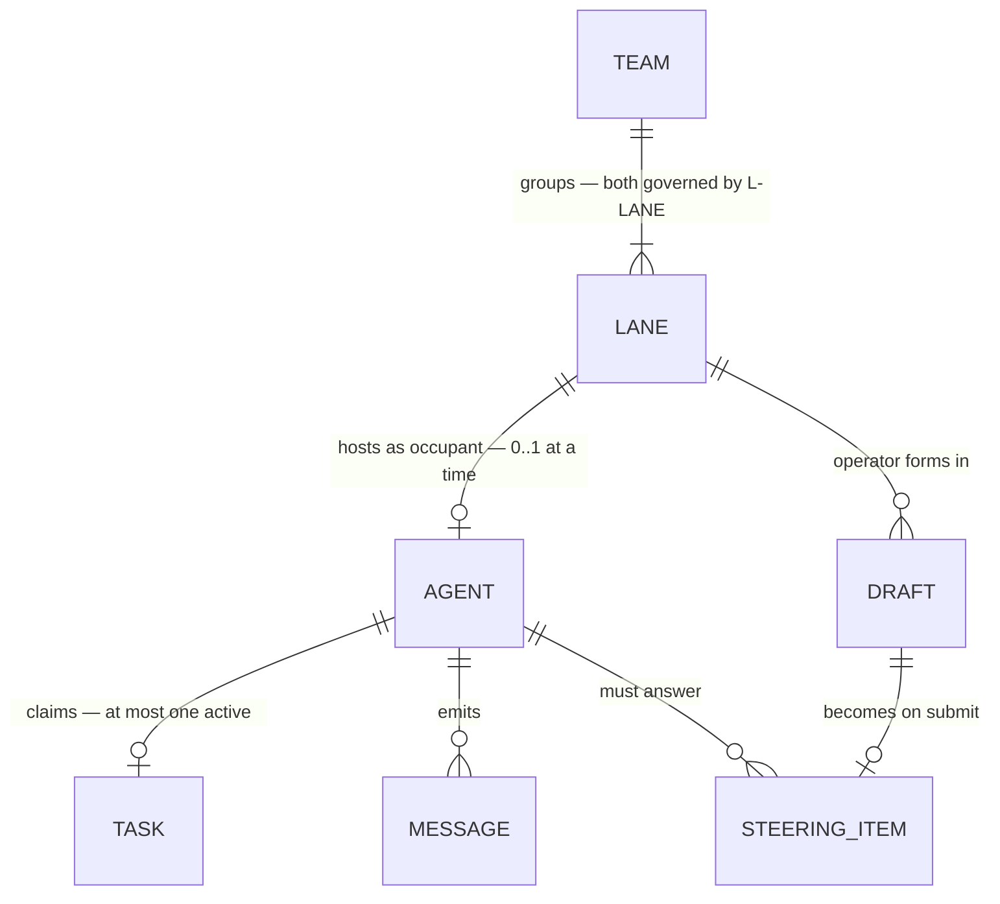
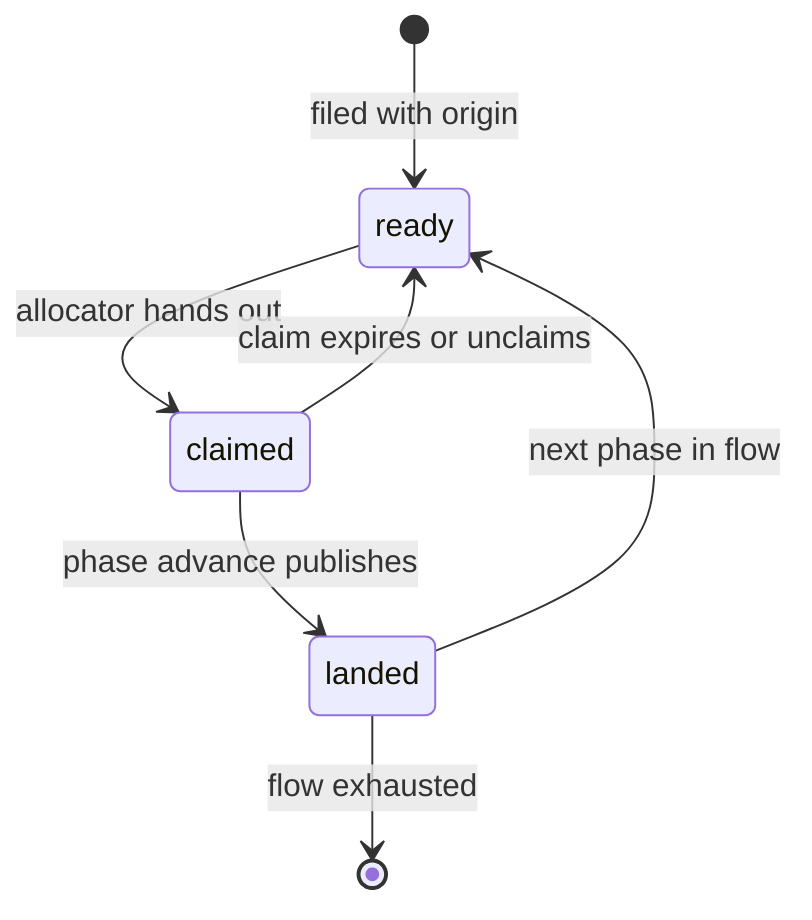
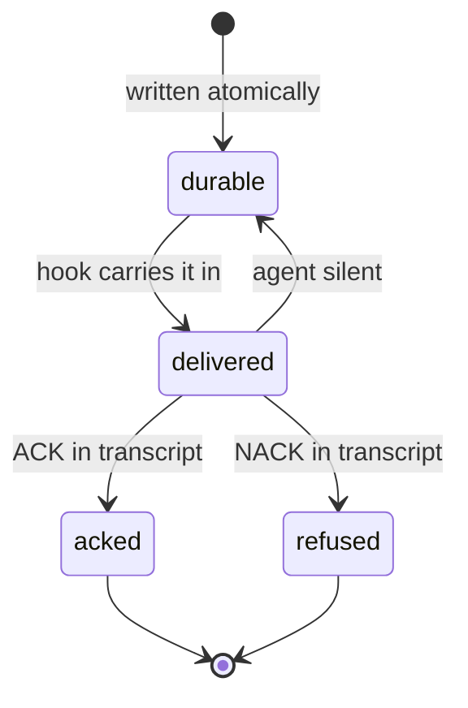
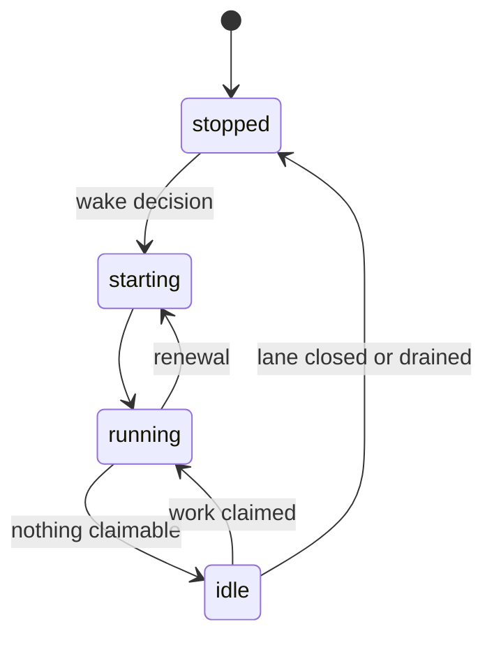
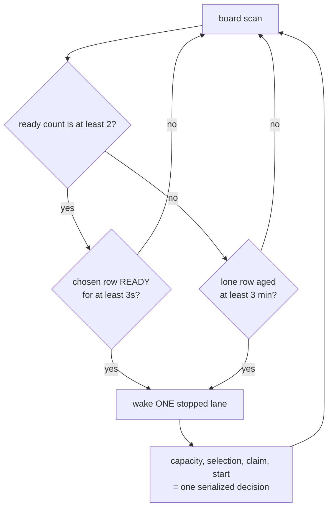
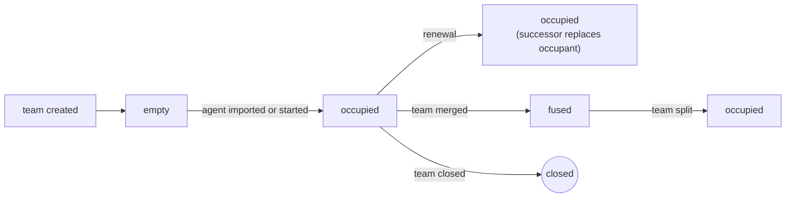
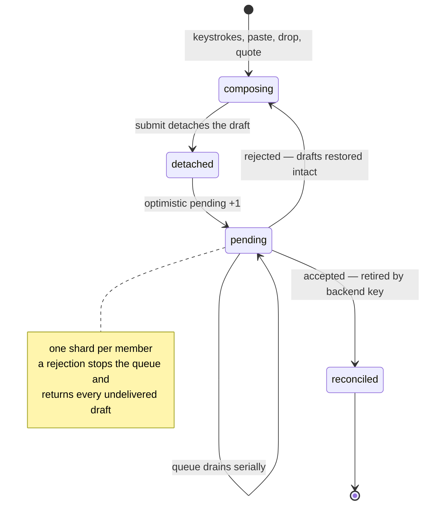
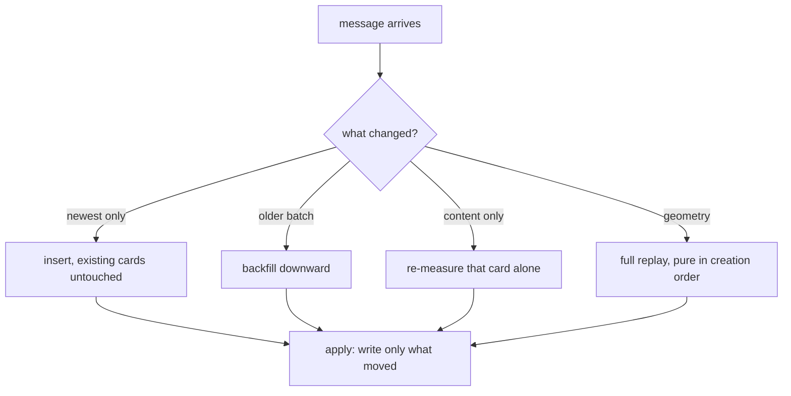
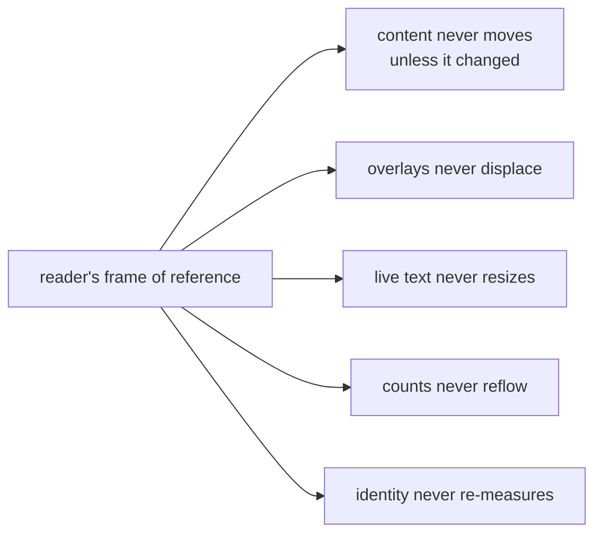
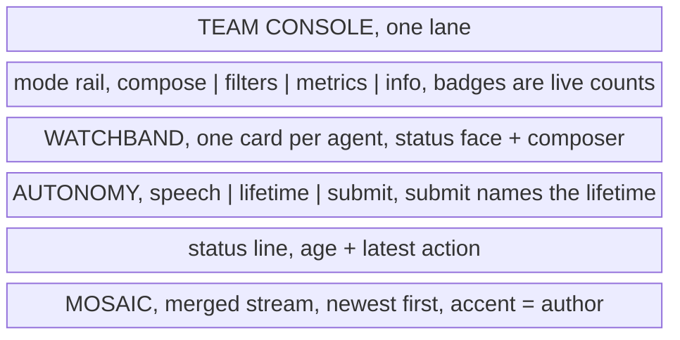

# Operating loops

The transformative loops this appliance runs, stated independently of the
language, framework, or visual spelling that realizes them.

---

## How to read a loop

Each loop states the same things, and the split between them is the point:

- **Invariants** — must hold in any implementation, in any spelling.
- **Policy** — tunable numbers with the reasoning that chose them. Change them
  deliberately; they are not arbitrary.
- **Incidental** — left open by the product model, named explicitly so the
  boundary of the requirement is unambiguous.
- **Acceptance** — how you observe the invariant from outside.

The invariant register owns every cross-document label. Each rule here is
identified by its language and enclosing loop.

---

## What transforms

Every loop in the appliance is the lifecycle of one of these. Nothing else has a
lifecycle.

Read it as: a **team** groups **lanes**; a lane hosts an **agent** as its
occupant, which claims a **task** and emits **messages**; the operator forms a
**draft** in that lane, which becomes a **steering item** the agent must answer.
Nothing outside the set has a lifecycle.

Seven nouns, six loops: **team and lane share one**, because every transition a
team has — created, merged, split, closed — is a transition of the lane surface
that renders it, and specifying them apart would split one machine across two
documents.

---

## L-TASK — the unit of work

**Intent.** A task moves through named phases, and each advance is an attested,
irreversible publication.

**Invariants**

- Every task names its origin (`ack:<key>` or `task:<handle>`). No
   assignable task exists without one.
- At most one active claim per actor, at most one actor per claim.
- A phase advance publishes exactly one merge whose first parent is the
   baseline; the tree is computed before the working tree is mutated, so the
   visible terminal state is either the untouched pre-merge tree or a
   recoverable merge. Never a half-installed conflict.
- The publication carries `Task-Key`, `Task-Project`, `Task-Phase`,
   `Task-Session`. First-parent history is therefore the complete ledger of
   attested work.
- A claim that expires returns the task to ready without losing the work
   committed under it.
- Self-authored review is the last-resort eligibility class, never a
   refusal. A peer wins whenever one exists; a solo agent still progresses.
- A review that changes nothing still advances the phase. Absence of a
   commit is not absence of review.

**Policy** — claim TTL 3600s, claim context window 300s, public flow
`todo` to `review`, private flow `todo`, hidden `.oops` flow `plan`, deferred to
a far-future wait, anti-self-review urgency negative 100.

**Incidental** — the task store, the handle alphabet, phase *names*, the number
of phase slots.

**Acceptance** — `git log --first-parent` reconstructs the full ledger; a killed
agent's task is reclaimable; a solo agent completes a review phase.

---

## L-STEER — intent made durable

**Intent.** Operator intent survives every failure between saying it and the
agent answering it.

**Invariants**

- The item is durable before it is delivered. Delivery is retryable;
   the item is not recreated.
- Only a semantic acknowledgement in the transcript retires an item. A
   read never does.
- Refusal retires the item exactly as acceptance does, and is recorded
   as a distinct disposition. Refusal must be as reachable as acceptance
   everywhere acceptance is taught.
- Undelivered-and-unanswered escalates on a stable lineage key. A resend
   is the same intent insisting, not a new intent.
- Delivery reaches the agent during non-shell work, not only at shell
   boundaries.
- Submit cost is independent of backlog depth — identity is derived from
   names and stat metadata, never by reading queued bodies.

**Policy** — 24h expiry, priority classes drive escalation cadence.

**Incidental** — the file format, the key alphabet, the delivery mechanism.

**Acceptance** — kill the browser mid-send: the item survives. Kill the agent:
the item is still pending. Answer it: the count drops by exactly one.

---

## L-AGENT — the work-availability loop

**Intent.** Capacity follows work. A lane with nothing to do stops; a board with
work to do wakes one. The operator never manages agent count by hand.

The wake decision itself is the hardened part:

**Invariants**

- Wake starts **exactly one** lane per decision. Capacity check,
   candidate selection, claim, and startup are a single serialized decision; a
   later inventory refresh must observe the started lane before capacity can
   expand again.
- Two ready tasks are the normal trigger — one for the waking lane to
   claim, one left on the board. READY excludes active claims, so already-running
   lanes are not part of the backlog count.
- A single ready task is never stranded. After the starvation age, one is
   enough. This is an *age*, not a retry interval.
- A chosen row must have been READY for a settle interval before it can
   wake a lane, so a burst does not beat a running agent's own done-to-next cycle
   or grab a row the instant it leaves plan phase. A row already older than the
   settle interval, or one riding the starvation escape, starts immediately.
- Rendering never launches. The snapshot, the live bus, and the UI
   project settled decisions; no read path can start or renew an agent.
- Decisions for one worktree are serialized; sibling lanes proceed
   independently.

**Policy** — start threshold 2, starvation 180s, settle 3s, ensure retry 5s.

**Incidental** — the scan trigger, the process supervisor, the transport.

**Acceptance** — file two ready tasks with every lane stopped: exactly one lane
starts. File one and wait: it starts after the starvation age, not before. File
six at once: lanes come up one decision at a time, not six at once.

> **Rendering never launches is the invariant most likely to be lost.** It is
> very natural to let a lane "ensure" its agent while rendering. That makes
> opening a browser tab a
> side-effecting act and turns a refresh into a fleet-wide launch storm.

---

## L-LANE — the place

**Intent.** The lane is the operator's, not the agent's. It is the stable
address for attention, drafts, filters, and history.

**Invariants**

- Lane is not agent. Renewal replaces the occupant; history, drafts, filters,
   scroll position, and speech state survive.
- A lane is a **team of worktrees**, not one worktree. A team may hold
   many members; the singular case is the degenerate one, not the model.
- Topology is server truth. The client never mounts a lane from local
   storage; local storage holds presentation preferences only.
- A fused team renders one merged stream on one host; every member
   remains its own concrete send address.
- Member order is one ordering, used for composer order, accent
   assignment, and attribution — and it is stable across transient refreshes. A
   member that momentarily fails to resolve keeps its seat rather than
   re-entering at the tail.
- Closing is requested, not performed. The lane disappears when the
   authority says so, and a lane holding unsubmitted intent resists removal.
- Message order is a pure function of the messages, never of member
   order. Reordering composers must not reorder the stream.

**Policy** — six members maximum, matching the six-slot accent palette.

**Incidental** — tiling, fuse gestures, menu placement, the accent palette
itself.

**Acceptance** — renew an agent mid-draft: the draft is still there. Reorder
composers: no card moves. Kill the server: the topology returns identically.

---

## L-DRAFT — the watchband

**Intent.** One strip that is simultaneously the *status face* of every agent in
the team and the *writing surface* for all of them. You read it like a watch and
you write into it without leaving it.

**Invariants**

- One shard per member; each shard is a concrete send address. Nothing
   is ever broadcast to a team.
- A draft is detached at submit and restored intact on failure —
   including attachments and quote drafts, concatenated newest-last.
- Sends drain serially per lane. A rejection stops the queue and returns
   every undelivered draft.
- The pending count is a floor over backend truth, retired by key
   identity — never by decrement, never by timeout.
- Unsubmitted intent is protected: closing a lane or leaving the page
   requires confirmation.
- A late completion never steals focus the operator has since moved.
- Shard order is member order is accent — so the colour of a card in the
   stream identifies the shard that would answer it.
- The band reports state the operator did not ask for: age, run state,
   pending, claimed task. It is a status surface first and a composer second.

**Policy** — 8 attachments, 8 MB each.

**Incidental** — the strip's geometry, which fields show, truncation, iconography.

**Acceptance** — submit into a dead backend: the text comes back. Submit to a
fused team: exactly one worktree receives it. Reorder shards: the stream does not
move, but accents follow.

---

## L-MESSAGE — the mosaic

**Intent.** Many concurrent agents produce messages continuously; the reader
must be able to hold their place. The lattice exists so that new content does
not move old content.

**Invariants**

- A card whose position did not change receives **no style write**.
   Enforced by skipping the write, not by relying on idempotence.
- New content places by insert. Existing cards are never re-decided,
   re-measured, or re-spanned.
- A card's column and span are decided once. Only its vertical position
   may settle afterwards. Nothing hops sideways.
- Growth pushes down transitively along the original layout; shrink
   keeps the reserved space. Zero movement outranks reclaiming a row.
- Layout is a pure function of (creation order, measured content,
   geometry). Same inputs, same layout, on any machine, in any order of arrival.
- Pending content reserves its footprint so resolution is exact or
   shrinking. A card is always measured whole, never as its placeholder alone.
- A scrolled reader is compensated in the same frame; a reader at the
   top sees the push-down, because there it is the signal.
- Nothing animates until the board first settles, and an unmeasurable
   surface renders nothing at all rather than guessing.

**Policy** — 12 tracks, wide tier at twice the width when a card measures tall, freeze
depth 2, settle 500ms or first deliberate gesture, resize debounce 200ms.

**Incidental** — track count, span ladder, the placement key's tie-breakers,
tween duration, the entire visual style.

**Acceptance** — replay a recorded event log: identical positions. Resolve two
pending cards in either order: identical layout. Scroll and let content arrive:
the viewport does not move.

---

## The Jitter Contract

Cross-cutting. Not a loop — a property every loop must preserve. This is the
appliance's most distinctive quality and the hardest to recover once lost.

- **Movement means change.** Any motion the reader sees must correspond to
   something that actually changed. Re-render is not change.
- **Affordances open out of flow.** Every menu, picker, overlay, and drag
   ghost is positioned out of the document flow, so opening one cannot reflow
   the board. This is why they read as *in-place*. The single in-flow menu is
   bounded to its own shard and can never disturb a sibling.
- **Live text lives in fixed slots.** Per-second ages render into
   fixed-width single-line slots, padded, so ticking never changes a box.
- **Counts have fixed footprints.** The pill triple always renders all
   three slots; a count moving between slots must not resize the pill.
- **Presentation changes never touch identity.** Recolouring, attribution
   toggles, and member-count changes must not enter any fingerprint that would
   force a re-measure.
- **Programmatic scroll is not a gesture.** Compensation and restore must
   be excluded from anything that reads user intent, or the surface competes
   with itself.
- **Batch, then paint once.** Multiple arrivals coalesce into one paint per
   surface. Trickling is jitter with extra steps.
- **Hidden means untouched.** A surface that cannot be measured is not
   guessed at; it renders nothing and repaints on reveal as a correction.

**Acceptance** — instrument style writes per frame. A no-op refresh must produce
zero. An agent joining a six-member team must move nothing that already existed.

---

## The three surfaces

What the operator actually manipulates, stated as a component contract.

**Contract**

- **The console is the unit of tiling.** Consoles sit side by side; each is a
  complete operator surface for one team. Adding an agent widens a console; it
  does not add a column to the page.
- **The rail's badges are the summary.** Compose shows pending, filters shows
  assigned routes, info shows member count. A badge is only present when its
  count is non-zero, so an empty rail means a quiet lane.
- **The watchband is the identity layer.** Every question of *who* — which
  agent, which branch, which task, which driver, how stale — is answered there,
  not in the stream.
- **The mosaic is the evidence layer.** It answers *what happened*, attributed
  by accent to the watchband card that owns it.
- **Autonomy is never implicit.** The submit control carries the lifetime's own
  name, so intent cannot be sent without its autonomy being visible in the same
  gesture.

**Incidental** — orientation, tiling rules, iconography, colour, whether the
watchband is horizontal.
