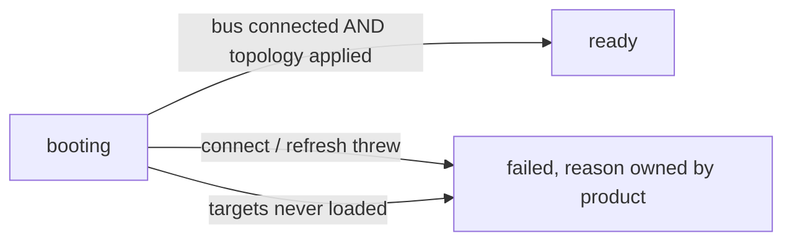
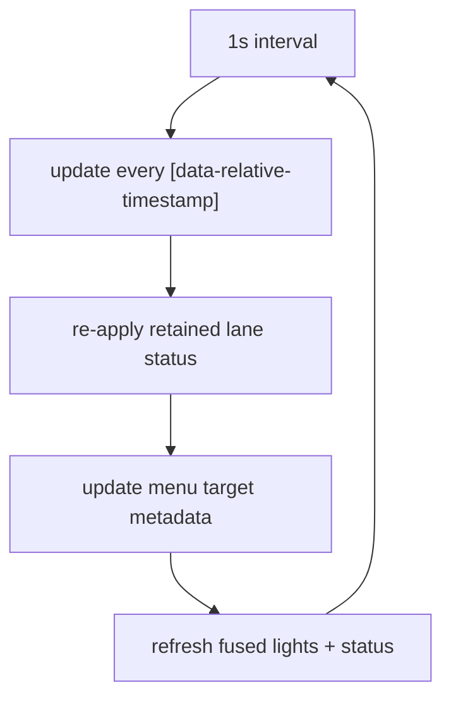
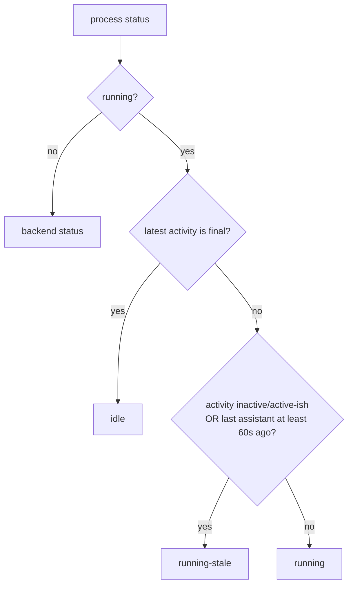
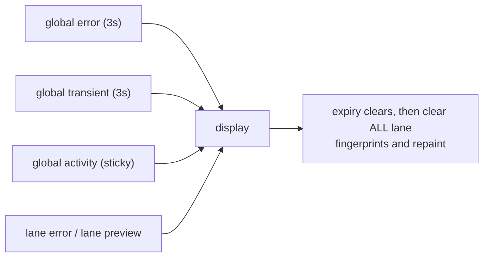
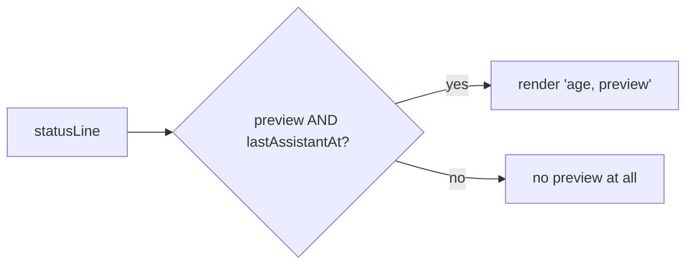
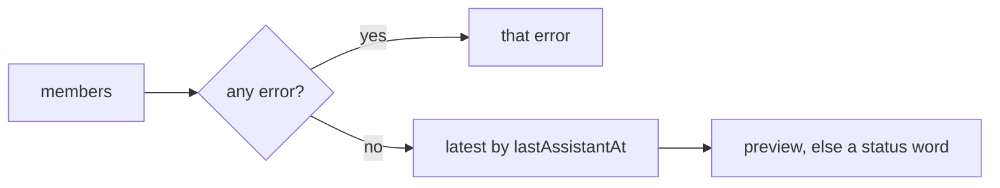
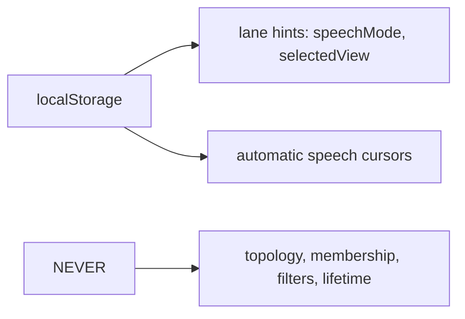
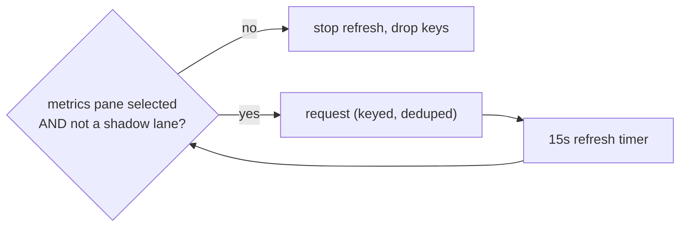

# Surface mechanics — Global chrome

[Surface mechanics](../mechanics.md) · [Spice product model](../README.md)
## Global chrome

### Closed loop: Serve lifecycle

**Invariant.** `ready` means genuinely usable, not merely navigated. Harnesses
wait on this instead of guessing from navigation timing or first-lane DOM
appearance; `failed` carries a product-owned reason so nothing proceeds past a
broken init in silence.

### Closed loop: Relative-time ticker

**Invariant.** Started **before** any server work, so slow discovery cannot
freeze already-visible time labels. Ages are a browser-local clock; the
`fixedRelativeTime` padding keeps a fixed footprint so ticking never reflows.

### One-way flow: Live visual-status derivation

**Invariant.** Recency is layered over structural status **client-side**, so a
quiet agent visibly decays without a server round trip. Decay windows: `< 60s`
active, `< 300s` active-ish, else inactive.

### Closed loop: Transient status precedence

**Invariant.** Global wins over lane. Expiry only clears if the text is still
the one that armed the timer, so a newer message is never erased by an older
timer.

### One-way flow: Status preview requires relative time

### One-way flow: Fused status line

**Invariant.** Leaving fusion restores the standalone line by clearing the
status fingerprint — a fused host that split would otherwise keep a sibling's
preview forever.

### Closed loop: Browser storage holds interface only

**Invariant.** The server snapshot is the sole topology source. Hints are
applied to whatever lanes the snapshot mounts, never used to mount one.

### One-way flow: Metrics are on demand

**Invariant.** The query pins its end timestamp so ordinary DOM re-renders
deduplicate; the window moves only while somebody can see it.

---
