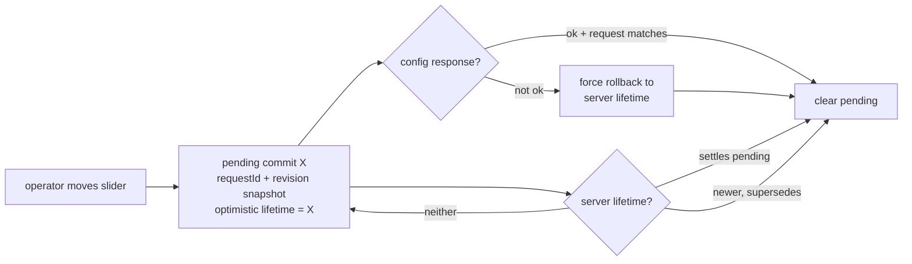
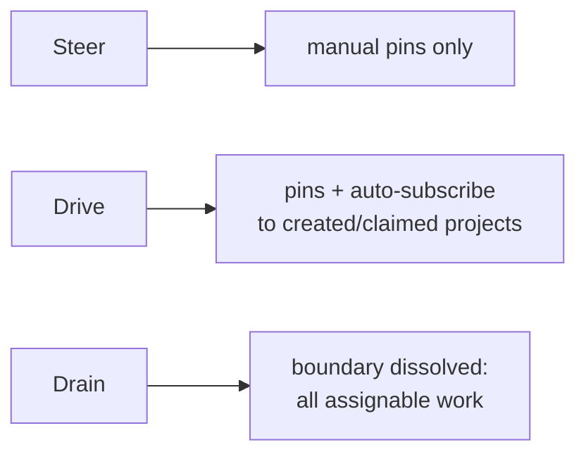
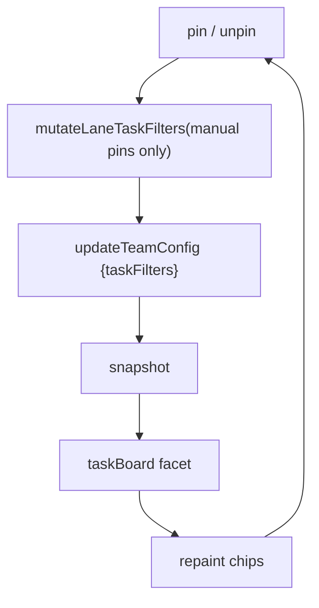
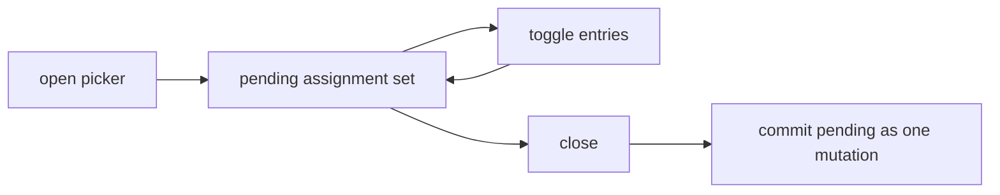
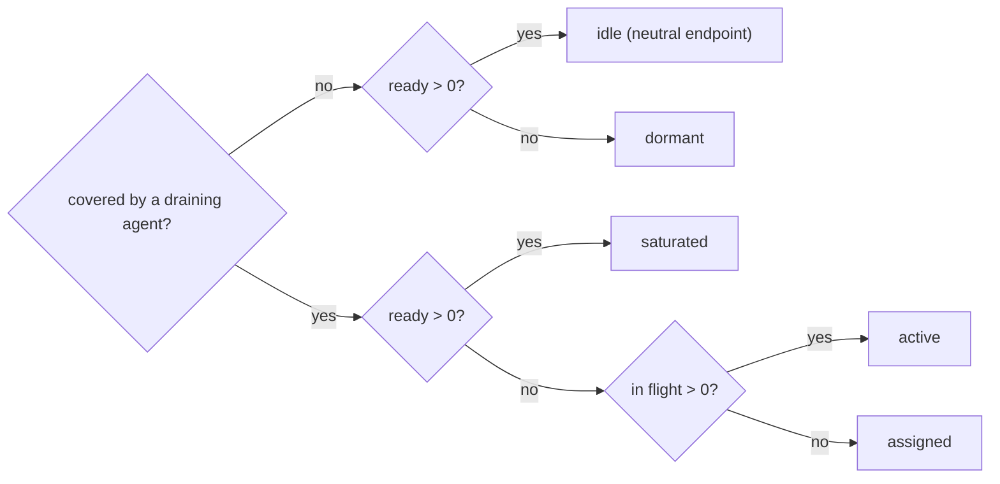
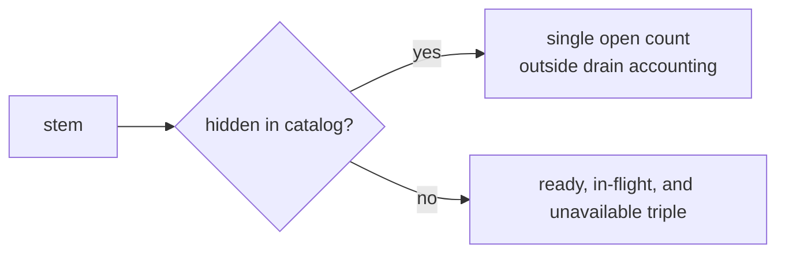
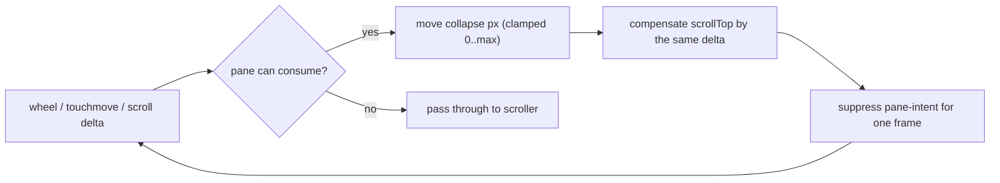
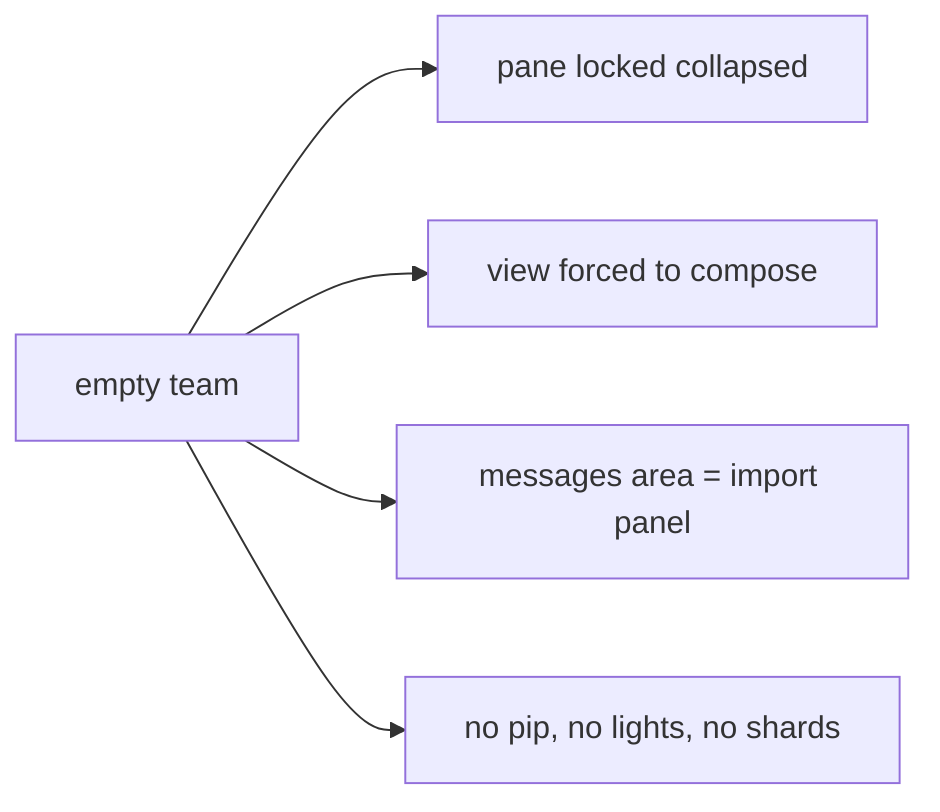

# Surface mechanics — Controls

[Surface mechanics](../mechanics.md) · [Spice product model](../README.md)
## Controls — lifetime, speech, filters

### Closed loop: Lifetime commit with supersede, settle, and rollback

**Invariant.** Three distinct decisions, each with its own predicate:
*older-than-lane-config* (drop), *supersedes-pending* (take), *settles-pending*
(clear). A slower echo of the value the operator just left never flips the
slider back.

### One-way flow: Lifetime semantics

**Invariant.** The vocabulary is exactly `Steer | Drive | Drain`. The
*effective* filter set is resolved **server-side** through the lifetime lens;
the client renders `effectiveTaskFilters` and never re-derives it.

### Closed loop: Task-filter pin mutation

**Invariant.** The UI writes back **only the manual pin layer**. Auto
subscriptions (`auto:create` / `auto:claim`) are server-managed and must never
round-trip through client state. Membership flows (`splitTeam`, `mergeTeams`,
`restore`) deliberately send lifetime **without** `taskFilters`.

### Closed loop: Filter picker staging

**Invariant.** Selections are staged, not applied per click — one config write
per picker session.

### One-way flow: Filter-pill tone ramp

**Invariant.** Saturation encodes **agent coverage**, layered with motion. A
stem an agent is camped on reads saturated even when everything is blocked;
`idle` alone means *handleable work is waiting for an agent*. The state triple
`ready, in-flight, and unavailable` must total `openTaskCount` — a mismatch throws.

### One-way flow: Hidden stems collapse

**Invariant.** Hidden stems (`oops`, `maxim_proposal`, project additions) are
never handed out, so their phases never advance and the triple carries no
information. The private `agent` channel **is** handed out, so it keeps the
triple but still sits out public boundary-dissolution accounting.

### Closed loop: Lane pane collapse and scroll handoff

**Invariant.** Programmatic scroll writes always route through
`setLaneScrollTopWithoutPaneIntent`, which re-baselines `previousMessageScrollTop`
and suppresses for a frame — otherwise compensation is misread as a fresh user
gesture and the pane oscillates.

### One-way flow: Empty-team lane is a locked shell

**Invariant.** An empty team keeps a lane so the team remains addressable; it is
the only lane whose message area renders something other than the stream.

---
