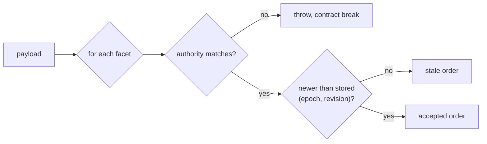
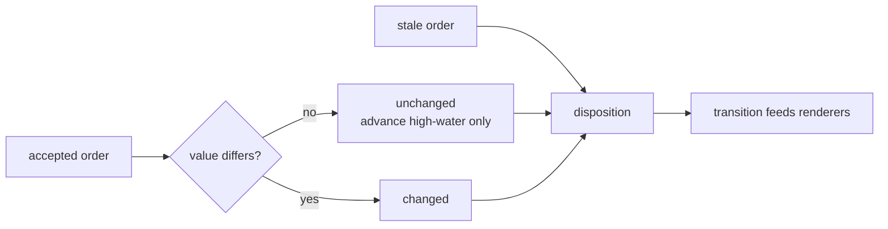
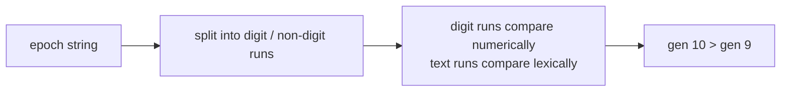
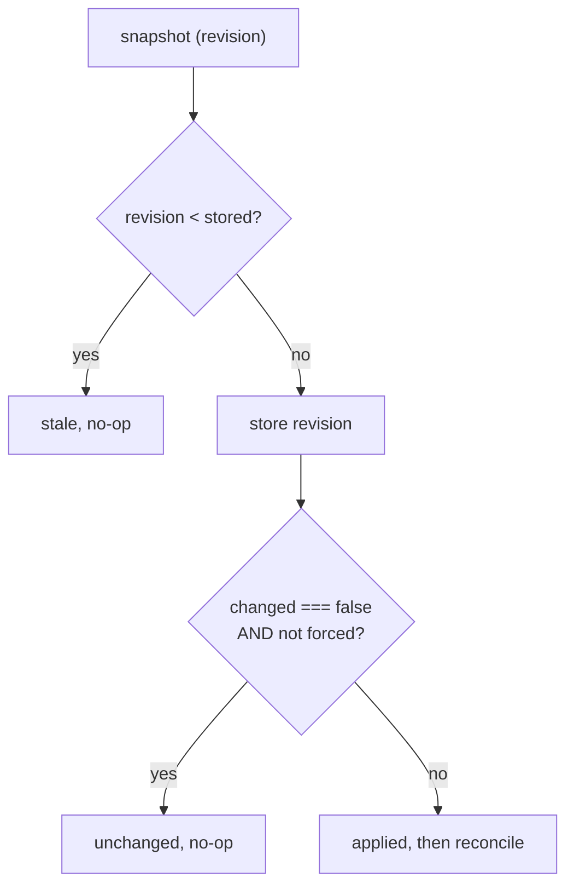
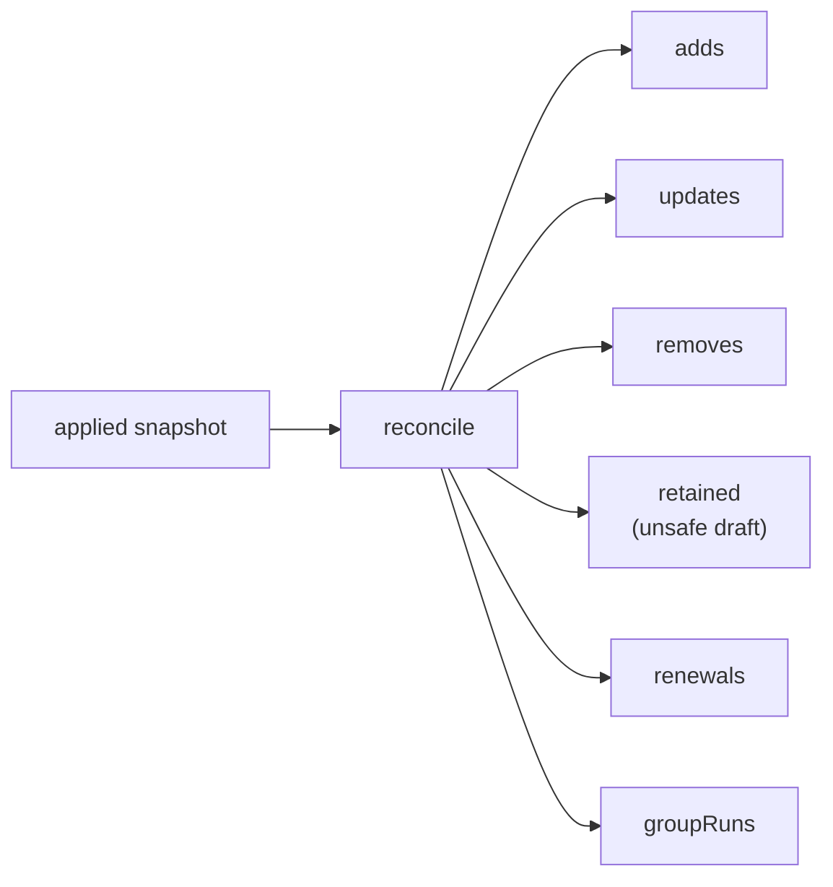
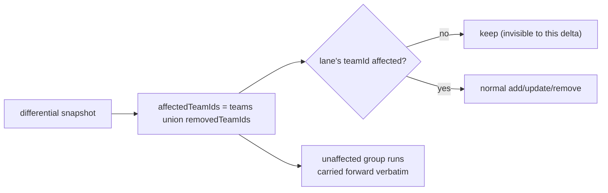
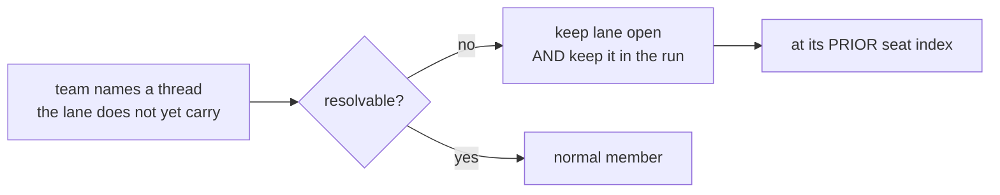
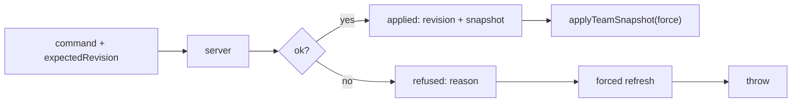
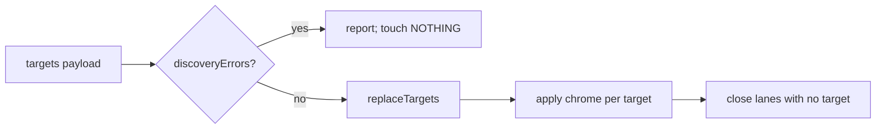
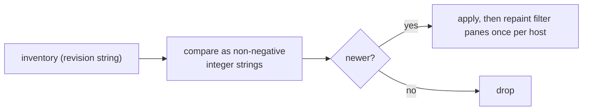

# Surface mechanics — Authority and freshness

[Surface mechanics](../mechanics.md) · [Spice product model](../README.md)
## Authority and freshness

### Closed loop: Lane chrome facet reducer — the core freshness loop

An accepted order advances the high-water mark whether or not its value
changes. All non-contract outcomes join one renderer-facing disposition.

**Facet authorities (mirrored on both sides of the wire):**

| facet | authority |
| --- | --- |
| `identity` | target-registry |
| `teamConfig` | team-store |
| `pendingInbox` | inbox |
| `taskBoard` | task-board |
| `lifecycle` | lifecycle-reconciler |
| `renewal` | team-store |
| `activity` | transcript |

**Invariant.** Each facet has **exactly one** authority and its own counter.
No lane-wide revision is ever minted. Any channel may carry any subset, in any
order, twice. Freshness advances only after the **whole** payload is read, so a
contract-breaking facet cannot leave a target half-advanced.

### One-way flow: Epoch is a natural-order tuple

**Invariant.** The epoch names the authority's *counter generation* and only
ever rises. An authority that restarted and resumed from a lower revision still
supersedes. Generations must be **canonical decimal counts** — a hash identity
is refused at the producer, because a total order over random digests pins a
facet forever at whichever digest sorted highest.

### Closed loop: Team snapshot acceptance

**Invariant.** Team revisions are monotonic. A quiet snapshot repaints
**nothing** — every subscriber gates on `disposition === "applied"` and on the
specific fields it consumes.

### One-way flow: Snapshot reconcile fan

**Invariant.** The store computes a *transition*; the app materializes it.
Renewals apply **before** lane adds/updates so a renewed lane never mounts under
its predecessor's thread id.

### Closed loop: Differential snapshot retention

**Invariant.** A differential snapshot is evidence only about the teams it
names. Unaffected lanes and unaffected fusions survive untouched.

### Closed loop: Unresolved member retention

**Invariant.** Retention and membership are **one decision**. Keeping the lane
but dropping it from the run would eject every card it owns from the merged
stream and, at 2 members, dissolve the fusion outright. Re-entry is at the prior
index, not the tail — member order is composer order and drives accent colour.

### Closed loop: Team command round trip

**Invariant.** The response is a **discriminated union** on `ok`, not one object
with optional fields — a reader cannot take a revision off a refusal. There is
no half-applied answer downstream of the refusal branch.

### Closed loop: Target discovery fails closed

**Invariant.** A payload whose discovery failed never enumerated the worktrees,
so its `workTrees` list is **not evidence** about which lanes still exist.
Closing a lane destroys its DOM, subscription, observers, cached messages, and
can dissolve a fusion — so a failed discovery must not be allowed to do it.

### One-way flow: Task-filter inventory freshness

**Invariant.** Revision comparison is length-then-lexical over normalized digit
strings, so it never overflows and never mis-orders `"10"` vs `"9"`.

---
