# Surface mechanics — Mosaic

[Surface mechanics](../mechanics.md) · [Spice product model](../README.md)
## Mosaic — the persistent lattice

### One-way flow: Render strategy selection (the cheapest sufficient path)

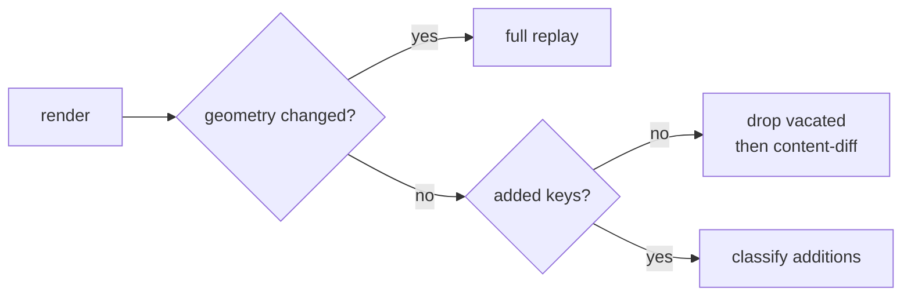

Only contiguous edge additions qualify for the cheaper insert and backfill
paths.

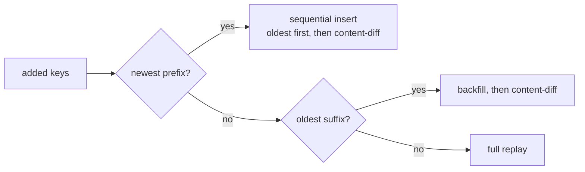

**Invariant.** Insert is layout-identical to replay (a card's decision depends
only on cards *before* it in creation order) but **structurally guarantees zero
movement**: no existing card is re-decided, re-measured, or re-spanned.

### Closed loop: Insert step

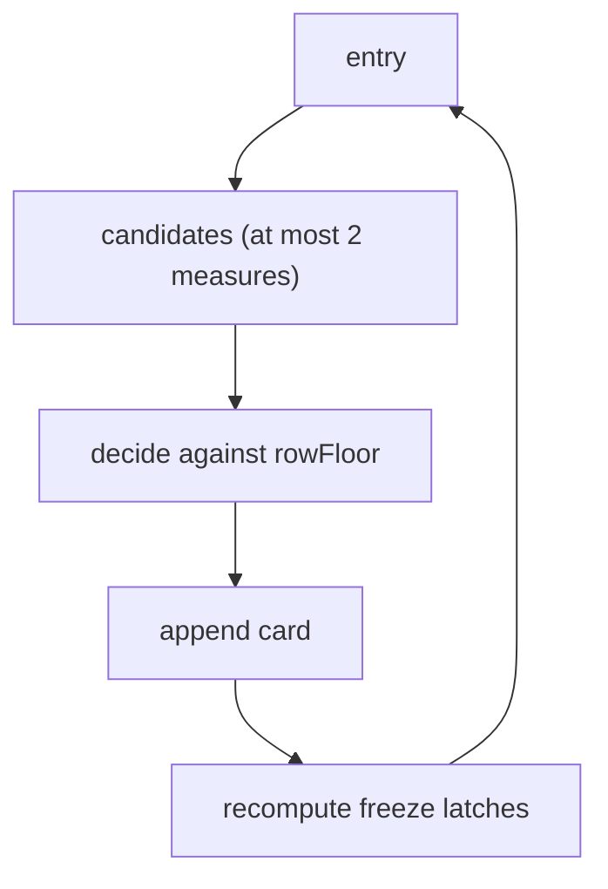

**Invariant.** `insert` is pure: decide, append, commit. Never touches an
existing card. `rowFloor` is returned new, never mutated.

### One-way flow: Placement key

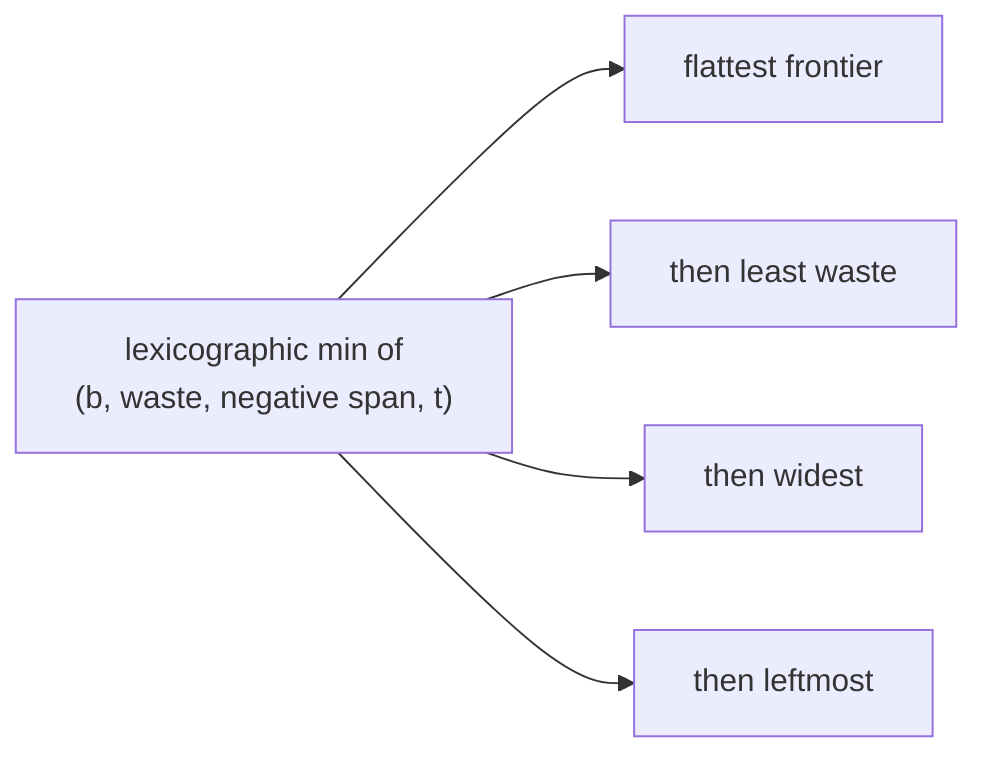

**Invariant.** A wide placement wins **only** if it lands strictly lower, or
ties with no more waste. It never digs a hole to take width.

### One-way flow: Candidate generation

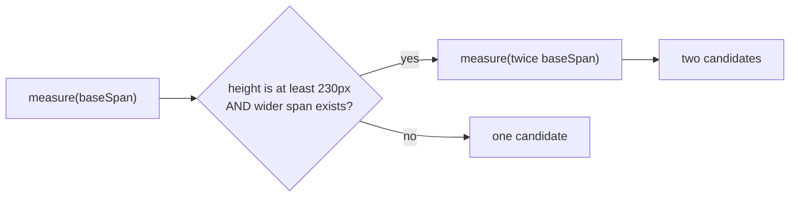

**Invariant.** At most **two** measurement reads per insertion, and the gate
reads *only the measured pixel height* — never class, kind, or content type.
Width is never assigned by what a card is; a span-by-class heuristic has no
place here, as a bias, a prior, or a threshold.

### Closed loop: Liquid tail and frozen prefix

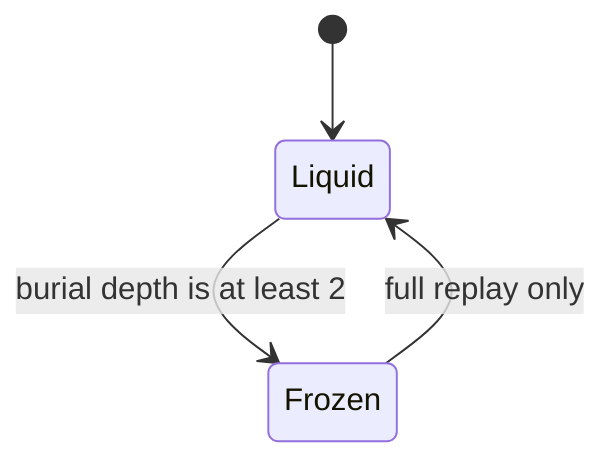

**Invariant.** Freezing is a **latch**. Burial depth is the *minimum*, across a
card's covered tracks, of how many strictly-later cards also cover that track.

### Closed loop: Liquid replay settles vertically only

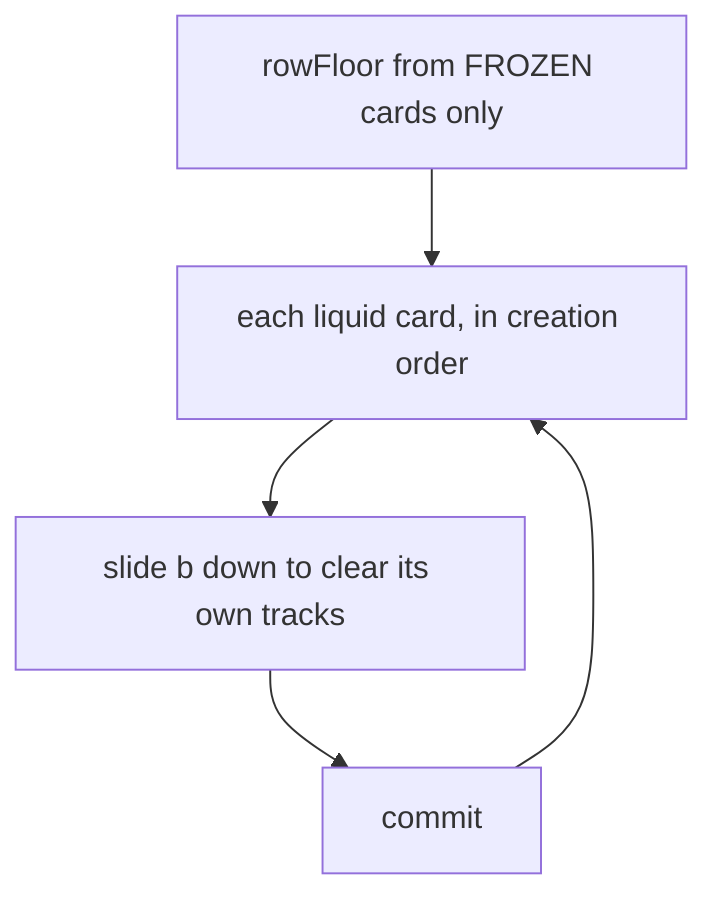

**Invariant.** `t` and `span` are latched at insert. Re-choosing the column here
was the message-card jitter source: a neighbour's late content re-optimised
every liquid card and untouched cards hopped sideways — sometimes back and forth as
two ACKs resolved in turn. Order-invariant: only `creationIndex` governs
processing.

### One-way flow: Frozen resize dispatch

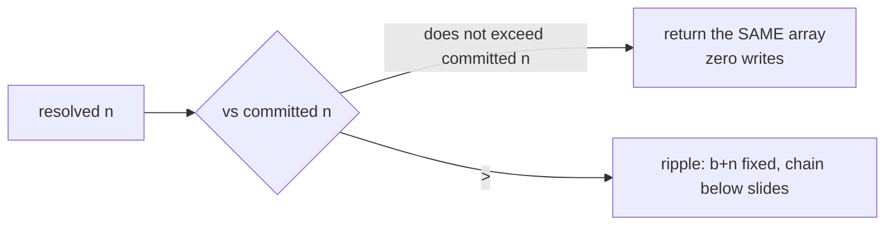

**Invariant.** Shrinking keeps the reserved rows exactly — **zero movement
outranks reclaiming a row**. The vacated space reconciles at the next full
replay, never here.

### One-way flow: Ripple reachability

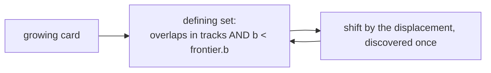

**Invariant.** Discovery always compares against the frontier's **original** `b`.
Comparing against a shifted threshold understates the gap whenever the displacement exceeds it,
silently dropping a downstream card and leaving an overlap. Reachability is
computed entirely over the original layout, independent of the displacement. Rows may go
negative; nothing clamps them.

### Closed loop: Full replay is a pure function

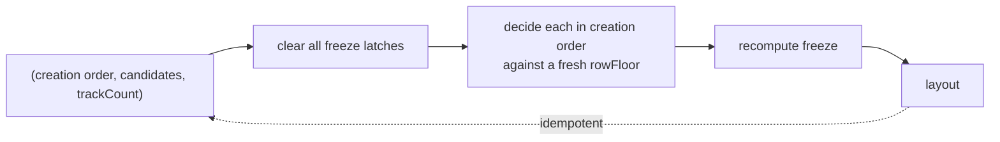

**Invariant.** Reads only `creationIndex` and `candidates` — never prior
`t/b/span/n/frozen`. Identical regardless of layout or freeze history, and
idempotent when replayed with unchanged candidates.

### Closed loop: Event-log replay equivalence

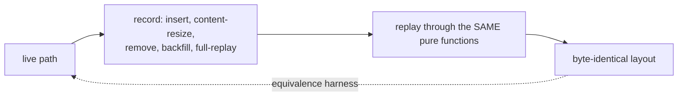

**Invariant.** Layout is a pure function of the recorded event sequence. Any two
implementations that consume the same log must produce identical positions for
every card — the same track, base row, row count, and span. This is the seam on
which the lattice is provable rather than merely observed.

### One-way flow: Creation index source depends on the path

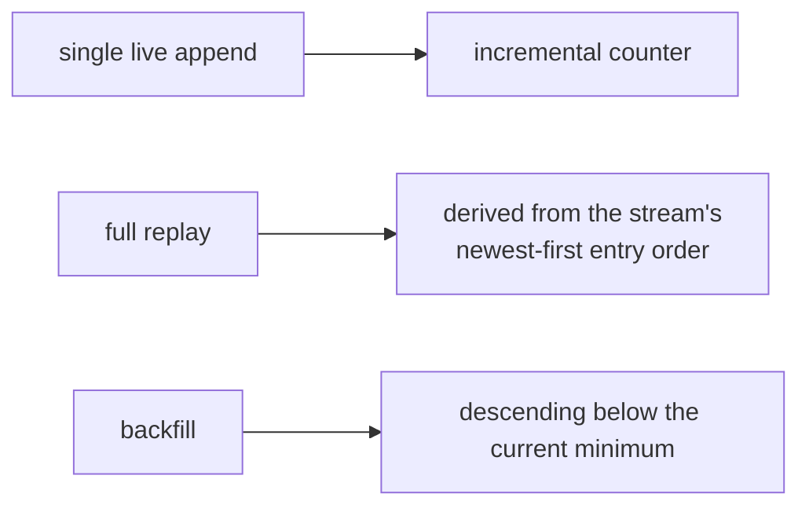

**Invariant.** A bulk batch of previously-unseen keys — a team fuse pulling in
another member's backlog, or a hydration landing several older messages — must
**not** be stapled onto the end of the counter in newest-first order. It would be
stamped newer than every known card, backwards.

### One-way flow: Two-layer motion

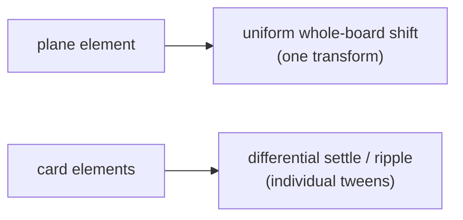

**Invariant.** These two layers must **never share a transition**. Card
positions are anchored to the fixed constant `K = 4096`, so a card whose
`(t,b,n,span)` did not change receives **no style write at all** — enforced by
skipping the write, not by relying on idempotence.

### One-way flow: Call-order contract

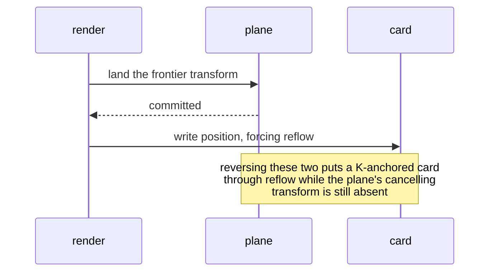

**Invariant.** A card anchored to the plane constant sits at a coordinate far
outside the viewport until the plane's cancelling transform is in place.
Reflowing one before that lands freezes a stale, enormous scrollable-overflow
region on the scrolling ancestor, which no later plane update corrects.

### Closed loop: Scroll compensation

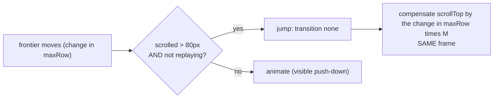

**Invariant.** Compensation is a **correctness** behaviour, not a motion effect
— it lands even under `prefers-reduced-motion`. Only the *transition* respects
the motion preference.

### Closed loop: Backfill viewport restore

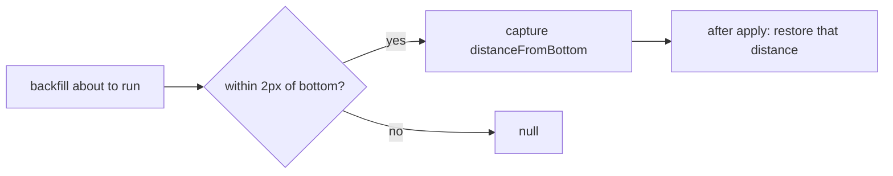

### Closed loop: Settle gate

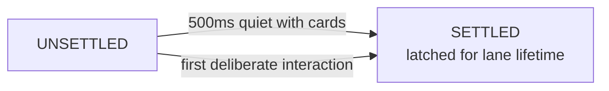

**Invariant.** Nothing animates until first settle; settling flips a flag and
**never triggers a render**. Deliberate gestures only — `scroll` is
*deliberately absent* from the interaction list because programmatic
compensation and backfill restore fire it.

### Closed loop: Deferral and reveal

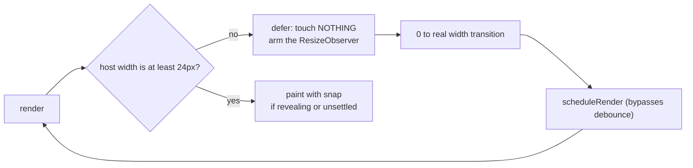

**Invariant.** Deferral guarantees zero writes while unmeasurable, so the
pre-hide rendered state **is** the committed state — a reveal is a correction,
not a rebuild. Rebuilding unconditionally made rapid hide/reveal flapping
(a composer pane growing over the stream) rewrite every card per flap.

### Closed loop: Resize debounce

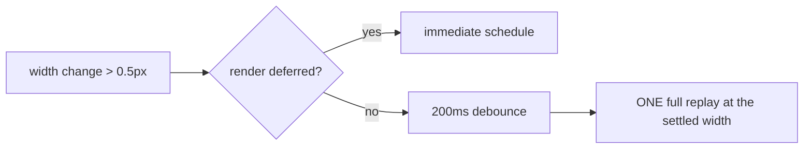

### Closed loop: Image resolution

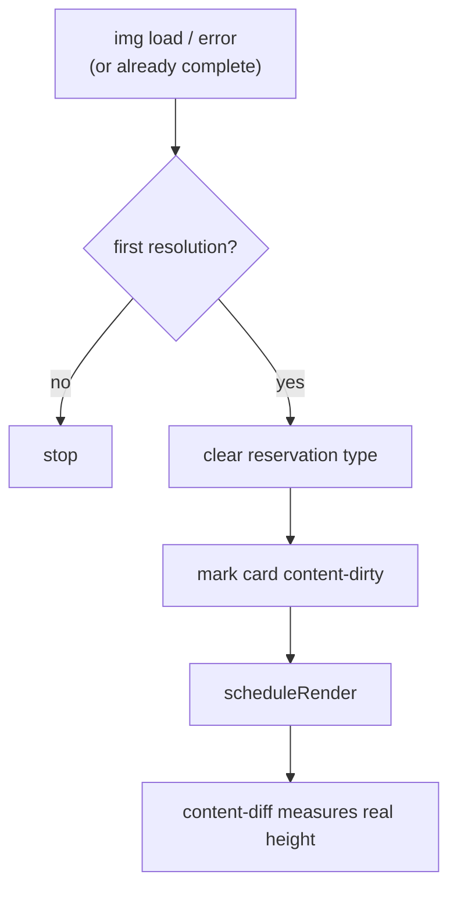

**Invariant.** The node is never replaced by a load event, so the reservation
stamp would otherwise persist forever and the card would never measure its real
content.

### Closed loop: One-shot fonts correction

```mermaid
flowchart TD
  M["measured while fonts.status is not loaded"] --> A["arm once"]
  A --> R["document.fonts.ready"]
  R --> U["unsettle + invalidate geometry"]
  U --> S["one correcting full replay"]
```

**Invariant.** Dormant today (serve ships system fonts), armed for the day a web
font lands. Frozen cards keep their rows and the ResizeObserver watches width
only — nothing else would ever correct rows measured before the real font
arrived.

### Closed loop: Re-entrancy guard

```mermaid
flowchart LR
  T["any self-triggered render<br/>(resize, reveal, fonts, image)"] --> G{"frame pending?"}
  G -- yes --> X[coalesce]
  G -- no --> R["requestAnimationFrame"]
  R --> C["clear fingerprint, then render"]
```

**Invariant.** Render machinery must **never** call the gated render entry point
synchronously from inside a render. Re-entrant renders multiply content-diff
passes, liquid replays, and motion events — the load-time image cascade.

### One-way flow: Content-dirty is narrow

```mermaid
flowchart LR
  K[key] --> R{"node reused?"}
  R -- yes --> C["clean (nothing changed)"]
  R -- no --> P{"key was already known?"}
  P -- yes --> D["content-dirty"]
  P -- no --> I["new key uses insert/replay path"]
```

**Invariant.** Marking every render dirty re-measured and re-placed every liquid
card on every no-op render. A full replay clears all marks, because it already
re-measured everything.

### One-way flow: Geometry pass

```mermaid
flowchart LR
  W["container width, root font px"] --> C["colW = (W minus 11 times gap) / 12"]
  C --> B["baseSpan = smallest legal span<br/>whose lane width is at least 17rem"]
  B --> L["L = 12 / baseSpan"]
  L --> M["lines = 3 / 2 / 1<br/>M = round(lines times 1.25rem)"]
  C --> E["integer edges[0..12]"]
```

**Invariant.** `minLane` is **not a divisor**. Encoding it as
`floor(width / X)` to pick a column count roughly halves the achievable lane
count. Only the edges table may compute with `colW`; every other module derives
widths from the table.

### One-way flow: Reservations are rem-denominated priors

```mermaid
flowchart LR
  T["reservation type"] --> A["ack / quote reserves chrome + 2 lines"]
  T --> I["image reserves 8.75rem"]
  T --> L["imageLarge reserves 15.75rem"]
  T --> U["unknown has no reservation"]
```

**Invariant.** The card is **always measured**, placeholder included — the
placeholder renders at its reserved footprint via CSS, so measuring captures the
reserved element *and* the body around it. Reserving fixed rows for the
placeholder alone dropped the reply body and buried the operator's card.

---
