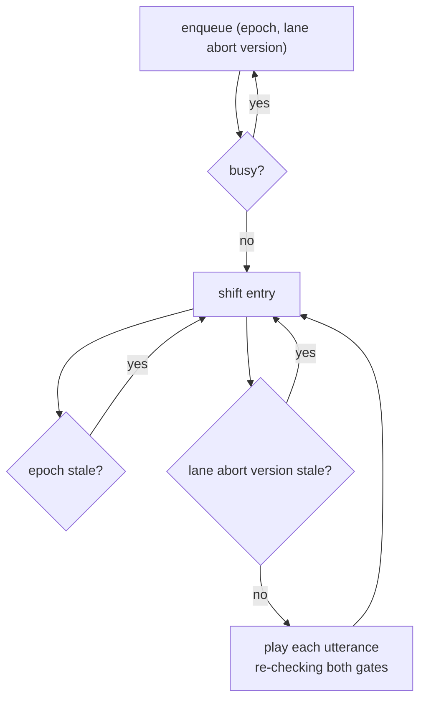
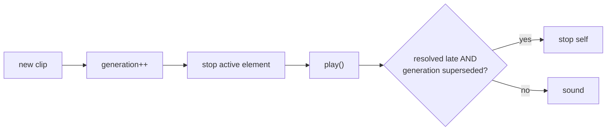
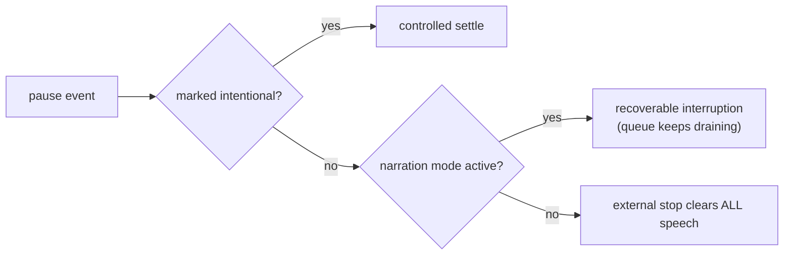
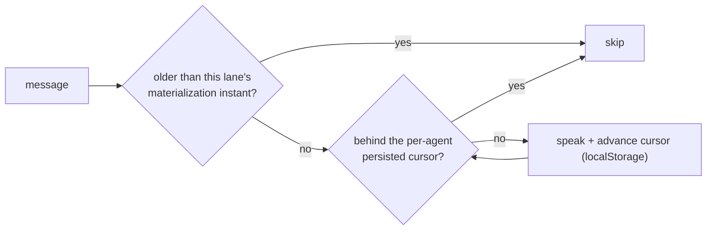
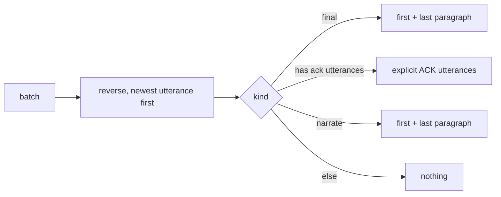
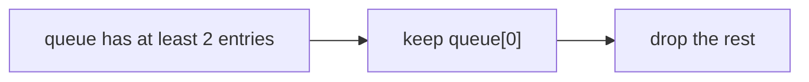

# Surface mechanics — Speech

[Surface mechanics](../mechanics.md) · [Spice product model](../README.md)
## Speech

### Closed loop: Queue drain with dual abandonment gates

**Invariant.** One global queue across all lanes. A hard reset bumps
`speechEpoch`; a lane abort bumps that lane's version. Stop is therefore
**immediate, idempotent, and global** even mid-drain.

### Closed loop: Single-owner playback

**Invariant.** At most one audio element sounds at any time. The generation
token exists because a `play()` promise can resolve *after* its clip became
stale.

### One-way flow: Intentional vs external pause

**Invariant.** An unmarked pause from OS media keys or a lock screen is a stop;
in narration mode it is an interruption. Clips also emit `pause` at natural end
— the marker is what disambiguates.

### Closed loop: Automatic narration cursors

**Invariant.** Two independent gates. The lane instant is a **pure UI concern** —
server lane lifetimes predate the browser session, but the operator only wants
to hear what arrives after they are looking. The persisted cursor (at most 500 agents)
survives refresh and reconnect.

### One-way flow: Newest-first enqueue, edge excerpting

**Invariant.** Explicit ACK utterances win. A `reply` card is a **non-final
ACK** — it acknowledges steering, it is not a final answer, so it never takes
the final cue.

### One-way flow: Backlog preserves the head

**Invariant.** A burst never queues minutes of stale audio; the utterance
already committed to is not cut off.

---
