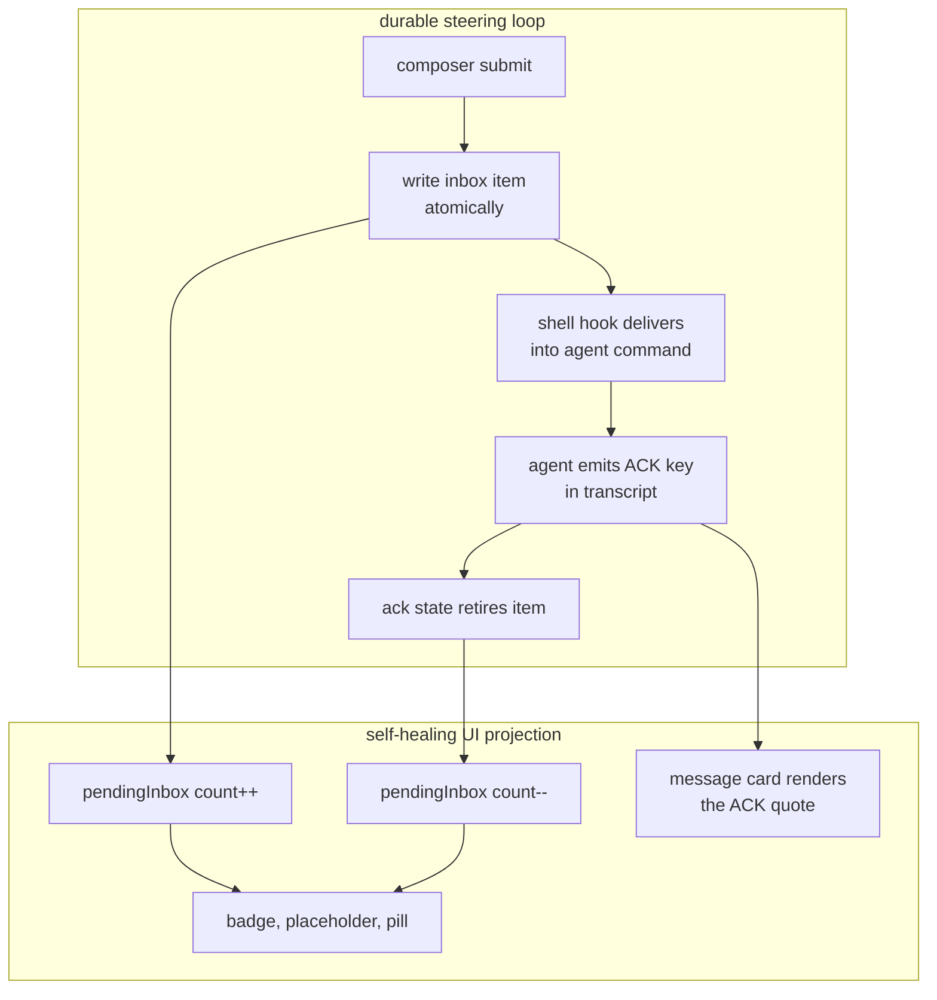
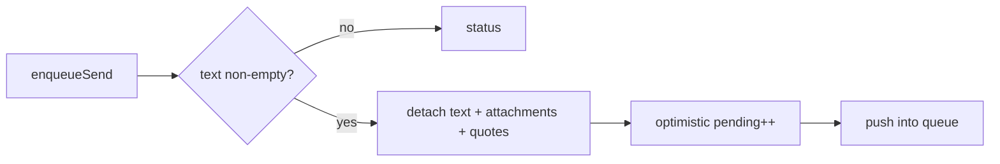
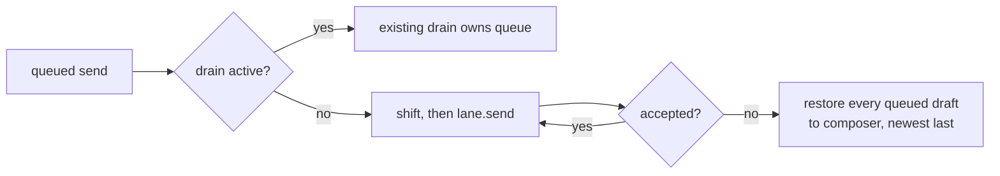
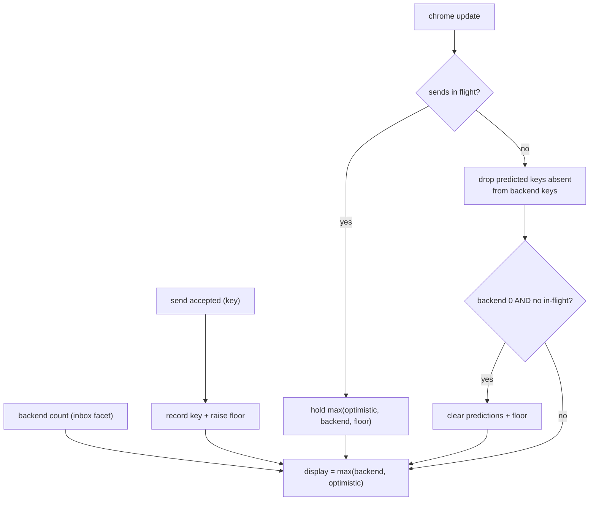
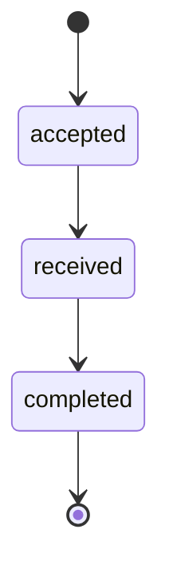
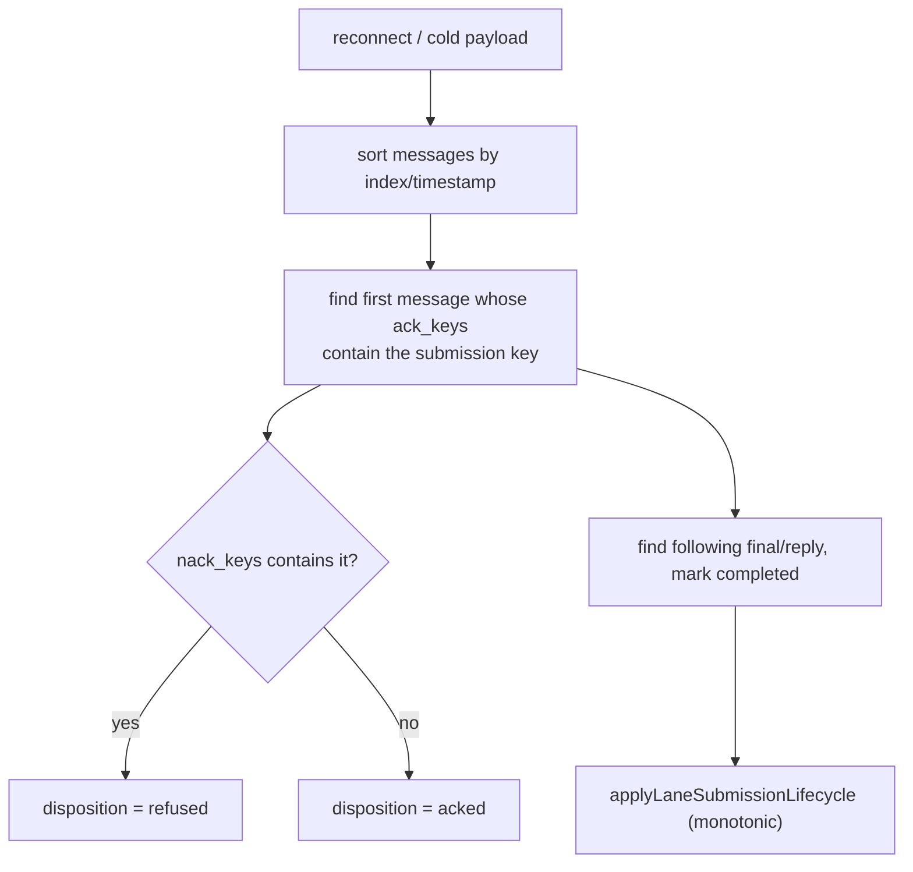
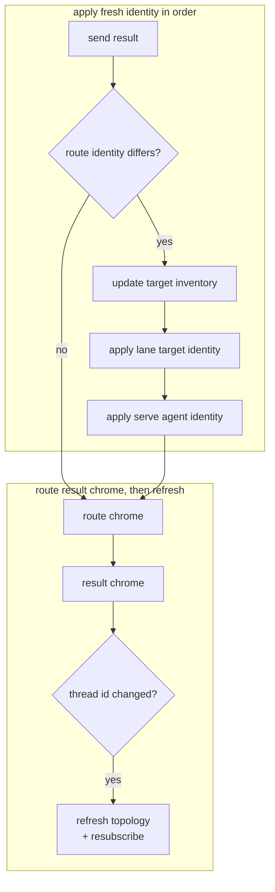
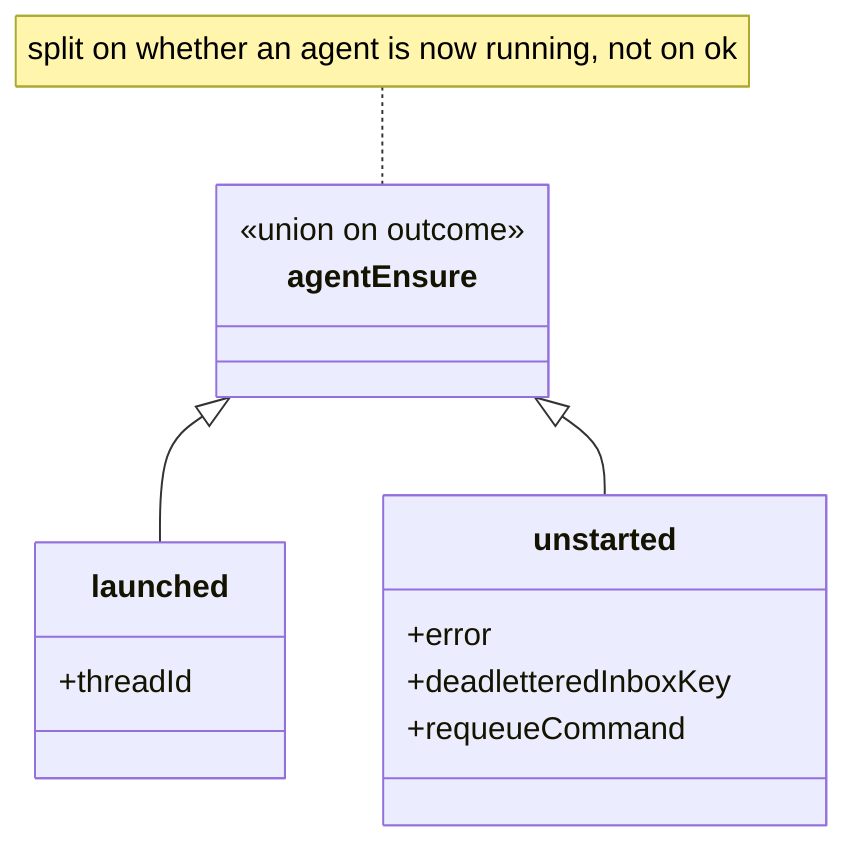
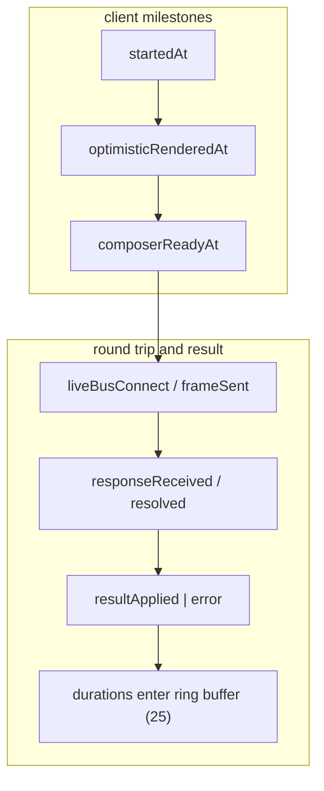
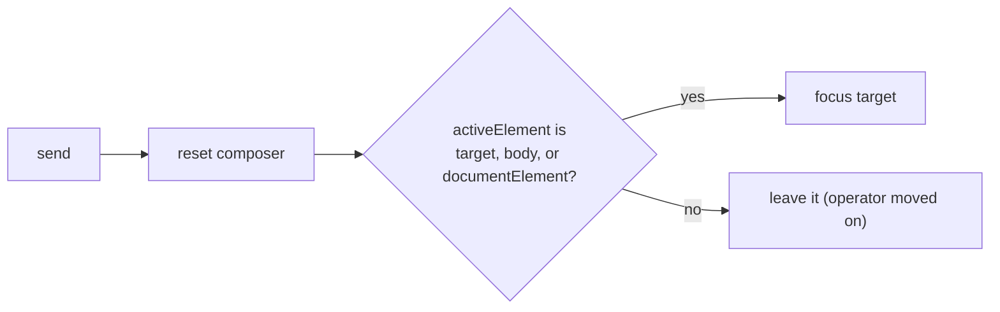

# Surface mechanics — Steering

[Surface mechanics](../mechanics.md) · [Spice product model](../README.md)
## Steering — send, pending, submissions

### Closed loop: The outer spice loop (what the UI is *for*)

**Invariant.** *Inbox items are never retired by a bare read* — only by a
semantic ACK in the transcript. The UI's pending count is a projection of that
durable queue, so it is self-healing: any lost optimistic prediction is
corrected by the next inbox facet.

### Closed loop: Send queue drain

The queued send joins the one serial drain already active for its lane, or
starts that drain itself.

**Invariant.** One drain per lane; a rejection **stops the queue** and returns
every undelivered draft to the composer, newest last. Sends are serialized per
lane so inbox order matches operator order.

### Closed loop: Optimistic pending reconciliation

**Invariant.** The optimistic count is a **floor**, never a source of truth, and
it is retired by *key identity* against the backend's key list — not by a
timeout, not by a decrement. That is what makes it converge exactly.

### Closed loop: Submission lifecycle (monotonic)

**Invariant.** Ranks are `accepted 1 < received 2 < completed 3`; a lower-rank
redelivery **never regresses** the stage, but its stage timestamps still merge.
Client keeps 50 per lane; server keeps 200 per connection.

### Closed loop: Submission reconstruction from the transcript

**Invariant.** The same progression is reconstructible from retained messages
alone. The live event stream is an **optimization**, not the only source — a
reconnect loses no lifecycle state.

### One-way flow: Send result updates identity, route, and chrome (ordered)

**Invariant.** Fresh-start identity is applied **before** route config and
inventory updates. A renewed session must not inherit stale identity from the
previous thread.

### One-way flow: Agent-ensure is a union on outcome

**Invariant.** Split on *whether an agent is now running*, not on `ok` — a skip
answers `ok: true` and starts nothing. Held as one object, a lane could bind
itself to a process no answer claimed to have started.

### Closed loop: Latency probe

**Invariant.** Marks are write-once (`if undefined`), so a retried phase never
overwrites the first observation. Server timing arrives on a separate
`lane.sendTiming` frame and is joined by requestId — including when it lands
*before* the probe completes.

### Closed loop: Composer focus restoration

**Invariant.** Detaching a focused quote drops focus to `<body>`; that case is
reclaimed. A *late* send failure must not steal focus back from wherever the
operator has since gone.

---
