# Surface mechanics — Stream

[Surface mechanics](../mechanics.md) · [Spice product model](../README.md)
## Stream — messages, ACK context, history

### One-way flow: Payload application order (state first)

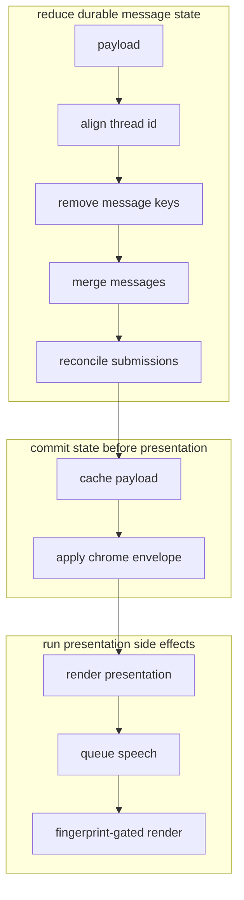

**Invariant.** Every step is idempotent under redelivery. The chrome envelope
must reach the store **before** anything paints from it.

### Closed loop: Known-message merge and trim

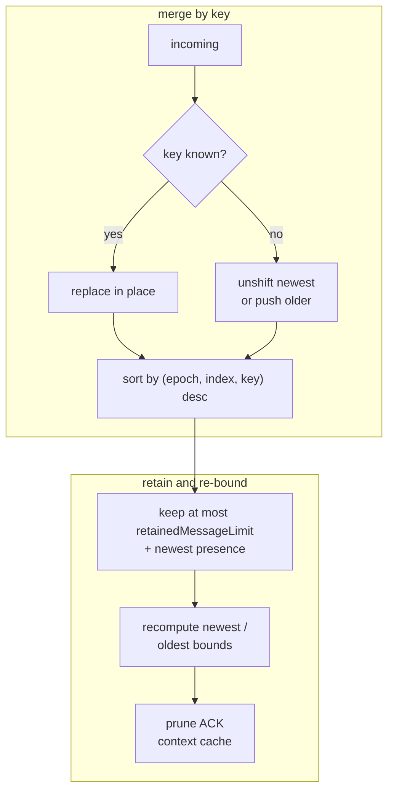

**Invariant.** Order mirrors the server's `_message_sort_key` exactly. Presence
records **do not consume** the visible budget but the newest one is retained.
Without the explicit sort, a full-window payload (the only place task cards
appear) would drop an older card ahead of newer live-appended messages.

### Closed loop: Thread change (renewal) preserves history

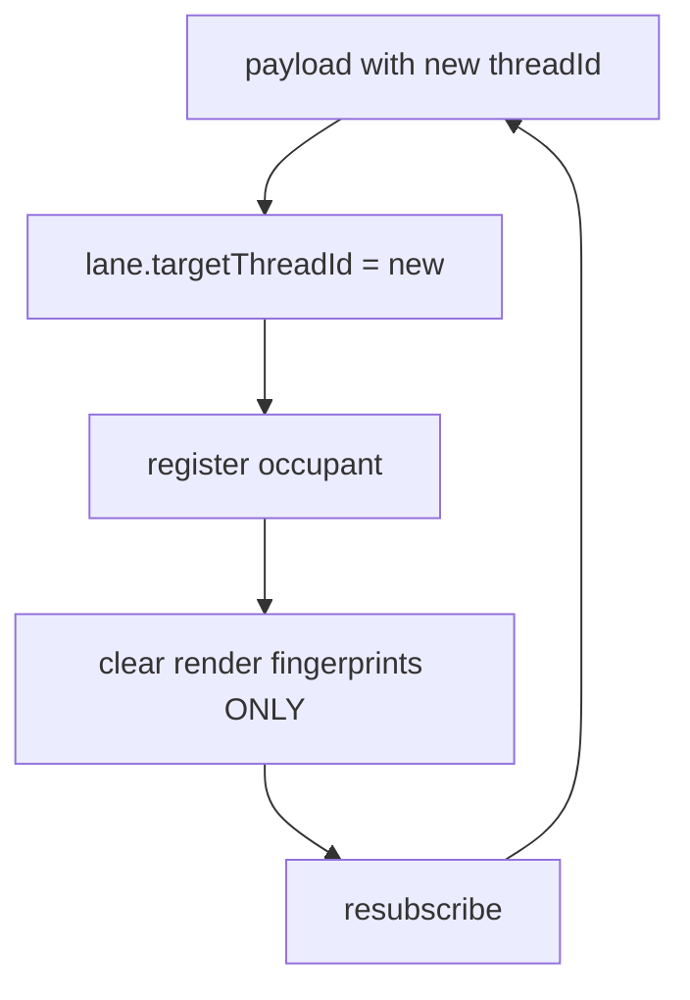

**Invariant.** The lane is the **operator's space, not the agent's**. A renewal
hands the lane to a new occupant identity; the retained message window survives
the handoff. Only the fingerprints drop, so the merged stream repaints cleanly.

### Closed loop: History paging

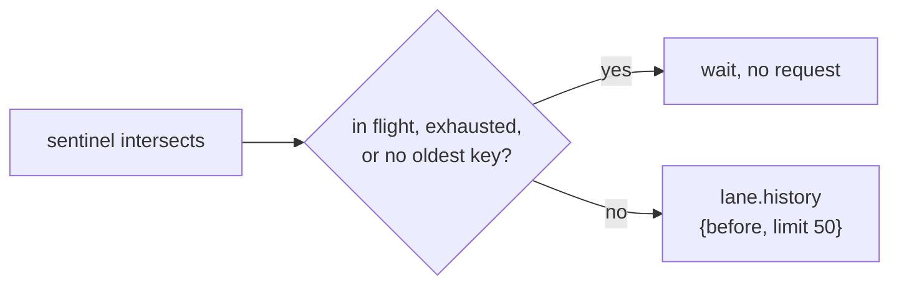

An admitted page either grows the retained window and renders, or latches
exhaustion.

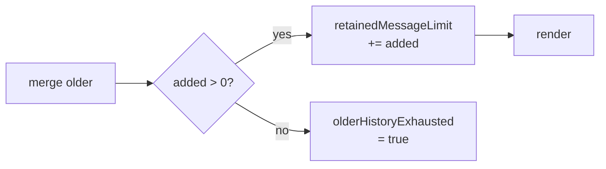

**Invariant.** The retained limit **grows** with hydration, so paged-in history
is not immediately trimmed away by the next merge. Exhaustion is a latch.

### One-way flow: Sentinel-per-member

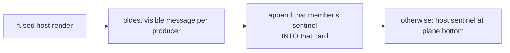

**Invariant.** Sentinels carry no lattice position; parenting them to an
already-positioned card reuses its real geometry for free. Each fused member
pages **its own** history independently.

### Closed loop: Tri-state

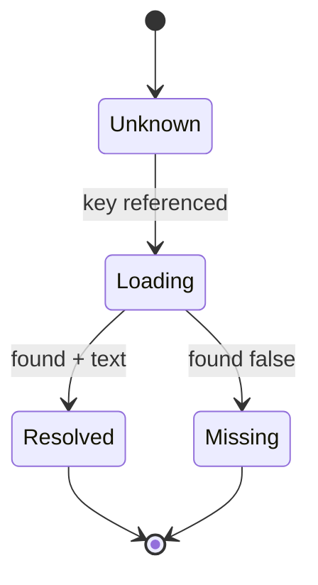

**Invariant.** *Confirmed-missing* is distinct from *still-loading*. The render
fingerprint encodes `"missing"` vs `""` so a failed lookup **re-renders** and
drops its skeleton instead of shimmering forever. Both states hold the same
reserved footprint, so resolution never reflows the card.

### One-way flow: ACK context lookup traverses the fusion

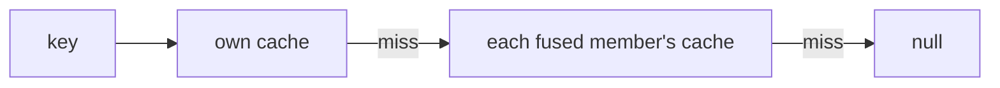

**Invariant.** Missing-ness resolution mirrors the same traversal — a member
that *has* the context wins over a member that confirmed it absent.

### Closed loop: ACK context cache pruning

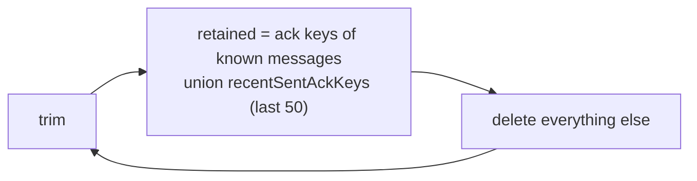

**Invariant.** Keys just sent by this browser are retained even before their ACK
lands, so the operator's own steering renders its quote immediately.

### Closed loop: Fingerprint-gated render

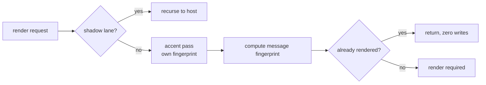

A required render commits its fingerprint only after the mosaic and all
dependent presentation state complete.

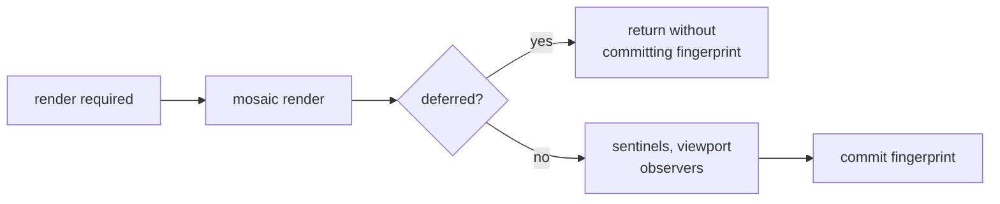

**Invariant.** A deferred render **must not** commit its fingerprint — the
content stays pending and the reveal path repaints it. Committing would leave
the lane permanently blank until new content arrived.

### One-way flow: What is (and isn't) message identity

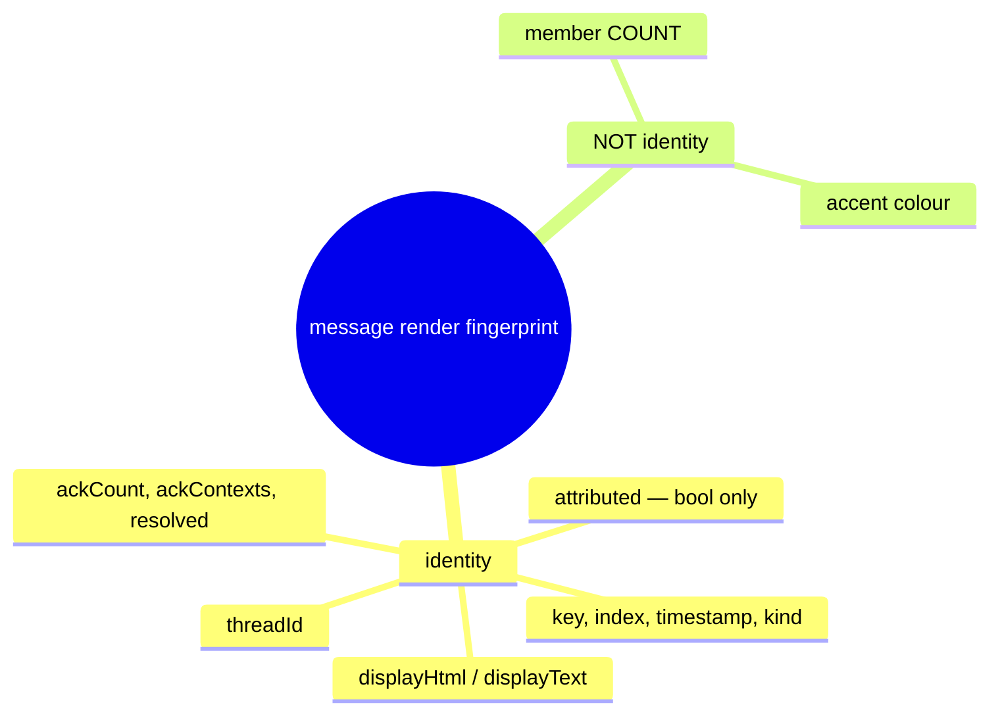

**Invariant.** Member *count* is deliberately excluded: nothing per-card depends
on it, and including it rebuilt and re-measured every card each time an agent
joined. Accent rides its own fingerprint and a **style-only** pass — no
measurement, no mosaic touch, so a composer reorder recolours in place.

### One-way flow: Occupant registration

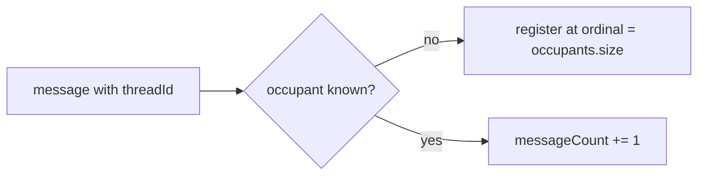

**Invariant.** First-observation order, never arrival-race order. A lane is an
envelope over the agents that have inhabited it.

### One-way flow: Time rules are derived, not stored

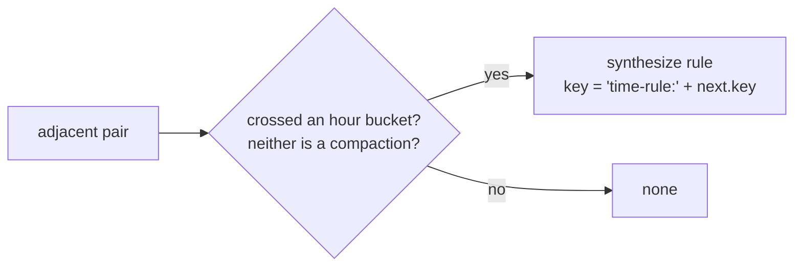

**Invariant.** Rules derive deterministically from the visible items, so they
never perturb the render-fingerprint contract, yet get a stable derived key so
they participate in the persistent lattice.

---
