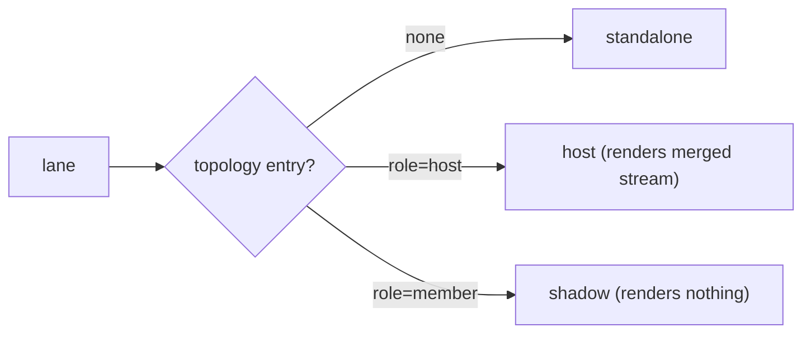
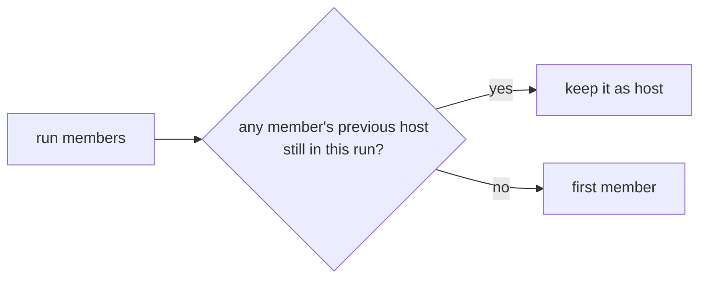
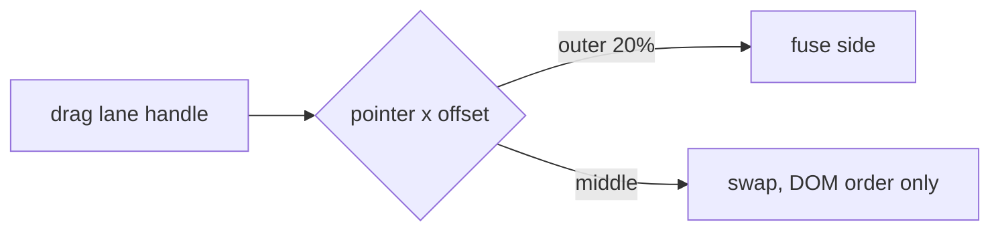
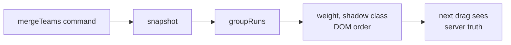
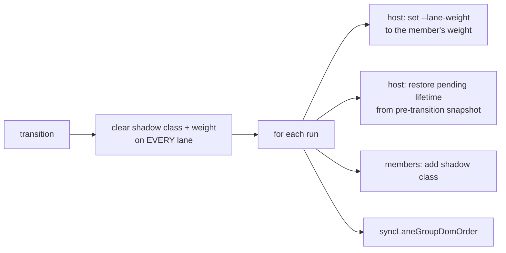
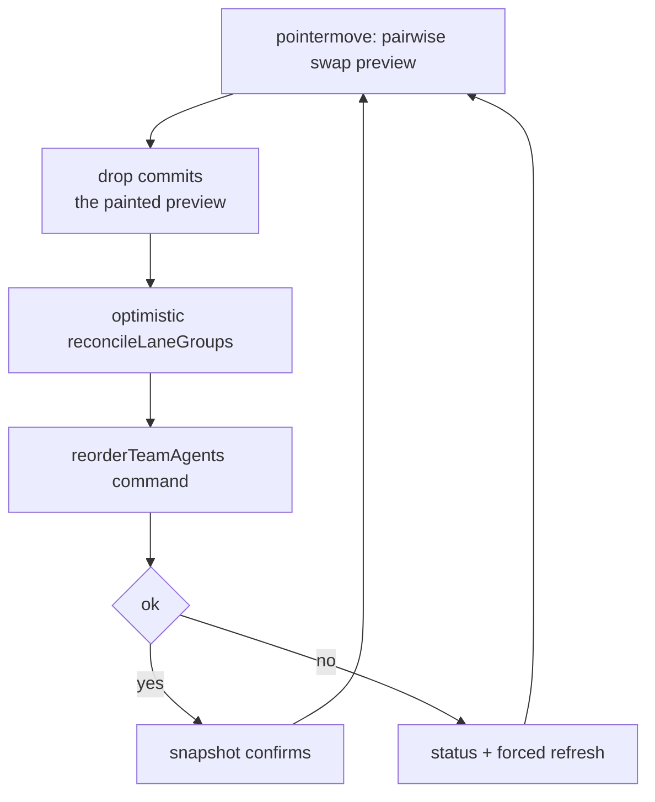
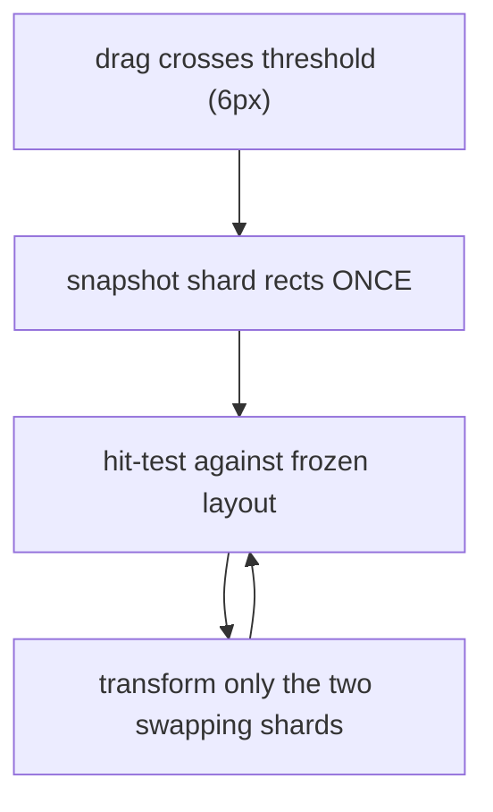
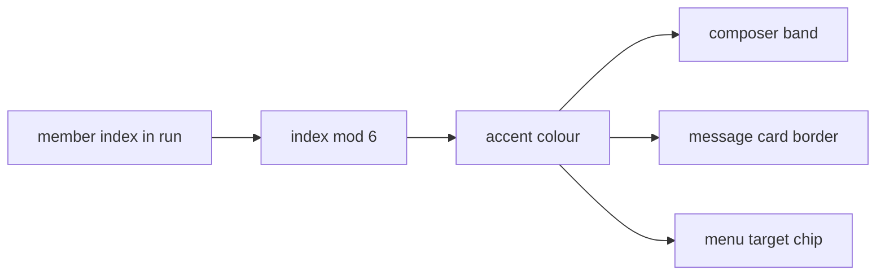
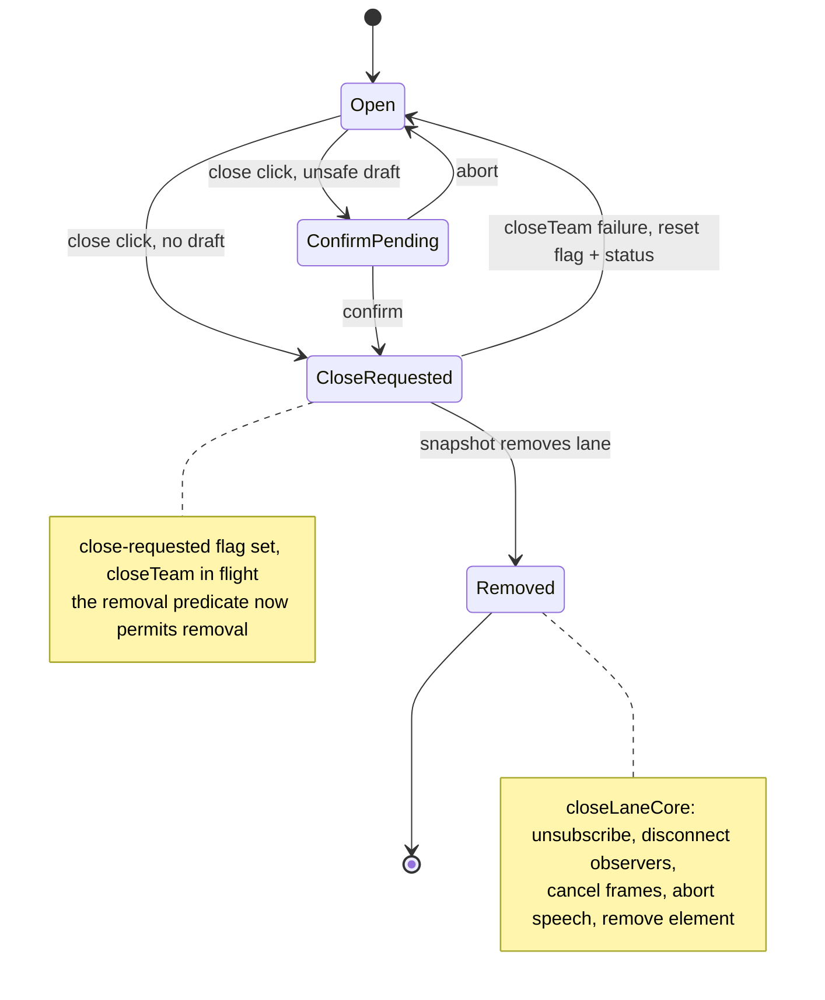
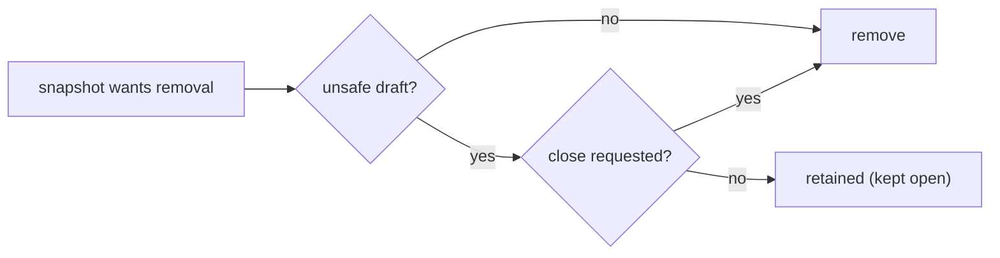

# Surface mechanics — Topology

[Surface mechanics](../mechanics.md) · [Spice product model](../README.md)
## Topology — lanes, teams, fusion

### One-way flow: Role resolution

**Invariant.** A shadow lane **never paints itself**; its messages flow into the
host's one merged stream. The gated render entry point on a member recurses to
the host. Members remain the concrete **send / refresh / drain addresses**.

### Closed loop: Stable host election

**Invariant.** Host identity survives membership churn. Re-electing on every
snapshot would move the visible lane, its scroll position, and its whole merged
stream across the board.

### Closed loop: Fuse by gutter drop

A fuse-side drop becomes server truth before the client materializes the next
interactive state.

**Invariant.** Fusion is a **server team merge**, not a client grouping. Swap is
purely presentational and never touches the server. Fuse is refused when the two
groups already share a member.

### Closed loop: Topology materialization

**Invariant.** Clear-all-then-apply, so a lane leaving a run is always restored.
Host lifetime **carries across the handoff** via the store's pre-transition
capture — otherwise a fuse silently reverts an in-flight lifetime change.

### Closed loop: Composer reorder — optimistic then authoritative

**Invariant.** The drop commits **`state.dropTarget` as last resolved by
pointermove**, never a re-resolution against release coordinates. Hand wobble on
release routinely lands outside the thin shard strip and would silently eat a
swap the preview was still promising.

### Closed loop: Reorder preview is measured once

**Invariant.** Hit-testing reads the frozen snapshot, never live rects. Moving a
neighbour into the hole must not reflow and feed back into hit-testing, which
puts the surface into a loop that oscillates its own scrollbars.

### One-way flow: Accent derived from member order

**Invariant.** Accent is a **pure presentation mapping**, deliberately outside
message identity. Every accent index is reduced mod 6 *at its source* so a
departed/renewed producer whose occupant ordinal grew past the palette recycles
a colour instead of throwing and aborting the whole render.

### Closed loop: Lane close

**Invariant.** Close is **requested**, not performed. The lane disappears only
when the snapshot says so. The close-requested flag is what lets the removal
predicate allow removal of a lane that still holds a draft the operator just
confirmed away.

### One-way flow: Unsafe-draft retention guard

**Invariant.** "Unsafe" = any composer text, attachment, or quote draft, **or**
any send still awaiting a backend key. The same predicate guards `beforeunload`.

---
