# Surface mechanics — Transport

[Surface mechanics](../mechanics.md) · [Spice product model](../README.md)
## Transport — the live bus

### Closed loop: Socket lifecycle

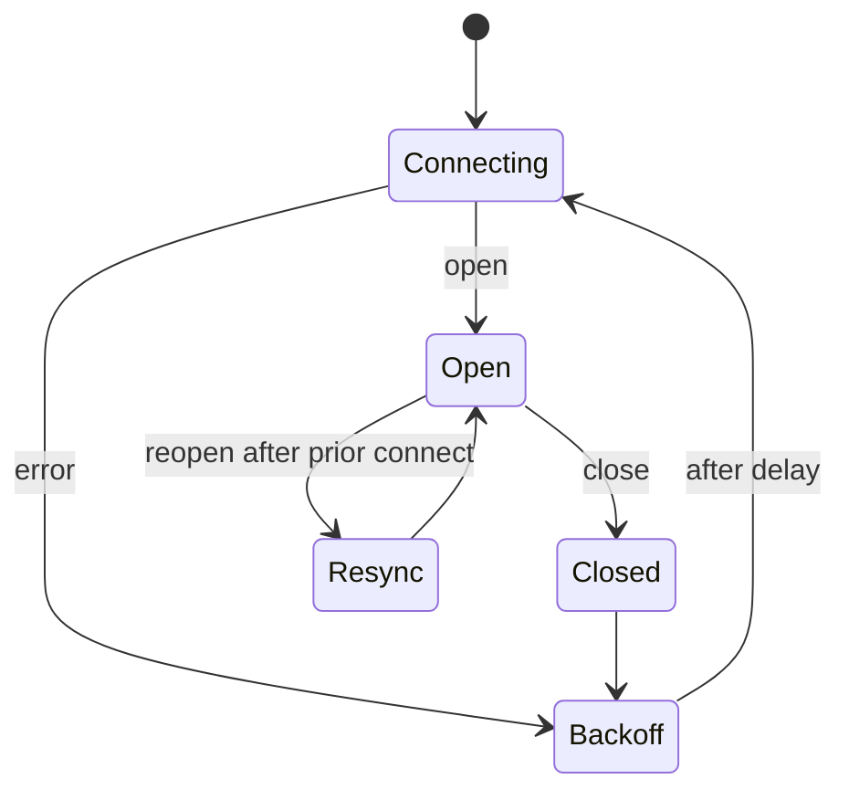

**Invariant.** Connecting resolves to a usable socket or rejects; it never hands
back an absent one. Backoff is exponential to a ceiling and resets on open. The
close handler is guarded by socket identity, so a stale socket's close cannot
tear down its successor.

### Closed loop: Heartbeat provokes the close it needs

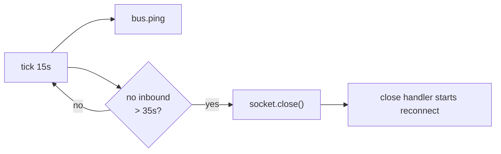

**Invariant.** A half-open socket never fires `close` on its own, so the
heartbeat *provokes* it and lets the single close path drive reconnect. The
socket closed is the one **this tick captured**, not whatever the current
reference holds by then.

### Closed loop: Reconnect resync

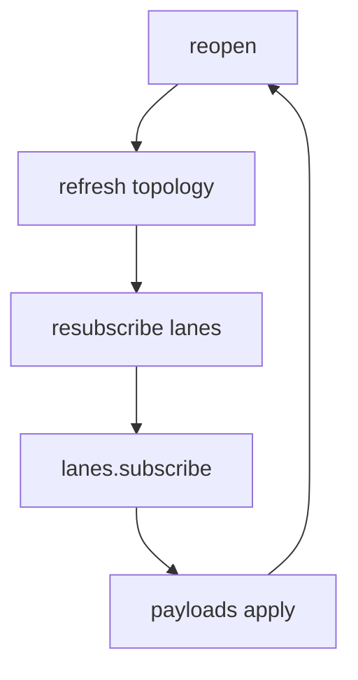

**Invariant.** Topology is refreshed **before** resubscribe. A lane may have
been renamed, renewed, or dissolved while the socket was down; subscribing
first would key on stale target ids.

### One-way flow: Request and response correlation

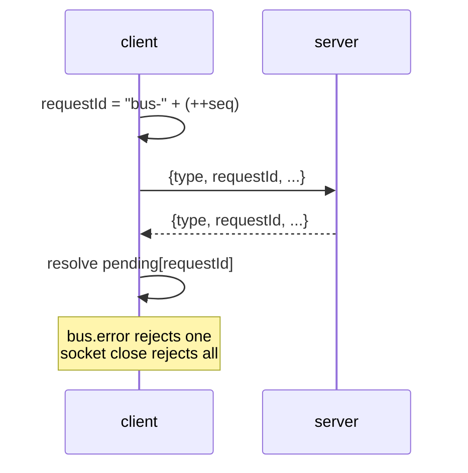

**Invariant.** Exactly one pending entry per requestId; the map is drained on
close so no promise outlives its socket. Frames **without** a requestId are
pushes and go to the push dispatch table.

### Closed loop: Subscribe coalescing (one frame per microtask)

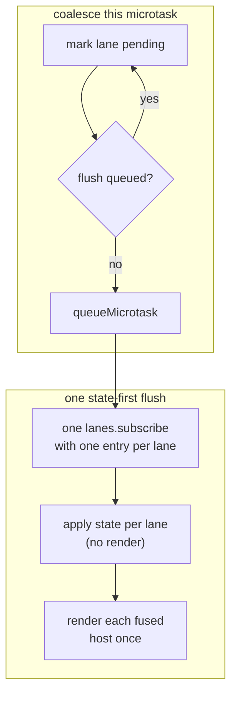

**Invariant.** Every subscribe trigger — snapshot mount, reconnect, thread
change, config revision bump — marks into one set that flushes as a single
frame. **State-first, then render.** A fused host must not repaint per arriving
member or the mosaic reshuffles mid-batch.

### One-way flow: Per-lane subscribe reply is independently faultable

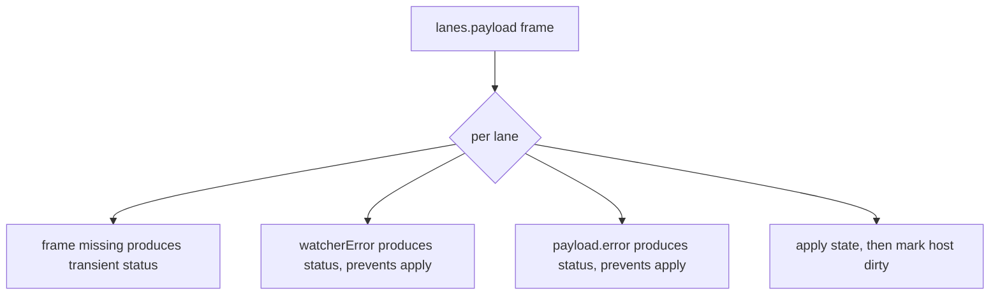

**Invariant.** A failed lane **keeps its batch slot**. Siblings apply and render
normally. One bad lane never voids the batch.

### Closed loop: Activity reconfiguration from focus and visibility

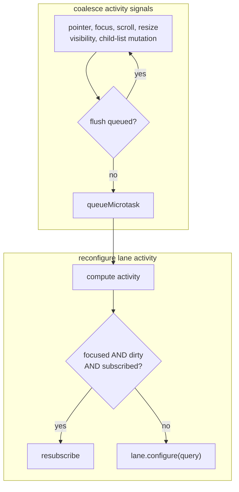

**Invariant.** Visibility is computed geometrically (lane rect intersected with board rect intersected with
viewport, `document.visibilityState`), never from a stored "is open" flag. The
`focused` field of the query is what the server keys background coalescing on.

### Closed loop: Background dirty coalescing (server to client)

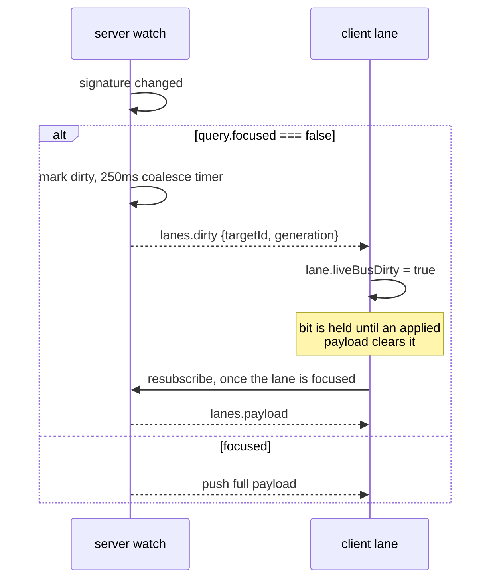

**Invariant.** An offscreen lane costs one aggregate frame per 250 ms, not one
payload per transcript line. The dirty bit is cleared **only** by an applied
payload — so a lane scrolled into view always catches up.

### Closed loop: Server watch loop

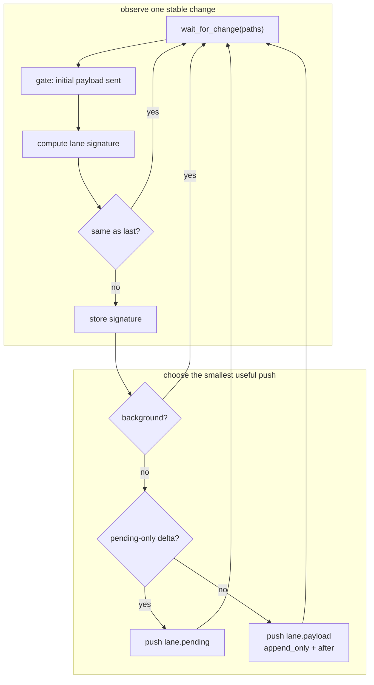

**Invariant.** The signature is `(transcript, inbox, other)`; comparing it is
what makes the watcher idempotent against filesystem noise. A **pending-only**
change pushes lane chrome alone — never a transcript re-read.

### One-way flow: Subscribe ordering gate

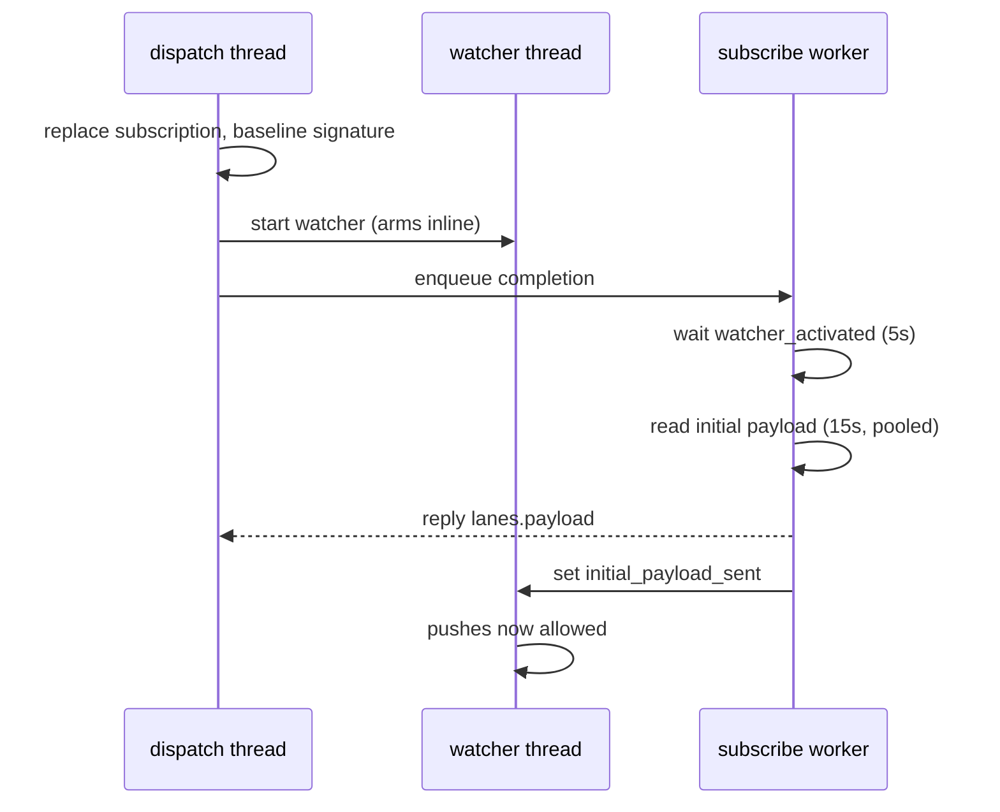

**Invariant.** The watcher arms **before** the initial read; the release gate
opens **after** the reply. A setup-racing edit is therefore delivered by exactly
one of {initial read, queued append push} — never both, never neither, never
out of order.

### One-way flow: Subscription generation gate

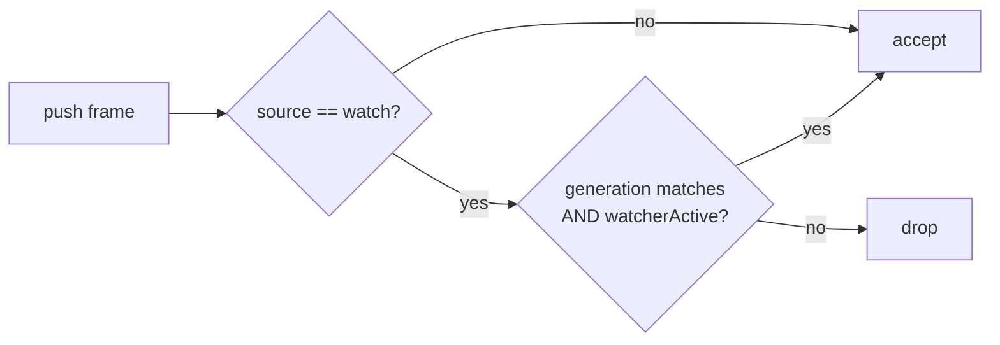

**Invariant.** Generation is `clientId:sequence`. A resubscribe mints a new one,
so in-flight pushes from the superseded watcher are dropped rather than
interleaved into the new stream.

### One-way flow: Per-target FIFO read chains

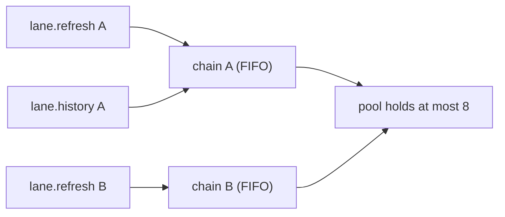

**Invariant.** Two reads on the same target apply **in request order**;
independent targets overlap. One slow lane never head-of-line-blocks
`bus.ping` or a sibling's send.

---
