# Product model — core — Control loops and boundaries

[Product model — core](../model.md) · [Spice product model](../README.md)
## Control loops

### Closed loop: The primary loop

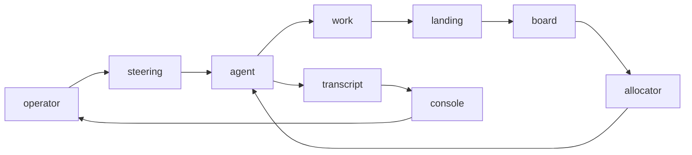

### Closed loop: Counsel

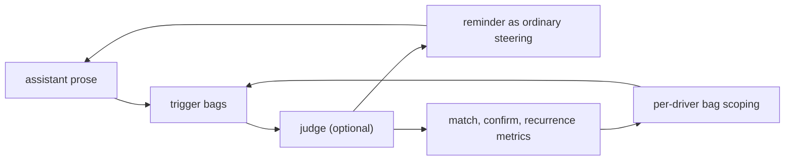

**Invariant —** A confirmed reminder returns as **ordinary steering** — the
same durable channel as the operator's own words. The counsel has no private
channel.

### Closed loop: Maxim mining

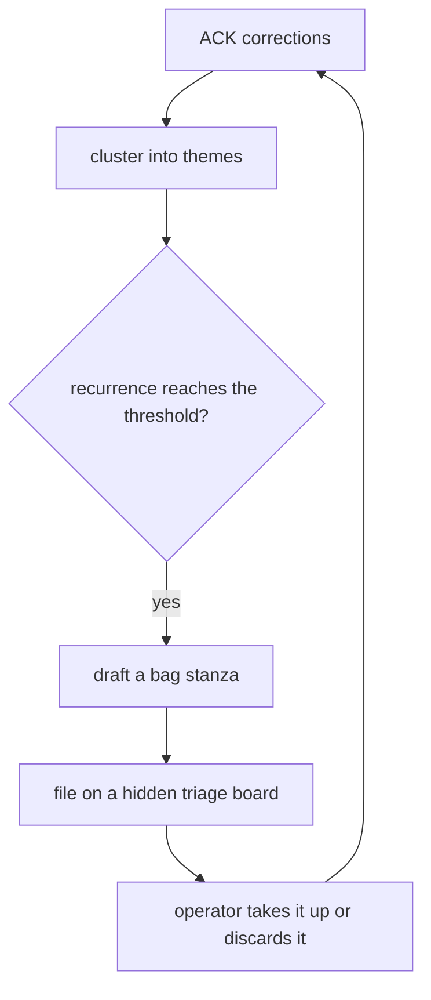

**Invariant —** New taste is *mined from evidence*, never invented. The
proposal lands as a task on a hidden board so it competes for attention like
everything else.

### Closed loop: Learning distillation

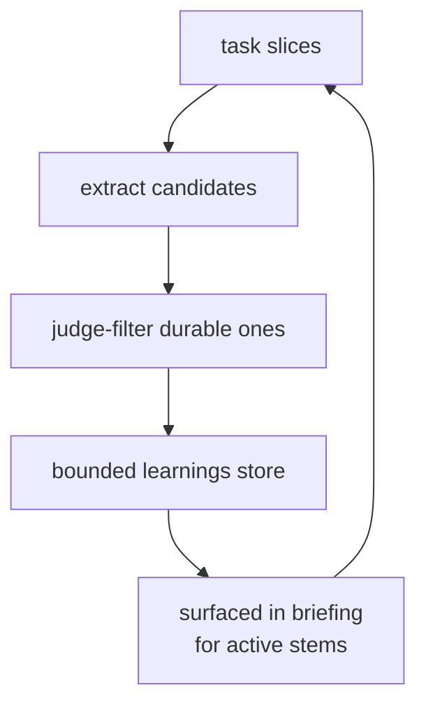

### Closed loop: Projection rebuild

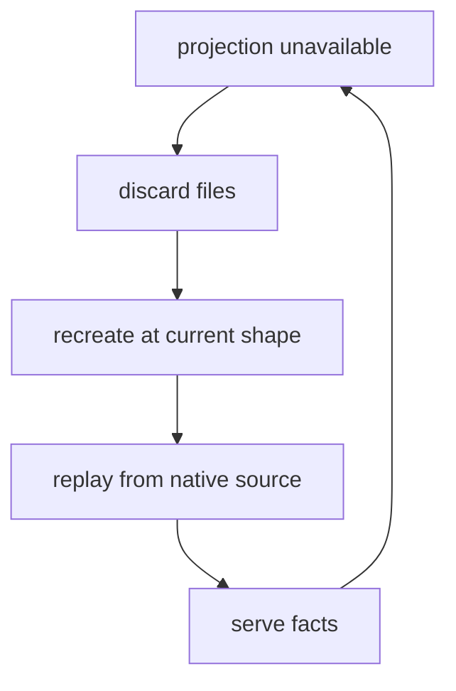

### Closed loop: Release

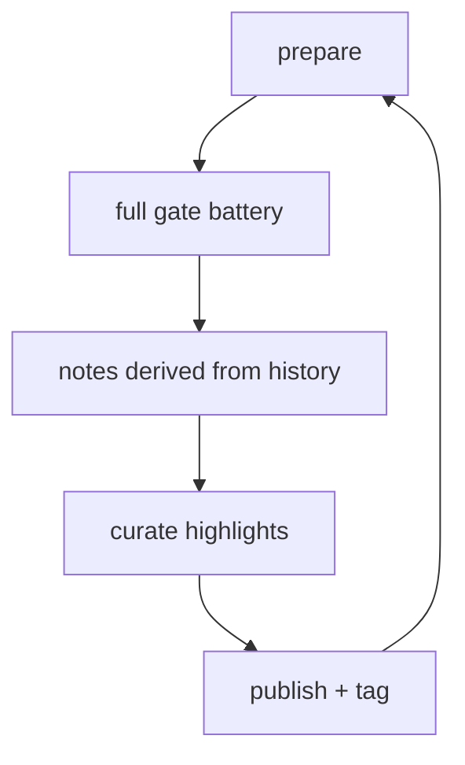

**Invariant —** Notes derive from git history, not a maintained changelog. The
ledger is already the record.

---

## Boundaries and seams

### The three git boundaries

**Invariant —** Agents never pull and never push. Git is touched at exactly three
control-plane moments, and no more.

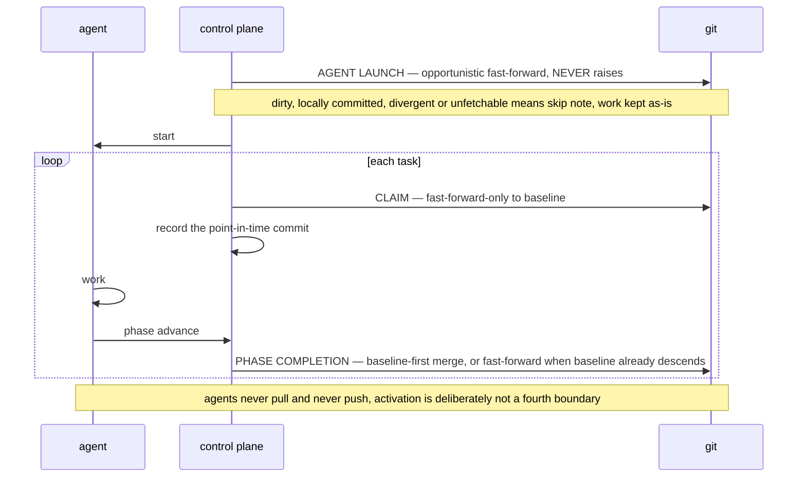

**Invariant —** The launch advance never raises. Dirty, locally committed,
divergent, or unfetchable lanes keep their work exactly as-is and start with an
explicit skip note. **A lane is never locked out, nor its tree mangled, by its own
checkout or an unavailable remote.**

**Invariant —** A real content conflict is the **one and only** thing surfaced to
the agent, and it is framed as *an overlap with the baseline* — never as a sync
with an upstream. The agent does not experience git as a distributed system.

**Invariant —** Activation is deliberately **not** a fourth boundary. Adding one
is a regression, not a feature.

### Landing refusals

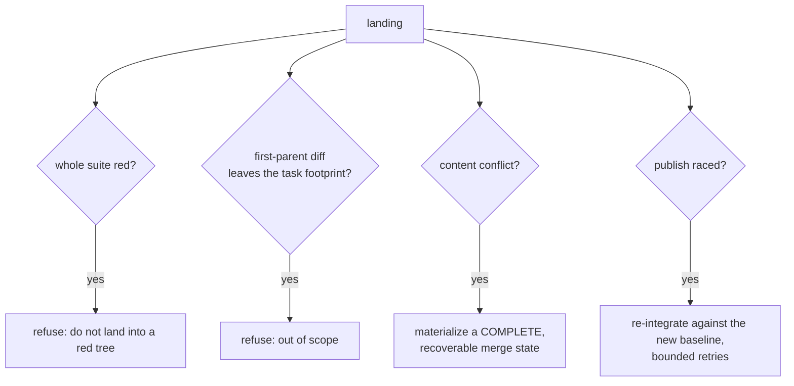

**Invariant —** A conflict is installed as a *complete* merge state or not at
all. The visible terminal state is either the untouched pre-merge tree or a
recoverable merge — never stranded markers.

**Invariant —** The task's **footprint** is the set of paths its own non-merge
commits touched. A landing that reaches beyond it is refused with a recipe.

**Invariant —** A publish race preserves every peer path before retrying.

### The rewind guard

The three boundaries govern when integration *writes*. A separate guard governs
what may be *unwritten*: a reference update on the checked-out branch that would
abandon commits already merged upstream is refused.

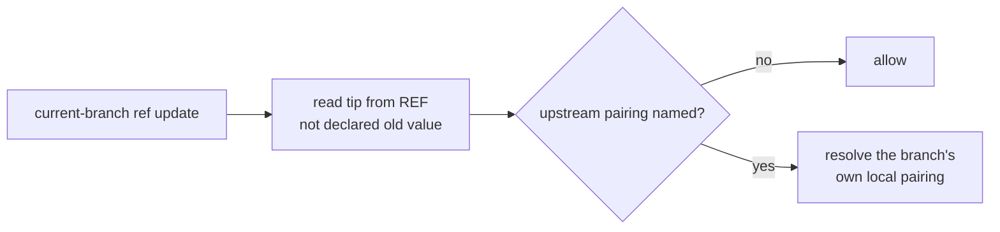

Only a non-appending update needs a resolvable upstream and an ancestry check.

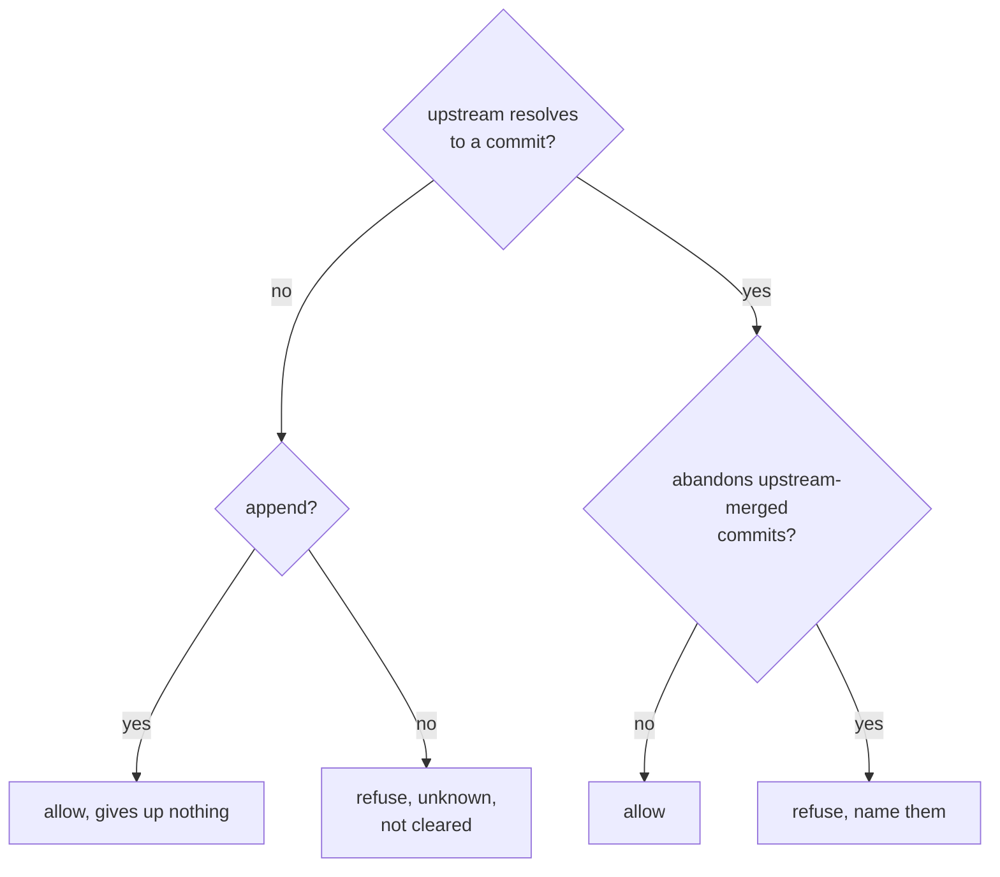

**Invariant —** The tip is read from the ref, never from the old value the
caller reported. Callers declare that field, and one that declares nothing sends
a zero value — under which a rewind reads as a branch being created.

**Invariant —** The upstream is resolved from the branch's own local pairing
and nowhere else. An alias can be aimed back at the branch itself by a
process-local configuration shadow, which would read every local commit as
already published; it is therefore not consulted **even as a fallback**, since a
fallback is precisely where such a shadow returns.

**Invariant —** Naming an upstream and resolving one are different questions,
and conflating them would let a pairing nobody can resolve read exactly like a
branch that tracks nothing. An append gives up no history and passes regardless;
only a rewind needs the answer, and without one it is refused as *unknown rather
than cleared*.

**Invariant —** The refusal names the commits at risk and directs the work
forward — continue with an append rather than amending or resetting backwards.

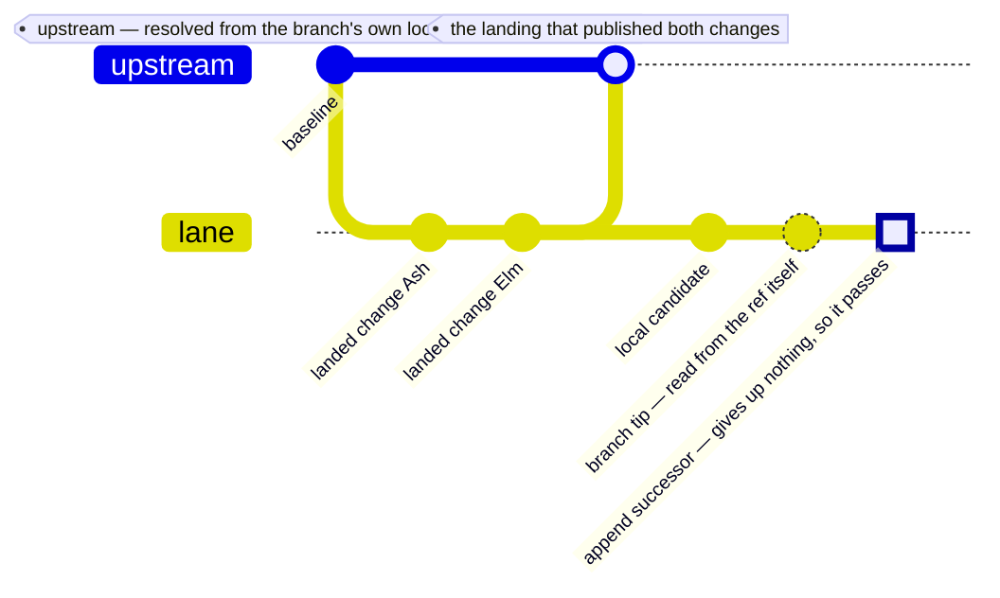

### The driver seam

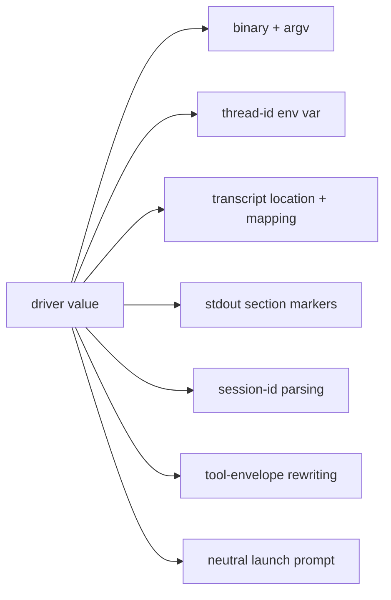

**Invariant —** Adding a driver is **writing one more value**, never adding mode
branches to consumers.

**Invariant —** Resolution order is explicit: environment, then configured
driver, then a default for unbound worktrees. Lane consumers resolve per
worktree; transcript consumers resolve per file.

### Configuration layering

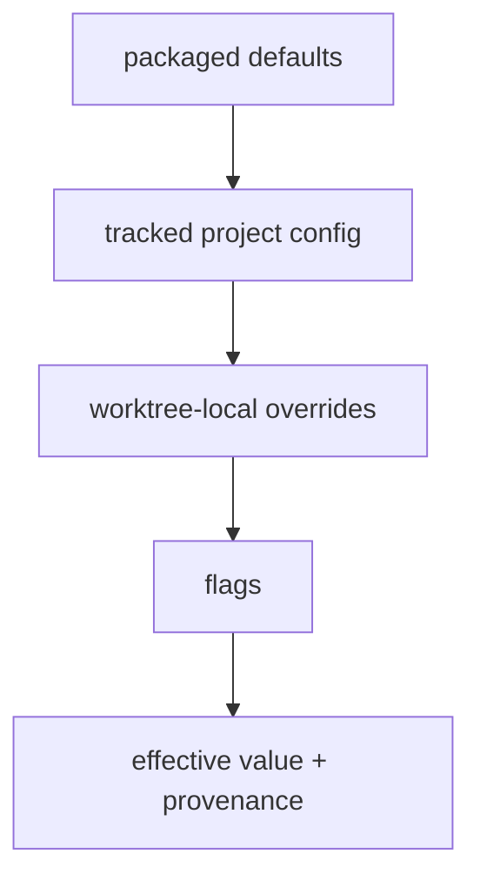

**Invariant —** Every effective value carries its **source provenance**. "Why is
this value what it is" is answerable without reading files.

**Invariant —** Bad configuration fails loudly. Opinions are configuration with
teeth, not silent defaults.

### Capability tiers

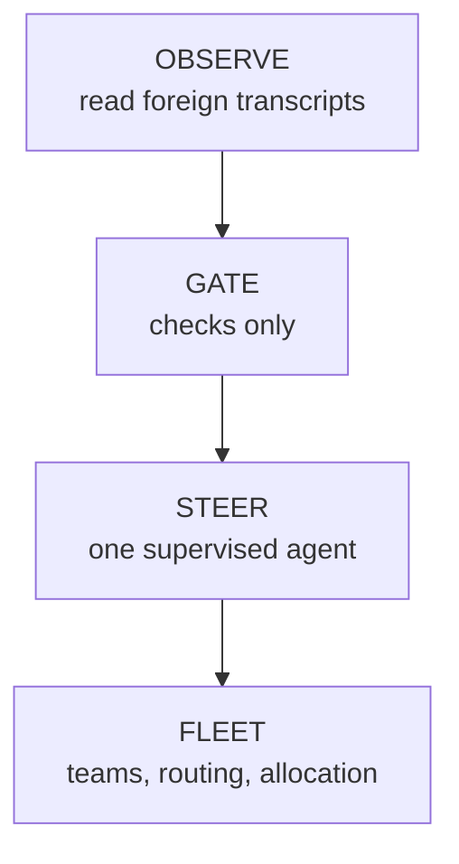

**Invariant —** Observation initializes nothing: no repository, no worktree, no
team state, no claims, no hooks, no steering, no supervisor socket. It is
strictly read-only and says so.

**Invariant —** Each tier is independently usable. A user may stop at any rung.

---

## Concurrency and serialization

### What is serialized, and why

| Scope | Serialized | Reason |
| --- | --- | --- |
| one worktree's lifecycle decisions | yes | two decisions could double-launch |
| capacity, selection, claim, and start | yes, as one unit | a partial view expands capacity twice |
| sends within one lane | yes | inbox order must match operator order |
| reads per target | FIFO chain | two reads must apply in request order |
| reads across targets | parallel | independent lanes must not block each other |
| team mutations | optimistic, revision-checked | clients re-pull on loss |
| inbox publication | short-lived lock | atomic key minting |

**Invariant —** A slow read on one lane must never block a heartbeat, a send, or
a sibling lane. Interactive paths and bulk paths never share a queue.

**Invariant —** Optimistic concurrency, not locking, governs topology: carry the
revision you believe, and re-pull when you lose.

### Ordering guarantees

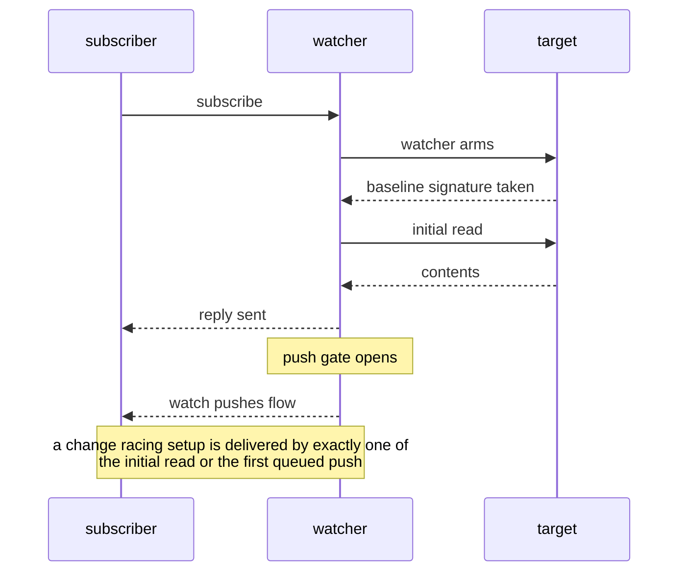

**Invariant —** A change racing setup is delivered by **exactly one** of {initial
read, first queued push} — never both, never neither, never out of order.

**Invariant —** A superseded subscription's in-flight pushes are dropped by
generation, not interleaved.

---
