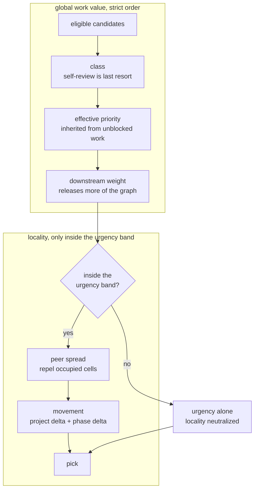
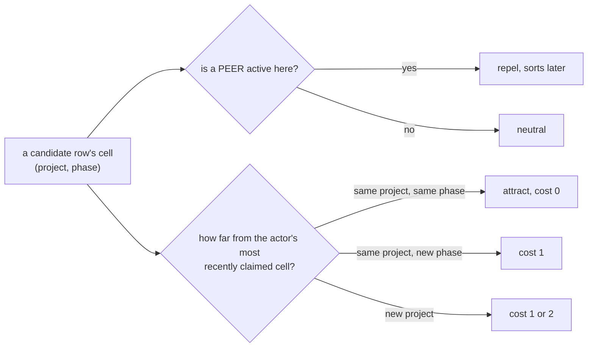
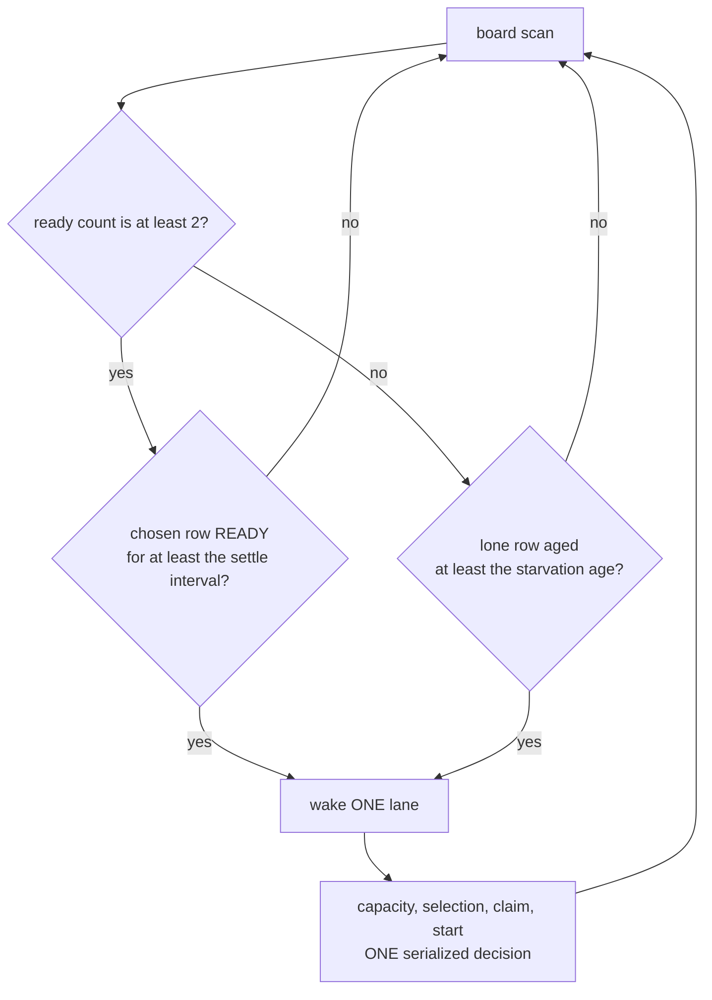
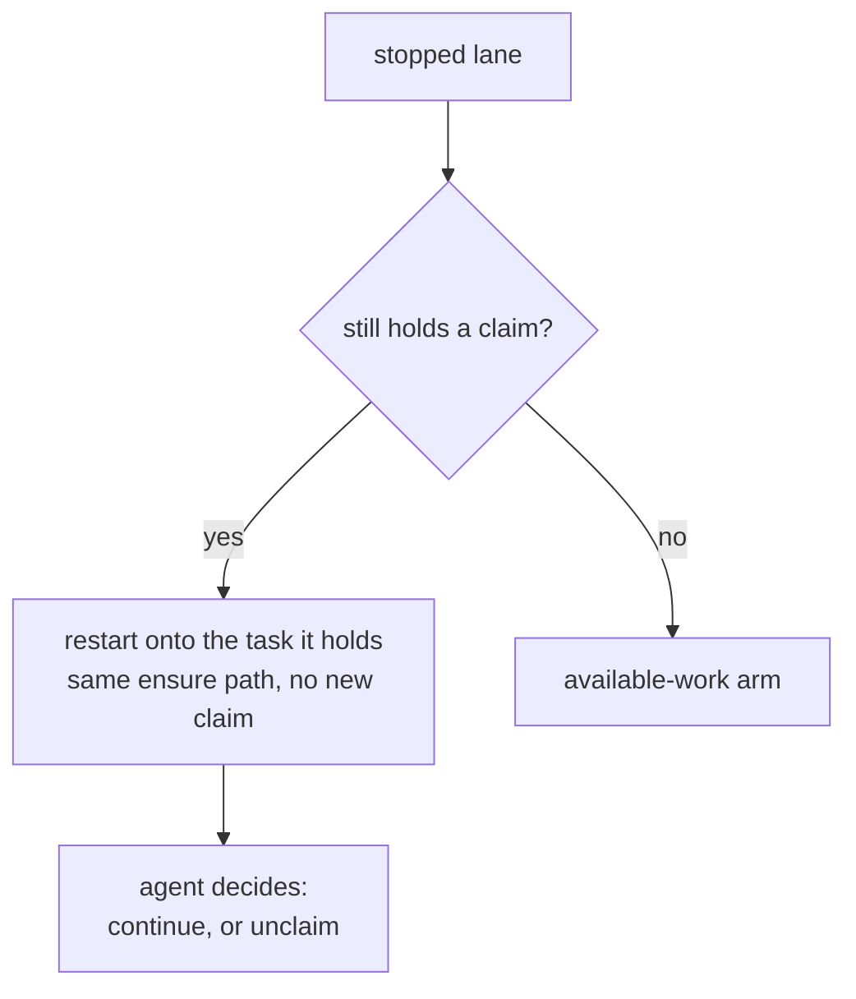
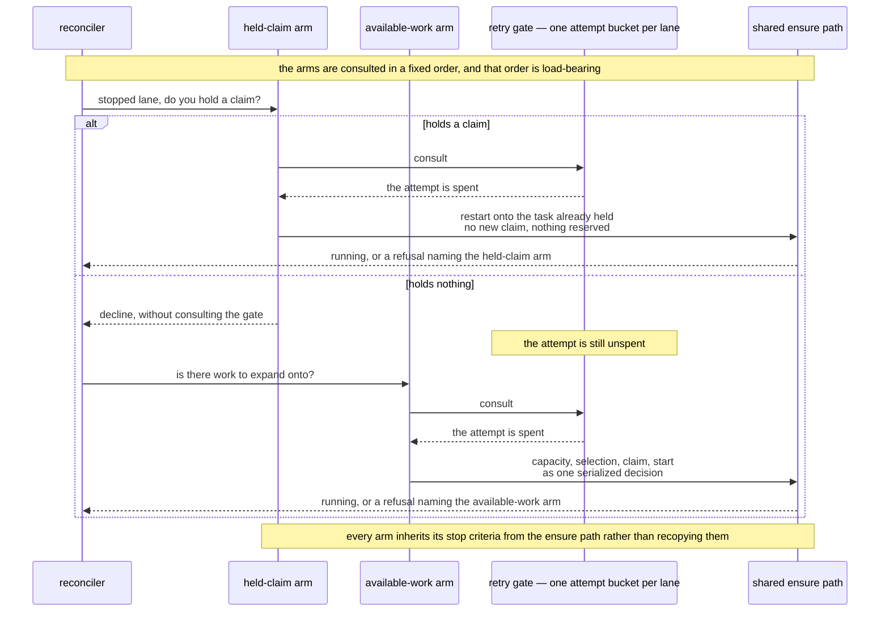
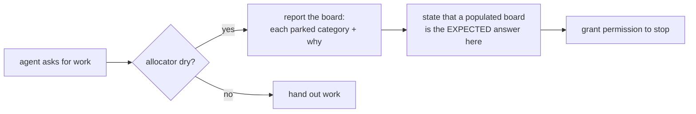
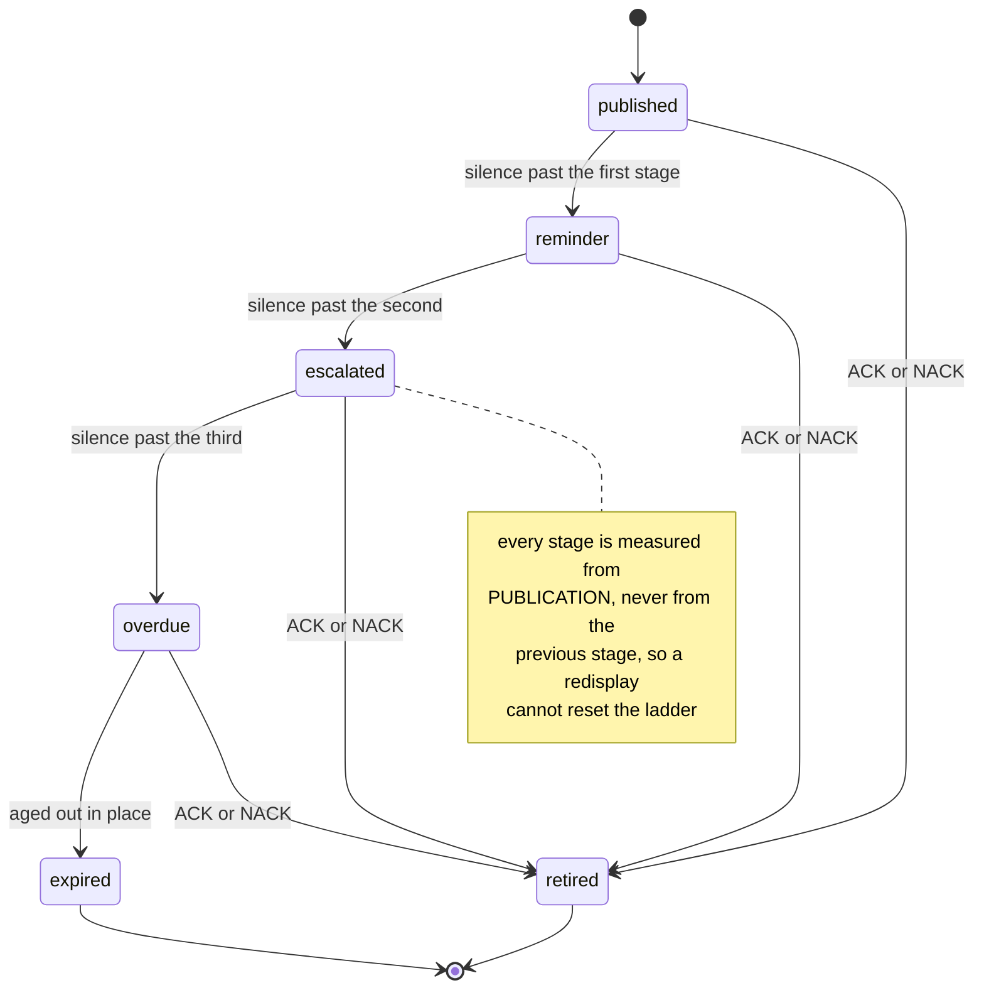
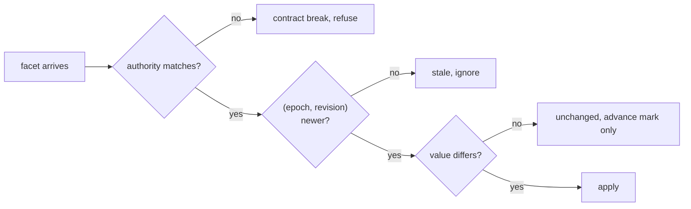
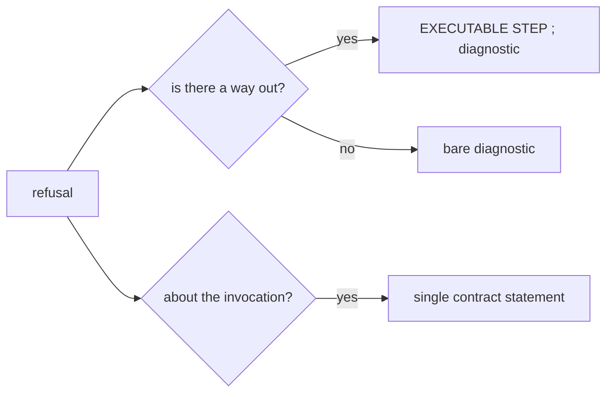

# Product model — core — Decision policies

[Product model — core](../model.md) · [Spice product model](../README.md)
## Decision policies

### The allocation ladder

The single most consequential policy in the product. Ordered, each level a
tie-break for the one above.

**Invariant —** A prerequisite **inherits the highest priority it transitively
unblocks**. Otherwise a critical task waits behind its own low-priority blocker.

**Invariant —** Locality is the *last* tie-break, never an override. Stickiness
reduces context switching but must never starve the graph.

**Invariant —** Self-review is never *excluded*, only ranked last. A quiet board
still hands an actor its own review rather than stalling.

**Invariant —** Peer spread is anti-affinity: prefer a cell peers are not in, so
a fleet spreads across the board instead of converging on one area.

### The cell — one coordinate, read two ways

Both locality terms address the same coordinate. A **cell** is a (project,
phase) pair, and it is the smallest region in which two agents can meaningfully
collide or meaningfully help each other.

**Invariant —** Affinity and anti-affinity are the **same coordinate read in two
directions**: peers repel, the actor's own recent work attracts. Expressing them
over one unit is what keeps them commensurable — one cannot be tuned into
overwhelming the other by accident.

**Invariant —** Anti-affinity reads peers across the **whole board**, not only
through the actor's own route. A cell may be crowded by work this actor could
never be handed, and that is the point: spreading is about where the *agents*
are, not about where this actor's candidates are.

**Invariant —** Anti-affinity is a preference, never an exclusion. When every
ready row sits in a crowded cell the actor is still handed one — the same
discipline as self-review, for the same reason.

**Invariant —** Affinity is measured from the actor's **most recently claimed
cell only**. There is no accumulated history and no decay curve, so an actor that
moves to a new area pays for the move exactly once and is then local to where it
now is.

**Invariant —** Movement counts project and phase **separately and sums them**,
so a candidate that changes both costs strictly more than one that changes
either alone. Changing phase inside a project and leaving the project for the
same phase cost the *same*; it is compounding the two that is penalised. That
gradient is what makes an agent finish an area rather than skim across several.

**Invariant —** Both terms are gated by a narrow urgency band beneath the top of
the row's own group, and are **neutralized entirely** outside it. This is the
mechanism behind "locality never overrides the graph" — a merely lower rank is
not enough, because a lower rank still decides every comparison the levels above
it tie on, and they tie constantly.

**Invariant —** Outside the band, rows order by urgency alone and sort after
every in-band row. The band is therefore a statement about *comparability*: rows
far apart in urgency are not close enough for a preference about placement to be
allowed to speak.

### Closed loop: Capacity — the work-availability wake

**Invariant —** Exactly one lane per decision. A later scan must observe the
started lane before capacity can grow again.

**Invariant —** Two ready is the trigger: one to claim, one left on the board.
READY excludes active claims, so running lanes do not inflate the count.

**Invariant —** Starvation is an **age**, not a retry interval. After it, one is
enough.

**Invariant —** The settle interval prevents a burst from beating a running
agent's own done-to-next cycle, or grabbing a row the instant it leaves plan phase.

**Policy —** threshold 2, settle 3s, starvation 3min, ensure retry 5s.

### Held-claim restart — the arm that is not about capacity

An agent that stops mid-task takes its claim with it, and a claimed row is not
ready — so the work-availability arm is structurally blind to the one task that
would bring that lane back.

**Invariant —** The claim is **not** re-reserved. A launch reservation hands the
row back if the launch never reaches readiness, and releasing this one would put
a task on the board whose worktree still holds the stopped agent's uncommitted
changes.

**Invariant —** Because the arm takes no new work, it applies to **every driven
lane**, not only those permitted to expand onto the board.

**Invariant —** It recovers the *task*, not the session, and is explicitly not a
wake signal. The agent-facing surfaces say so, because a lane waiting on an operator and a
lane recovering its own task are different states.

**Invariant —** One retry-attempt bucket serves every arm for a lane, and
consulting the gate **spends** the attempt. Arms that can decline cheaply are
consulted first, so a lane holding nothing cannot throttle the arm behind it.
The ordering is load-bearing.

### The empty board is a result, not a fault

**Invariant —** A dry allocator arrives while the board still visibly holds
rows. Pointing the agent at those rows makes it conclude the allocator missed
something and go hunting for a row to unstick by hand. Report the board instead:
held by other lanes, waiting on dependencies, deferred until scheduled, on the
oops board.

**Invariant —** Permission to stop is bound to the single condition that grants
it, and the lookalikes are named so they cannot be generalized to: a board that
merely looks quiet, and a low pending count.

### The escalation ladder

The ladder is a race between silence and an answer, so what matters is not only
the rungs but that every rung has the same exit.

**Invariant —** Escalation is driven by *silence*, measured from publication, and
rides a stable lineage key so it reads as one intent insisting.

**Invariant —** Every rung exits the same way. Only a semantic answer retires an
item, so the ladder describes how loudly it is asked and never how it ends.

**Invariant —** Expiry is a **terminal state distinct from retirement**. An item
nobody answered and an item that was refused are different facts, and collapsing
them would make silence look like a decision.

**Policy —** reminder 15s, escalated 60s, overdue 300s, expiry 24h.

### Freshness and ordering

**Invariant —** Epoch names the authority's counter *generation* and only rises.
An authority that restarted and resumed from a lower revision still supersedes.

**Invariant —** Only a monotone count may be published as a generation. A hash
identity is refused at the producer, because a total order over random digests
pins a facet forever at whichever digest sorted highest.

### Refusal grammar (repair-first)

**Invariant —** A refusal that can name a way out states the **runnable command
first**, then the diagnostic. The reader who has just been stopped wants the way
out first.

**Invariant —** The rationale is structural, not stylistic: *an agent mid-claim
has no operator to ask and no second screen to read.* The message is the entire
interface.

**Invariant —** Two exemptions, because inverting them moves the reader further
from the fix: refusals with nothing to run stay bare; refusals about the
invocation itself stay one contract statement.

**Invariant —** Gate reports are a third shape: the finding board is the
evidence, then a summary that scores it. The board is not a diagnostic to be led
past.

---
