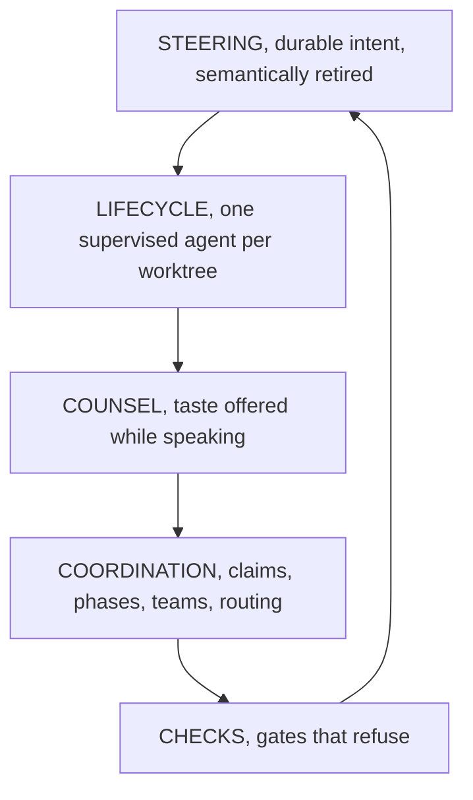
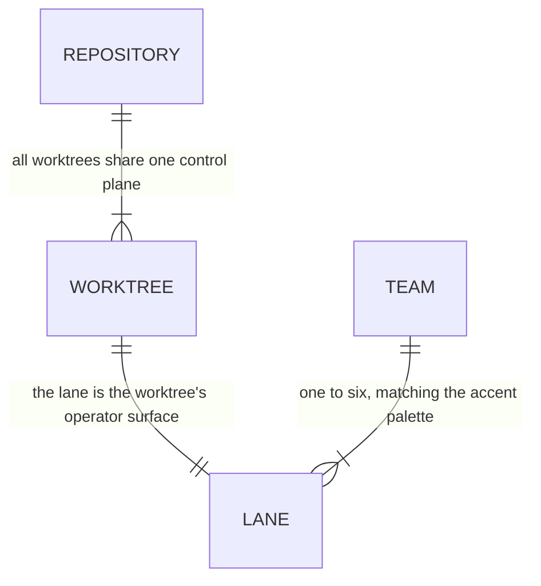
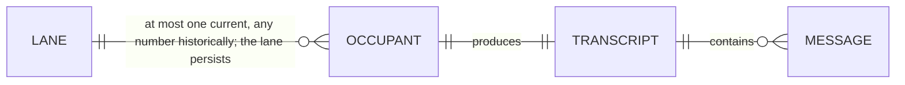
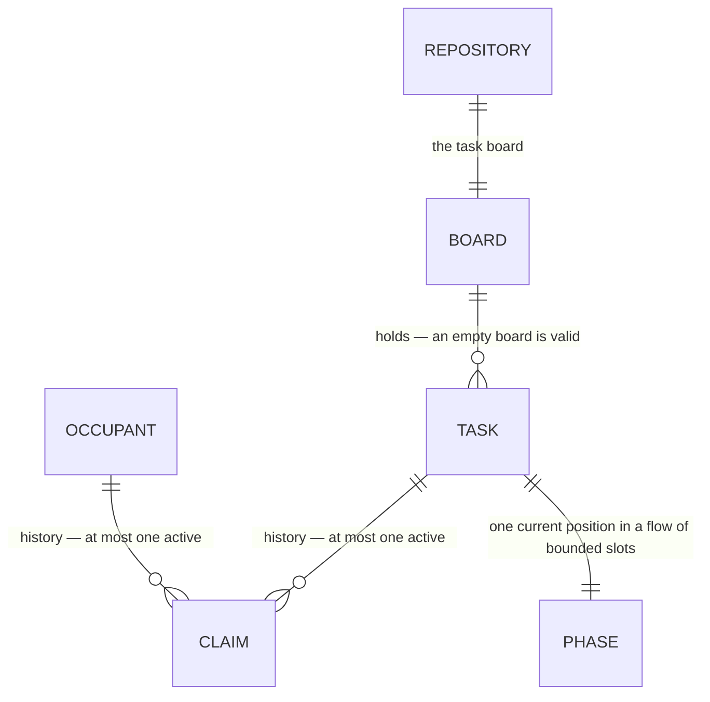
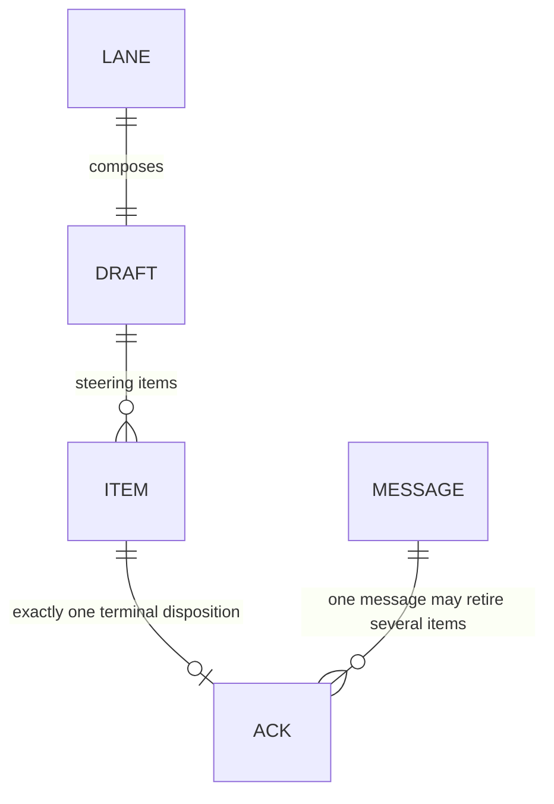
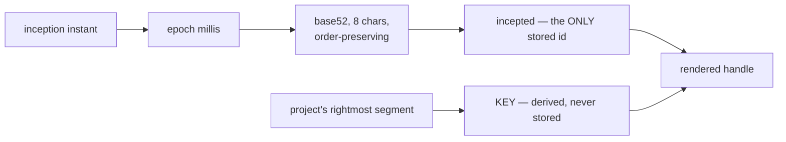
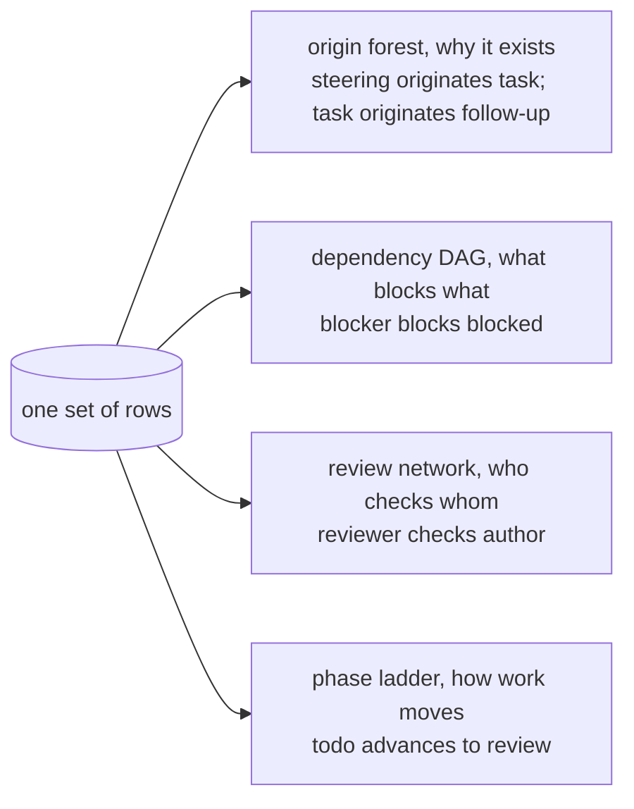
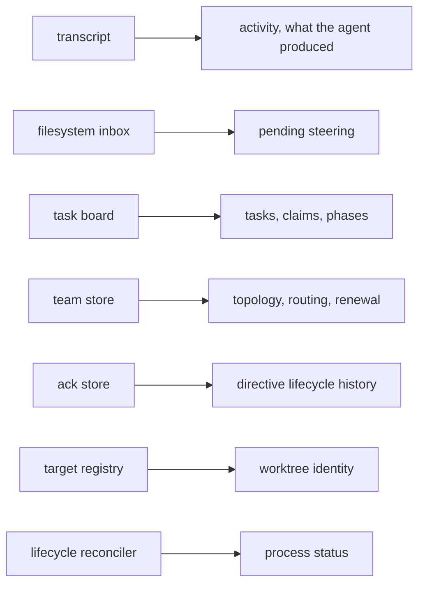
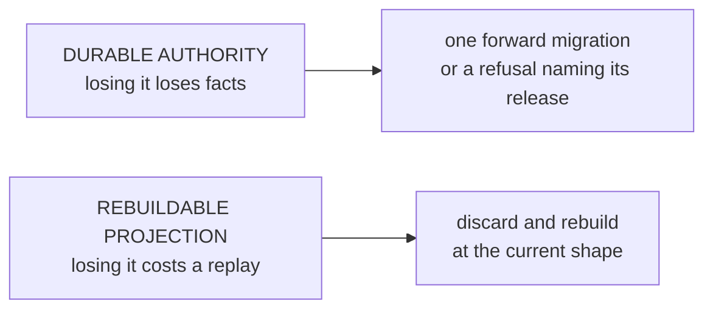

# Product model — core — Orientation and domain

[Product model — core](../model.md) · [Spice product model](../README.md)
## Orientation

### What the product is

An **operations console for a fleet of coding agents**. One operator supervises
many agents, each inhabiting a real git worktree, by reading their transcripts and
writing durable steering into their repositories. Supervision, coordination,
counsel, and repository checks are all *derived* from those two surfaces —
the transcript and the filesystem — rather than maintained separately.

### The planes

Each plane can be removed and the rest still runs — degraded, not broken. That
separability is a design property, and it is what makes the progressive
disclosure ladder in [First five minutes](failures.md#first-five-minutes) possible.

### Reading guide

| Label | Meaning |
| --- | --- |
| **Invariant** | must hold in any implementation |
| **Policy** | tunable, with reasoning given |
| **Incidental** | left open by the product model |
| **Closed loop** | reaches a fixed point |

---

## Domain model

### The entity map

The map is split by domain so cardinalities remain legible. `REPOSITORY`,
`LANE`, `OCCUPANT`, and `MESSAGE` repeat where they join the views.

The surface topology owns durable places:

Occupant history hangs from the durable lane and remains readable through its
transcripts:

The board owns work; claim history joins it to the occupants who did that work:

The lane owns forming intent; messages provide the evidence that retires it:

**Invariant —** A team of one is the degenerate case of a team of any size,
never a separate type. Every rule written for teams must hold for a team of one.

### Identity

**Invariant —** `incepted` is the sole stored identity. Everything else about a
task's name is derived.

**Invariant —** Re-homing a task to a different project changes its rendered
handle **for free**, because the key was never stored.

**Invariant —** The stamp is sortable as a plain string, so identity ordering is
inception ordering with no parsing.

**Policy —** The alphabet omits vowels in both cases, so a stamp can never
accidentally spell a word. Collisions advance the instant by 1 ms rather than
adding entropy, preserving sortability.

**INC** — the alphabet, the width, the separator.

### Independent task graphs

One set of rows carries several *different* graphs. None is visible from a list.

**Invariant —** The origin forest and the dependency DAG are **deliberately
different shapes**. Lineage is *why a task exists*; dependency is *a plan
skeleton*. Collapsing them loses both.

**Invariant —** The review network is the only record of who checks whose work.
It is a graph, not a field.

**Invariant —** These views are *rendered*, not merely queryable. The product
emits diagram source for each one — the shape of work is meant to be looked at.

### The authority map

Every fact has exactly one owner. This is the single most important table in the
product.

**Invariant —** No fact has two authorities. A consumer that needs a fact asks
its owner; it never re-derives it from a cheaper nearby source.

**Invariant —** Each authority carries its own freshness counter. There is no
global revision. A message that changes one fact must not invalidate another.

**Invariant —** A payload may carry any subset of facets, in any order, twice.
Consumers reduce by `(authority, epoch, revision)` and ignore what is stale.

### Storage classes

**Invariant —** The two classes never share a file, a connection, or a
transaction.

**Invariant —** A projection family must answer all of these or it does not
belong in the projection store: *where do its facts come from, what records how
far it got, how far back can that source be replayed, what refills it, what
can it still say when the source no longer reaches back far enough.*

**Invariant —** An authority migration is a **singular forward step**, never an
accumulating ladder. Refusing an unsupported shape without mutating it is
legitimate when the refusal names the release that owns the migration.

---
