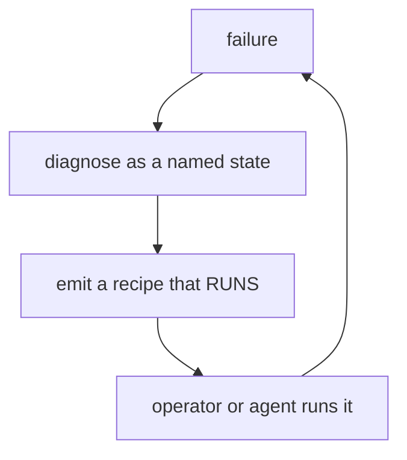
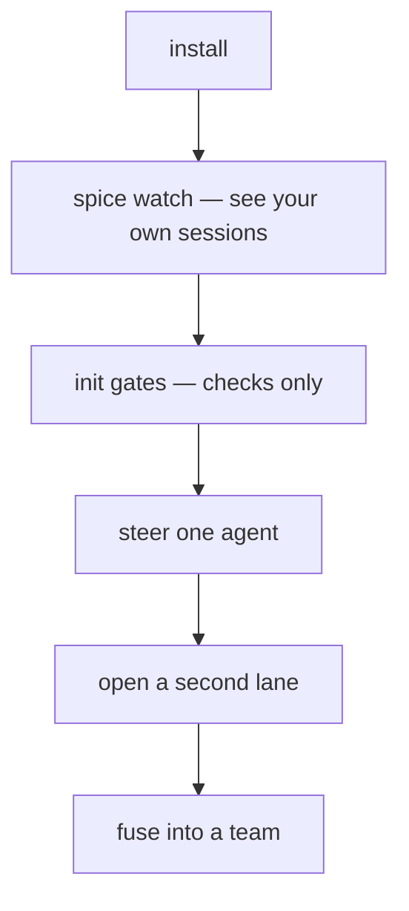
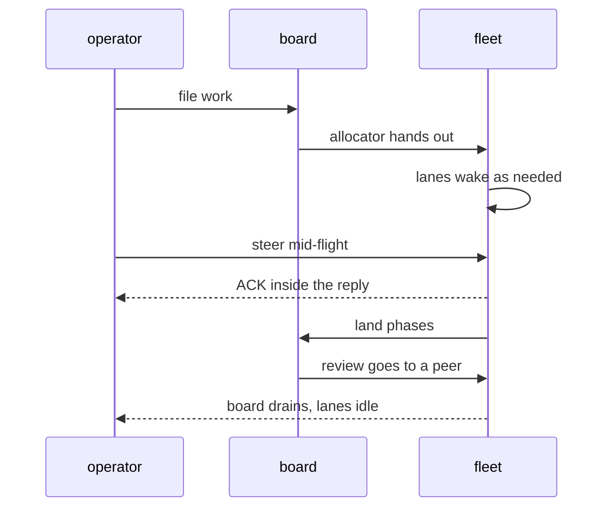
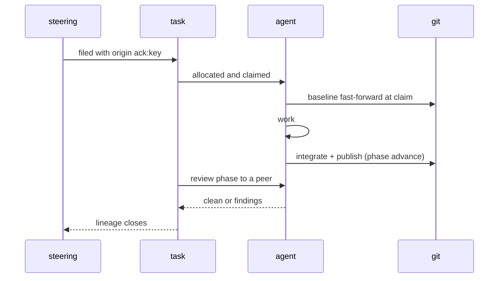
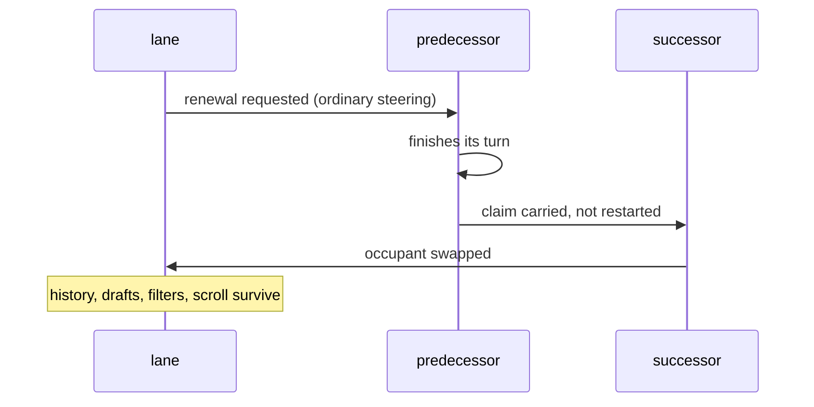
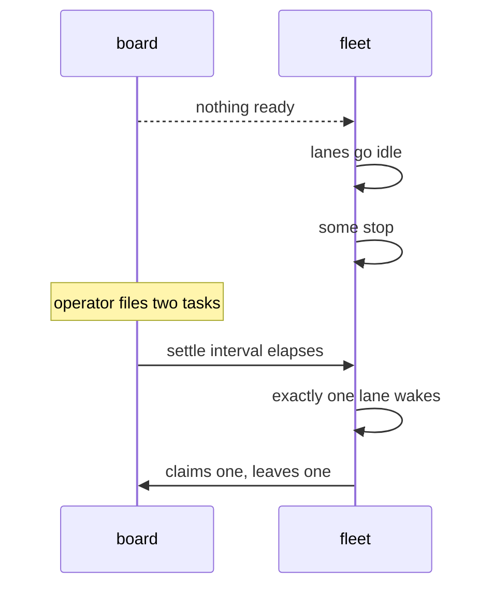

# Product model — core — Failure, journeys, and ontology

[Product model — core](../model.md) · [Spice product model](../README.md)
## Failure and degradation

### The degradation table

| Failure | Behavior | Never |
| --- | --- | --- |
| transport drops | reconnect with backoff, resync topology, resubscribe | lose steering |
| discovery fails transiently | **touch nothing**; report | destroy lanes |
| agent dies mid-claim | claim goes stale, peer takes over, displaced lane told | silently reassign |
| agent won't start | steering dead-lettered with a requeue command | drop the item |
| remote unreachable at launch | start anyway with a skip note | lock the lane out |
| landing conflicts | complete recoverable merge + recipe | stranded markers |
| landing races | re-integrate against new baseline, bounded retries | clobber a peer |
| projection corrupt | discard, rebuild, replay | serve silent nulls |
| authority shape unsupported | refuse, naming the release that migrates | mutate blindly |
| judge unavailable | publish judge-free | block the counsel |
| speech backend fails | silence | block the transcript |
| working-state collection fails | silence | change the command's outcome |
| a probed subsystem is unavailable | brief anyway, with the gap visible | withhold the briefing |
| a release step is interrupted | re-running converges | unwind or duplicate |
| an install is interrupted | resume; refuse a new one until it completes | interleave two histories |
| a lane's payload fails | that lane shows its own error | void the batch |
| surface unmeasurable | render nothing, repaint on reveal | guess a layout |

**Invariant —** **Absence of evidence is never evidence of absence.** A failed
enumeration is not a report that things are gone.

**Invariant —** Every degradation is *loud*. Silent success and silent
degradation must not look alike.

**Invariant —** One exemption, and its shape is what makes it safe: a
**decoration** laid over another operation — speech beside the transcript, the
working-state line beside a command — fails silently, precisely so that it can
never alter the thing it decorates. The exemption is available only where the
degraded component contributes nothing the reader would otherwise act on.

### Repair-first recovery

**Invariant —** A recovery recipe must be executable **as printed**, in the state
that printed it. A recipe naming a moving reference (rather than the resolved
one) is a defect.

---

## Journeys

### First five minutes

**Story.** *As a newcomer, I want the first thing I run to show me something
about work I already did, so that the tool proves itself before it asks for
setup.* — The observer tier requires no repository, no config, and no agent.

**Case.** The very first commit must not be blocked by a missing optional
dependency. A gate that cannot run degrades to a note, not a refusal.

### A day steering a fleet

### A task's whole life

### Renewal

### The board goes empty

### Reading a fused team

**Story.** *As a reader, I want four agents' output in one stream, attributed,
newest first, without any card moving as new ones arrive.*

**Cases** — a new member joins mid-read (nothing existing moves); a member is
renewed (its old messages keep their accent); composers are reordered (colours
change, order does not); a member's history is paged (only that member's
sentinel triggers).

---

## Ontology

The vocabulary is deliberate. These words carry contracts.

| Term | Means | Not |
| --- | --- | --- |
| **lane** | operator-owned container over a worktree target | the agent |
| **occupant** | the agent thread currently inhabiting a lane | the lane |
| **team** | server-side grouping of lanes | a client view |
| **watchband** | the per-agent status-and-compose strip | a toolbar |
| **mosaic** | the placed, newest-first message lattice | a feed |
| **shard** | one member's concrete send address | a broadcast |
| **lifetime** | autonomy policy: Steer, Drive, Drain | a filter |
| **steering** | durable operator intent requiring acknowledgement | a chat message |
| **ACK / NACK** | semantic retirement, accepted or refused | a read receipt |
| **claim** | exclusive, leased possession of a task | an assignment |
| **phase** | a slot in a task's flow; advancing publishes | a status field |
| **origin** | why a task exists (`ack:` or `task:`) | who filed it |
| **footprint** | paths a task's own commits touched | the diff |
| **baseline** | the shared line a lane integrates with | an upstream |
| **battery** | an ordered set of verifications that must all pass | a test run |
| **lineage** | one logical thing followed across copies | a log |
| **fold** | a projection built from a fact source | a cache |
| **maxim** | a curated near-universal taste rule | a lint rule |
| **counsel** | taste offered while the agent writes, as steering it may answer either way | enforcement |
| **oops** | a cheap, private admission of a mistake | a bug report |
| **study** | a repo-wide analysis that can refuse a commit | a linter |

**Anti-vocabulary** — words the product deliberately does not use **of itself**,
because each implies a shape it rejects: *adopt, parentless ownership, injection, fallback,
shim, alias, legacy, upstream, sync, push, pull.*

Two uses stay legitimate, and they are the only two. **Naming the thing being
rejected** — *never a fallback*, *agents never push or pull* — is the list doing
its job rather than breaking. **Naming a foreign mechanism** the product must
reason about but does not take on: git's own upstream pairing in [The rewind
guard](boundaries.md#the-rewind-guard) is the whole of this case, and it is precisely why the
ontology defines *baseline* as *not* an upstream.

There is no third case. Where a banned word looked earned, the plainer word was
already in the neighbouring prose: the plan phase is *prepended*, which is the
verb [the plan-phase invariant](states.md#closed-loop-the-plan-phase-is-prepended-not-requested) uses
for it.

Anything else is drift. A word on this list appearing as the product's own
positive name for its own behaviour is a finding, not a style preference.
