# Product model — core — Entity state machines

[Product model — core](../model.md) · [Spice product model](../README.md)
## Entity state machines

### Task

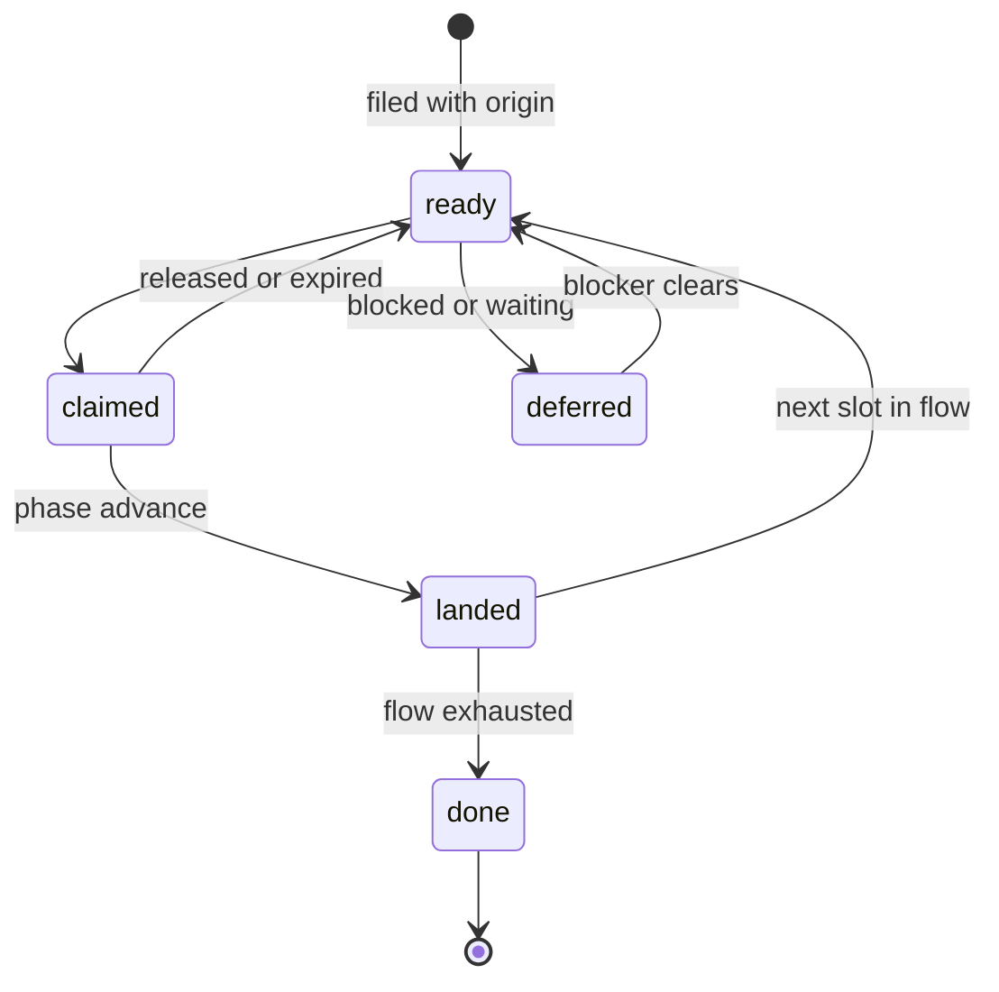

**Invariant —** Queue age has one durable origin, and unrelated modifications to
a row must not reset it. Starvation fairness depends on this.

**Invariant —** A phase advance is a publication, not a field write. It is
observable in history without a parallel event log.

### Closed loop: The plan phase is prepended, not requested

A task captured with no acceptance criteria and no named flow is neither refused
nor filed vague. A **plan phase** is prepended to its flow, and that phase cannot
be closed until the missing acceptance exists somewhere.

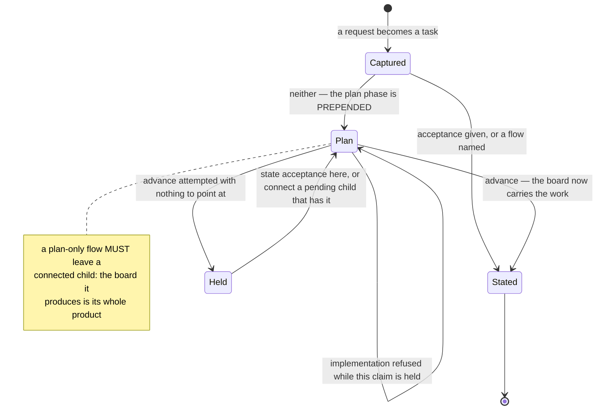

**Invariant —** Absence of acceptance is treated as **unfinished thinking, not
as an error**. The system prepends the step that produces the missing thing
rather than refusing the capture, because refusing at capture time discards the
request along with the ambiguity.

**Invariant —** The plan phase closes only when acceptance exists — on the task
itself, or on at least one connected pending child. A plan that produced no
statable outcome has not planned anything.

**Invariant —** A plan-only flow must connect a child with acceptance. Its
entire product is the board it leaves behind, so there is nothing else it could
be permitted to exit on.

**Invariant —** Implementation is refused while a plan-phase claim is held, and
a plan phase carrying local commits cannot advance. The refusal is what makes
the phase mean anything: an agent free to implement while planning will, and the
plan becomes a description of what was already built.

**Invariant —** The prepended step is visible as a **phase**, not as a flag. An
operator reading the board sees a task sitting in `plan` — a position in a flow
they already understand — rather than a hidden attribute explaining why the task
behaves unusually.

**Policy —** The named phases are a small approved set with a bounded number
of slots per flow, so a flow cannot grow into a workflow engine.

### Closed loop: Claim

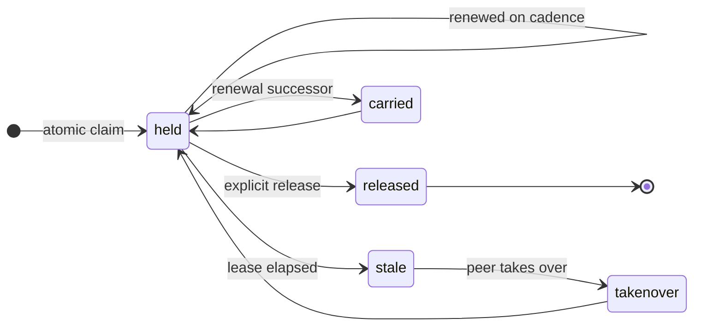

**Invariant —** Claiming is atomic: activity marker and claim metadata are set
in one mutation. A row can never be ACTIVE with no owner.

**Invariant —** A takeover replaces **exactly the stale claim the allocator
observed**, never whatever is current by the time the write lands.

**Invariant —** A displaced claimant is **told**, through its own durable
steering channel. Work is never silently taken.

**Invariant —** Renewal *carries* the claim to the successor without restarting
it. The successor inherits elapsed work, not a fresh lease.

**Invariant —** A witness record durably distinguishes *an intentional,
announced end* from *no history at all*.

**Policy —** Lease 3600s; context window spanning 300s before and after the
claim so a claim is reconstructible
from the transcript around it.

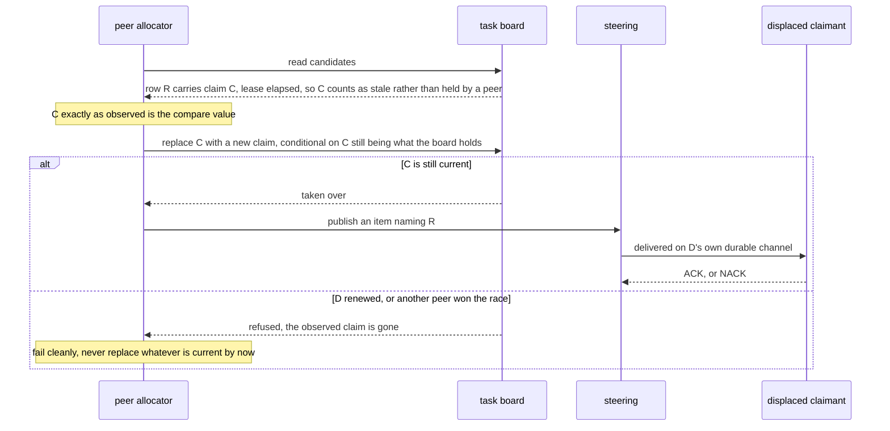

### Closed loop: Steering item

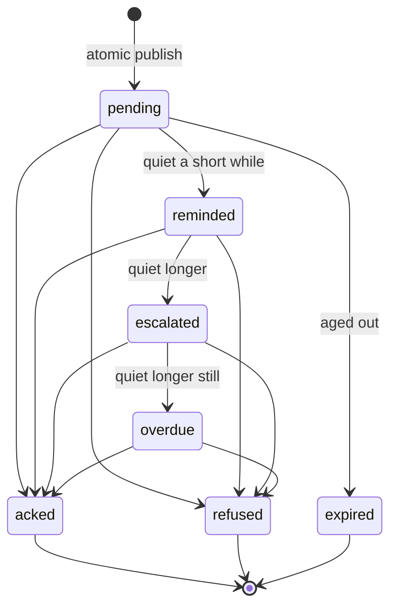

**Invariant —** Publish is atomic and durable before delivery is attempted:
temp write, flush to disk, link into place, flush the directory.

**Invariant —** Reads never retire. Only a semantic acknowledgement or refusal
does.

**Invariant —** The escalation ladder is time-since-publication, not
retry-count. Escalation changes *presentation urgency*, never identity.

**Invariant —** An item that cannot be delivered is **dead-lettered**, not
dropped, and the parked key is reported with the command that requeues it.

**Policy —** reminder 15s, escalated 60s, overdue 300s, expiry 24h,
collision suffixes bounded.

### Closed loop: Agent process

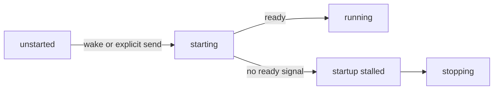

Once ready, the process alternates between working and waiting; stopping and
renewal return through the lifecycle authority:

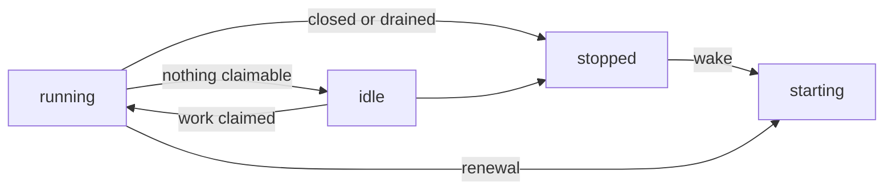

**Invariant —** Only the lifecycle authority may transition this machine.
Rendering, snapshotting, and querying cannot.

**Invariant —** Ambient thread ids are refused at launch. A lane binds to the
thread the launch answer names, never to one inherited from the environment.

**Invariant —** The launch prompt is **neutral**. The real ask is recovered from
live control-plane state, not baked into startup.

### Lane and team

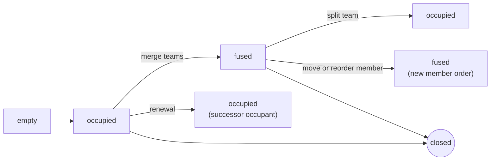

**Invariant —** Fusing is a *team merge*, splitting a *team split*. There is no
client-only grouping.

**Invariant —** Closing is requested; the lane disappears when the authority
confirms it.

**Invariant —** A lane holding unsubmitted intent resists removal until
confirmed.

### Closed loop: Submission (a draft becoming evidence)

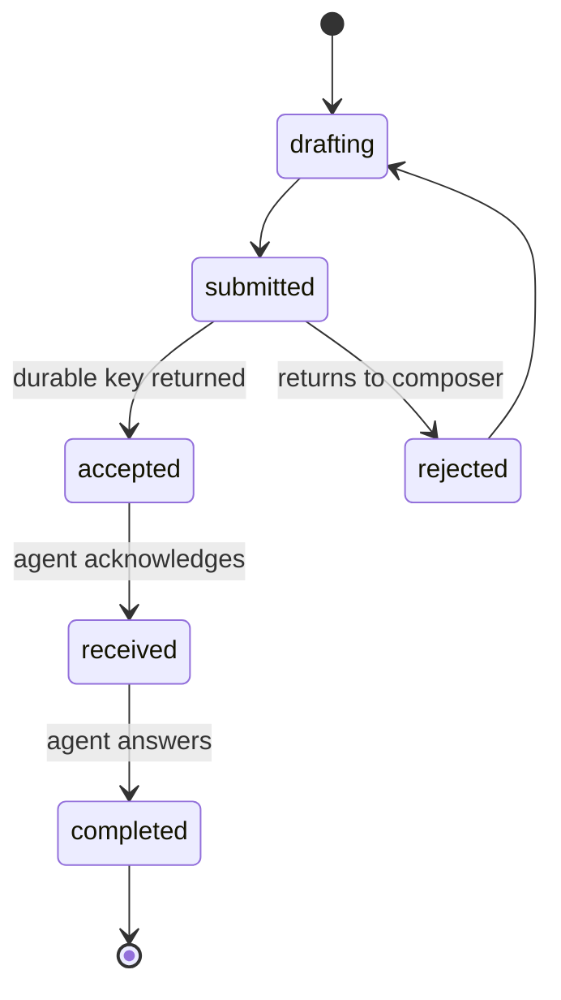

**Invariant —** Stage rank is monotonic. A redelivery of an earlier stage merges
its timestamps without regressing the stage.

**Invariant —** The whole progression is reconstructible from retained messages
alone. Live events are an optimization, never the only source.

### Message card

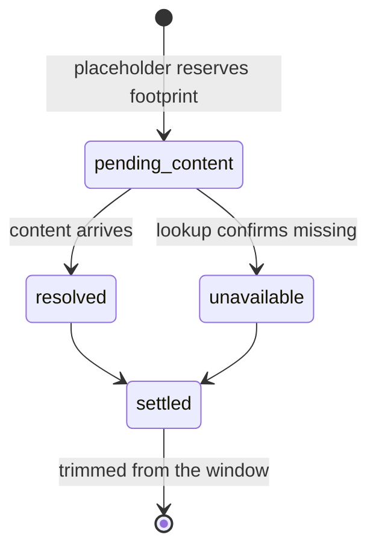

**Invariant —** *Confirmed missing* is a distinct state from *still loading*, and
occupies the same footprint so resolution never reflows.

### Closed loop: Maxim reminder

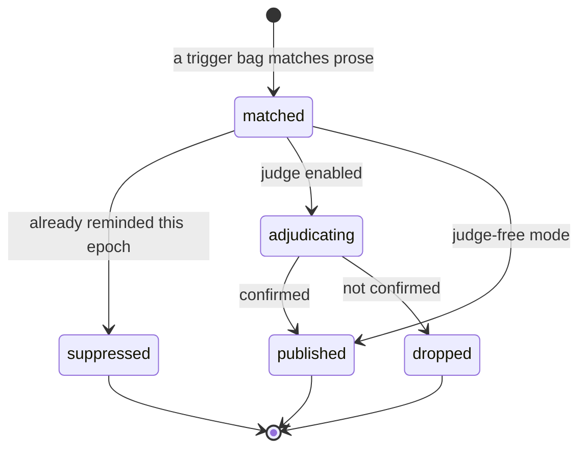

**Invariant —** At most one reminder per content-derived key per compaction
epoch. Compaction may make the same reminder eligible again — because the agent
may have lost the earlier steering — but it never changes the reminder text.

**Invariant —** Self-echo is suppressed. The system must never judge itself for
quoting itself.

**Policy —** Judge-free by default (more false positives, no local model
required); adjudication is opt-in and uses a small parallel judge panel.

#### The bag, and how it matches

A **bag** is a stable name, one message, and a set of triggers. Every trigger
resolves the same bag, so a bag is one opinion with several ways of being
provoked.

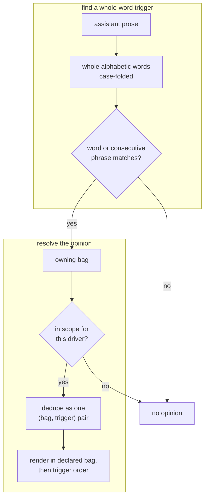

**Invariant —** Matching is over **whole words**, never substrings, and there is
no stemming at match time. A bag enumerates its own variations; the matcher
never mutates the prose to find a hit. This keeps the set of things that can
fire a bag readable in the bag itself, rather than emergent from a
transformation nobody can see.

**Invariant —** A trigger is an alphabetic word or phrase, and anything else is
refused when the configuration loads. A trigger that can never match a word is a
silently dead opinion.

**Invariant —** One statement fires a bag at most once, however many of its
triggers hit, and results order by declared bag order then trigger. The same
prose always produces the same reminders in the same sequence.

**Invariant —** Applicability is expressed in the same selector grammar
everything else uses, so a bag can apply to one driver and not another without
inventing a second scoping language.

**Invariant —** A bag is disabled by **name**, in a tracked record, so every
clone sees the same set of opinions in force. A disabled bag is enumerable — an
opinion the repository has decided against, rather than one that quietly stopped
firing.

**Invariant —** Adjudication asks the same question in several equivalent
framings and **shuffles them**, so a judge that latches onto position rather
than meaning cannot bias the answer. A reply that does not collapse to a single
yes or no is retried a bounded number of times and then abandoned rather than
interpreted.

### Closed loop: Projection family

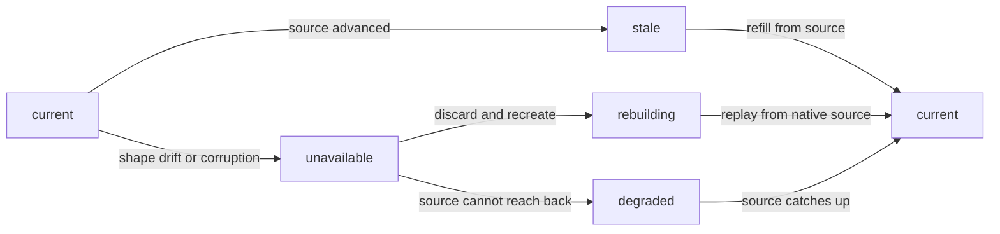

**Invariant —** `unavailable` must be **loud**. A projection that read nothing
must never present the same answer as one that read everything.

---
