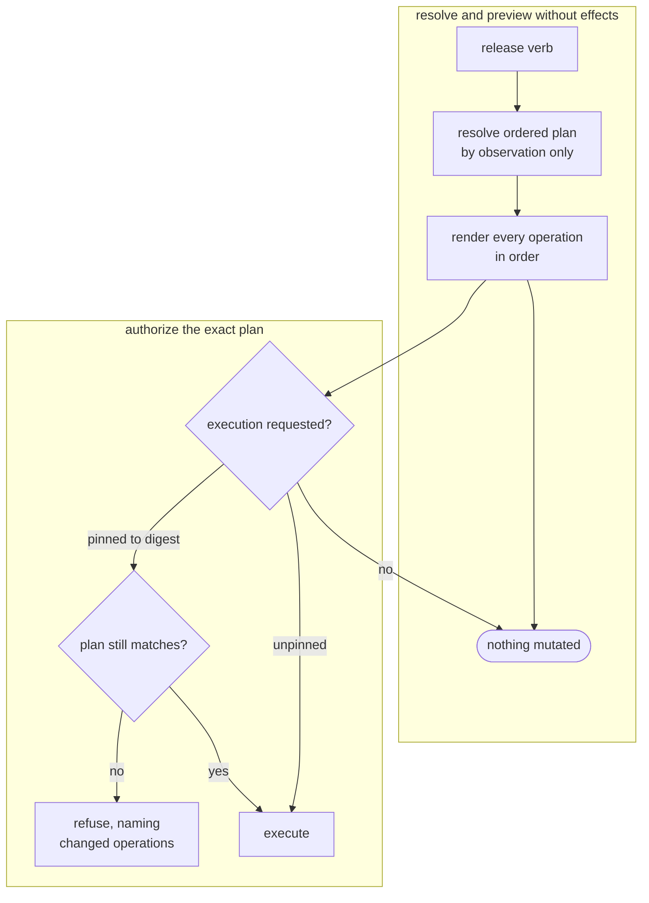
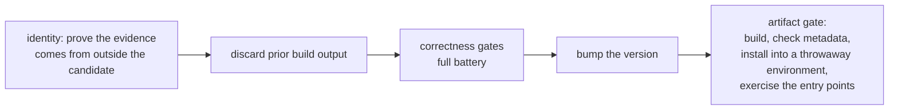
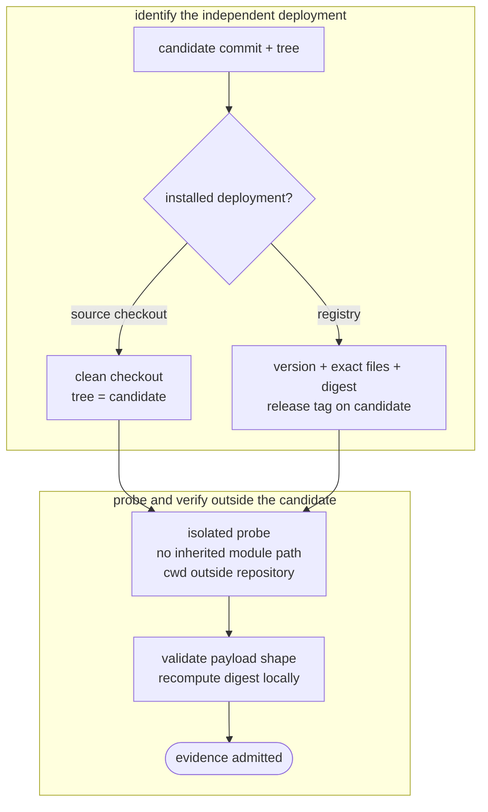
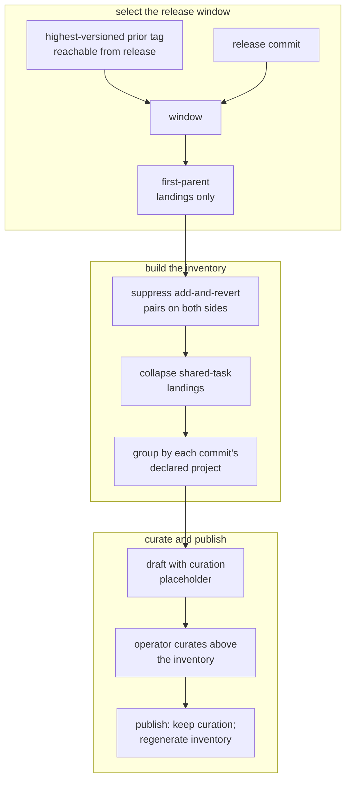
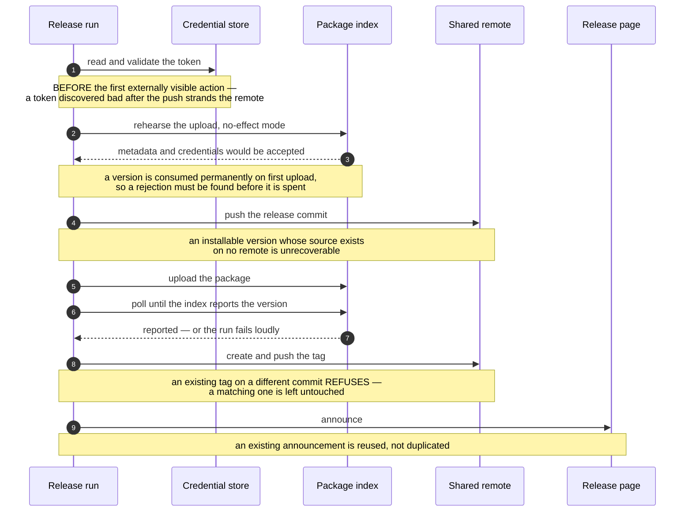
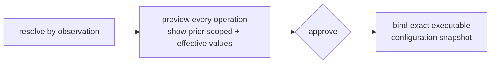
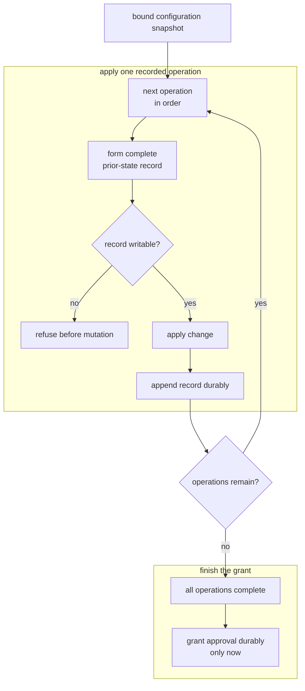
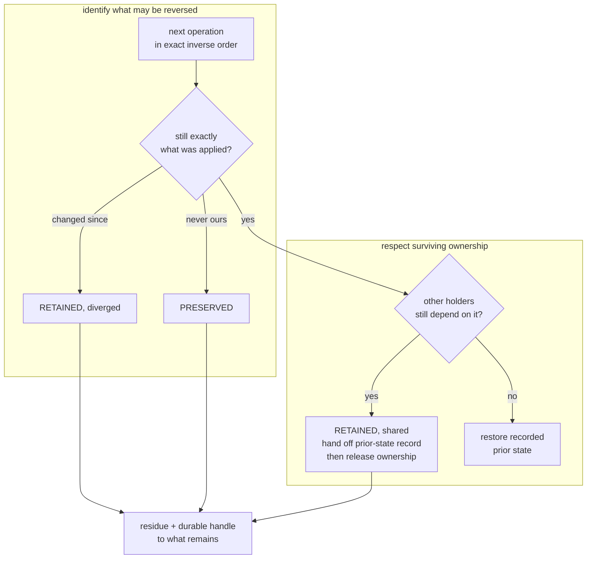
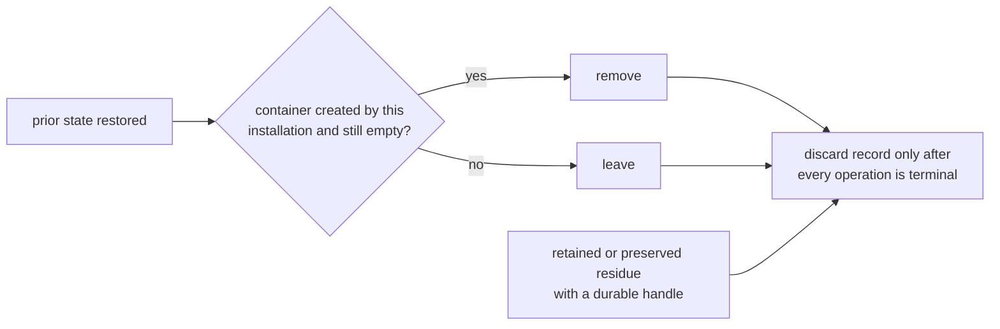
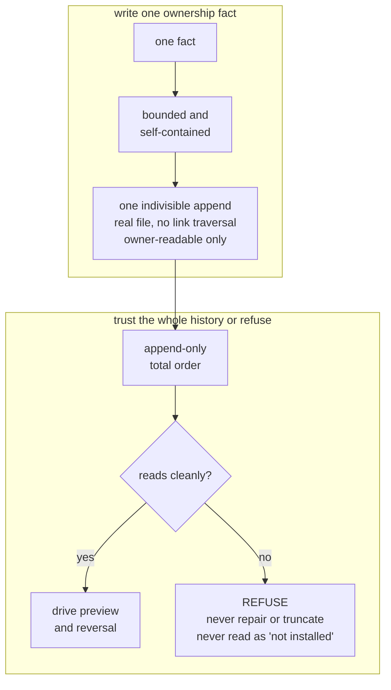

# Product model — supporting planes — Distribution

[Product model — supporting planes](../planes.md) · [Spice product model](../README.md)
## Distribution

Everything else in the product is reversible. Distribution is where the system
touches surfaces it does not own — a package index, a shared remote, an operator's
own repository — and where a mistake is permanent. The plane is built around that
asymmetry.

### A release is a plan, not a verb

**Invariant —** Every verb that can change anything renders its **complete
ordered plan** and mutates nothing until execution is explicitly requested. An
irreversible step described only after it runs gives the operator no chance to
stop it.

**Invariant —** An execution request may pin the digest of the plan that was
read. Reviewing one preview and applying a silently different plan is exactly how
an unreviewed publish reaches the world.

**Invariant —** Plan identity covers the repository, the action, the version, the
source commit, the resolved release commit, the ordered operations, **and the
content of the notes**. A digest over step names alone would let the notes file
or the target commit change after approval and still satisfy the check.

**Invariant —** Step order is part of what the plan commits to, because the
ordering is the safety property, not an implementation detail.

**Invariant —** Preconditions that can be evaluated without effect are evaluated
while the plan is built. A cheap check deferred past the gates strands the
operator after the push with a failure that was knowable up front.

**Invariant —** Inspection is free of consequence. Checking the gates, drafting
the notes, and previewing the range never bump, commit, tag, push, or publish —
so "what would the next release contain?" is a safe question.

**Invariant —** When an installed parent owns the effects, it hands over
execution authority keyed to the exact plan, or the run refuses. Two layers each
believing they own the plan publish the same release twice.

### The gate order, and the one seam in it

The bump sits between two gates, and both neighbours are load-bearing.

**Invariant —** The bump lands **after** correctness. A bump written before a red
suite leaves a rewritten version behind in a now-dirty tree, which the
clean-tree precondition then blocks on every retry.

**Invariant —** The bump lands **before** the artifact gate, so the package that
is uploaded is the exact package that was built, metadata-checked, and installed
under that version.

**Invariant —** The artifact gate proves the package by **using** it: a fresh
build into a throwaway environment, then its entry points exercised. A package
missing a module passes a metadata-only check and fails on the first user
install.

**Invariant —** Verification mode runs the publishing path's own checks through
the same body. A parallel verification path drifts until a clean dry check
certifies something the real release never validates.

**Invariant —** No release action proceeds from a dirty worktree — artifacts are
built from the tree, so a dirty tree ships code that exists in no commit. A
bump-and-commit release additionally requires a claimed unit of work and no
local commits the board has not recorded.

### Evidence comes from outside the candidate

A candidate that proves itself proves only that it works when run from its own
source tree. The question a release has to answer is whether the deployment the
fleet actually executes matches the thing being released.

**Invariant —** Evidence comes from an **independently installed** deployment,
never from the candidate tree's own interpreter.

**Invariant —** The probe runs isolated. An inherited module path makes the
installed deployment import the candidate tree, so the reported identity is an
echo of the thing under test and the gate always passes.

**Invariant —** A deployment that runs a source checkout must itself be clean. A
checkout imports the working tree rather than the commit, so uncommitted edits
pass a commit-identity check untouched — the tree hash is the same before and
after them.

**Invariant —** A registry-installed deployment is compared by a **content
digest** over its packaged payload, not by version string. Version strings are
reusable; a rebuilt or locally patched package carrying the same version would
otherwise be accepted as proof.

**Invariant —** Files packaging deliberately omits are excluded from both sides
of the comparison, so the check is satisfiable by a correct release.

**Invariant —** A self-reported identity is structurally validated and its digest
recomputed locally before it is believed. An unvalidated payload lets a broken
probe assert a match simply by printing one.

### Notes are read out of the ledger

**Invariant —** Notes derive from the ledger. There is no maintained changelog to
drift, and a release's own bump commit is excluded from the notes it generates.

**Invariant —** Only **first-parent** landings are counted, so one merged unit of
work contributes one entry rather than one per internal commit.

**Invariant —** Work added and reverted inside one window is suppressed on both
sides. Otherwise the release advertises a feature that is not in the artifact.

**Invariant —** A revert pairs with the landing whose history *contains* the
reverted commit, not with one whose identifier equals it. The reverted commit
almost always arrived on a side branch and never appears in the first-parent
list at all.

**Invariant —** Landings sharing a task identity collapse into one entry, held at
the position where that task first landed and described by its most recent
wording. A task that lands once per phase would otherwise appear once per phase,
described by its earliest and least accurate wording.

**Invariant —** Every entry carries at least one reference back into history, and
entries preserve landing order. A description with no pointer cannot be verified
when it turns out to be wrong.

**Invariant —** Entries group by the project each commit itself declares — the
author's own statement of what the change belongs to — never by inference from
the paths it touched. A commit declaring none lands in a general grouping rather
than disappearing.

**Invariant —** A trailing handle is stripped from a description only when it
matches that commit's own recorded identifier. Guessing from shape truncates
descriptions that merely end in a hyphenated token.

**Invariant —** The prior tag must be **reachable** from the release commit, and
tags are addressed through their fully qualified ref namespace. A branch sharing
a tag's name would otherwise silently redefine the range, and the result would
look entirely plausible.

**Invariant —** With no prior tag the range degrades to a bounded window of
recent landings **and says so**, rather than rendering all history or nothing.

**Invariant —** Curation owns the region above the generated inventory;
everything from the inventory down is regenerated at publication against the real
release commit. Curation necessarily happens before the release commit exists, so
a frozen copy would name the wrong commit and the wrong range.

**Invariant —** Notes are refused when untouched, when they still carry the
placeholder, or when the curated region holds nothing but banner and headings.
Any of those publishes a page that opens straight into a machine-generated
inventory.

### The publication sequence

Four external systems, none of them transactional together, and the upload
cannot be withdrawn. The order is the design.

**Invariant —** The commit reaches the shared remote **before** the package is
uploaded. The reverse order yields an installable version whose source commit
exists nowhere shared.

**Invariant —** The announcement waits until the index actually reports the
version, and a timeout fails loudly. Announcing first produces a page pointing at
something users cannot install.

**Invariant —** Every step **converges** rather than duplicating, so a release
interrupted partway through is completed by re-running it rather than unwound.
The sequence spans systems that cannot be made atomic together, so idempotence is
the only available recovery.

**Invariant —** A separate verb performs only tagging and announcement, so a
release whose package already shipped can be finished without rebuilding or
re-uploading anything.

**Invariant —** A version names exactly one commit. An existing tag pointing
elsewhere refuses rather than being moved: moving a published tag rewrites what
an already-distributed version means for everyone who fetched it.

**Invariant —** Publication builds from the working tree, so the release commit
must be its head. Otherwise the uploaded package is built from one tree while the
tag and notes describe another.

**Invariant —** An operator interruption terminates with a status distinct from a
gate failure. Collapsing the two sends the reader hunting for a defect that does
not exist.

### Installing into a repository the product does not own

The same discipline, pointed inward. Installing hooks means writing into someone
else's repository, so every mutation is owned, recorded, and reversible.

That bound snapshot governs a serial write-ahead loop. Approval becomes durable
only after the final operation completes.

**Invariant —** What the operator reviews is produced purely by observation and
is the same resolved plan that later executes. A re-derived description means
consent covered something that was never shown.

**Invariant —** No change is made until its record has been formed and accepted
as writable, and the record is durably committed before the next change is
attempted. A mutation whose record was lost is an untracked modification of
someone else's repository that no uninstall can ever find.

**Invariant —** Each record carries the **complete prior state** — value,
permissions, and whether the file, setting, or parent directory existed at all.
Recording only the new state makes absence unrecoverable, so an uninstall leaves
an empty file where the operator originally had nothing.

**Invariant —** Prior state is captured once, at first application. A repeat run
must never re-derive it from state the installation itself produced, or a later
reversal restores the installer's own output as though it were the operator's.

**Invariant —** Approval is granted durably only after every authorized operation
completes. An interrupted install must not leave a standing trust grant for
configuration it never finished installing.

**Invariant —** Generated artifacts live in a directory the product owns, and are
activated by **redirecting** the host tool there — never by writing into the
location the repository already uses for the same purpose. Installing into the
conventional location silently overwrites what the repository itself ships.

**Invariant —** Every generated artifact carries an ownership digest, so an
untouched installation is distinguishable both from a locally modified one and
from a newer generated shape.

**Invariant —** Generated state excludes itself from version control through a
marker it owns, rather than depending on repository-level exclusions it does not
control.

### Reversal is a claim about identity

An uninstall that reverts by *name* destroys operator edits. Reversal restores
only what it can still recognize as its own.

Once identity and shared ownership permit restoration, container cleanup is a
separate decision. Every path ends in a recorded terminal outcome.

**Invariant —** Reversal runs in exact inverse order and refuses a record whose
order is not the exact inverse. Application enables a capability before using it
and writes files before pointing configuration at them; any other order leaves
the repository pointing at things that no longer exist.

**Invariant —** A shared prerequisite is retained whenever any dependent setting
in the same reversal was retained. Removing the enabler while a dependent
survives leaves a repository that is neither installed nor cleanly uninstalled.

**Invariant —** Everything declined is reported as **residue**, with a durable
addressable handle to the record of exactly what remains. An uninstall that
reports success while leaving hooks behind convinces the operator the repository
is clean while the leftovers keep executing.

**Invariant —** An interrupted reversal blocks a new installation until it is
resumed. Re-installing over a half-reversed repository interleaves two ownership
histories, and the original prior state becomes unrecoverable.

**Invariant —** Both directions are resumable and idempotent: a re-run performs
only what is not yet recorded complete, and a plan already satisfied against
unchanged state performs and records nothing.

**Invariant —** A reversal refuses when the ownership record changed between the
preview and the application, so authorization is never spent on operations that
were never displayed.

### The ownership history

The record is the only thing standing between "installed" and "unrecoverable",
which makes its own integrity the load-bearing property of the whole plane.

**Invariant —** A fact split across two writes produces a torn record, and an
unreadable history means the installation can never be reversed. Every fact is
bounded so that it fits one atomic append; a fact too large is refused rather
than split.

**Invariant —** An unreadable history **refuses**. Reading damaged provenance as
"not installed" strands real, still-active modifications with no owner and no
path to removal.

**Invariant —** Every record is bound to the repository it describes and refused
when it names a different one. A copied repository directory would otherwise
drive a reversal that rewrites the wrong working tree.

**Invariant —** The record is discarded only after every operation in it has a
terminal, recorded outcome. Discarding it mid-reversal destroys the provenance of
everything not yet reversed.

**Invariant —** Approval facts attach to an operation already recorded, and may
not alter its identity or position. An approval that stands alone grants durable
trust corresponding to nothing installed.

**Invariant —** A superseded on-disk representation is converted forward exactly
once; its reappearance afterwards refuses rather than converting again. Otherwise
a replayed document reclaims ownership of state that was already reversed.

---
