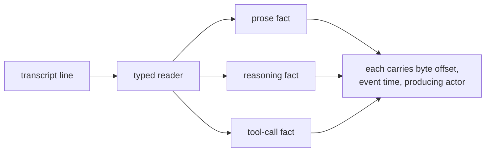
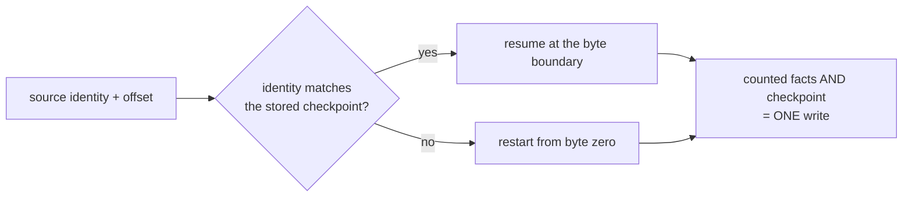
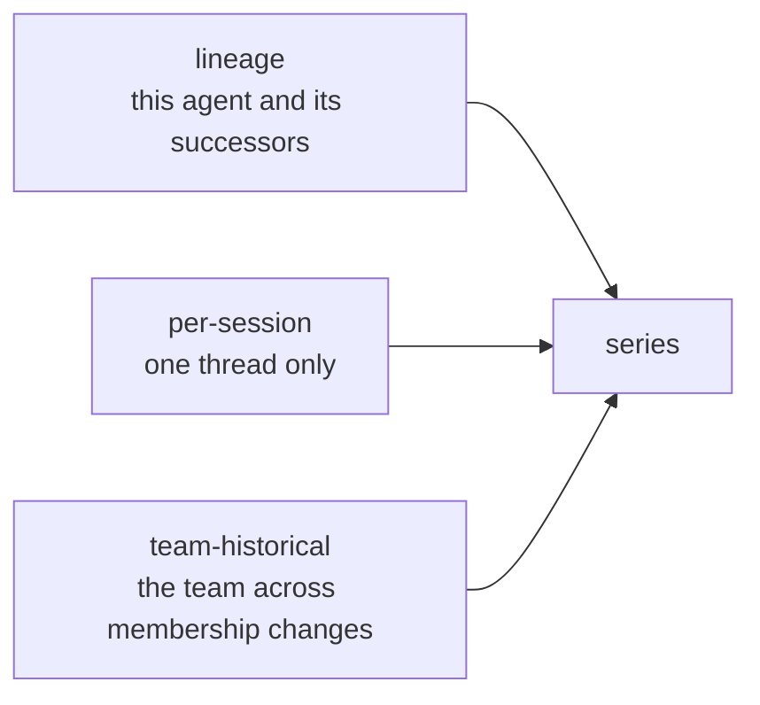
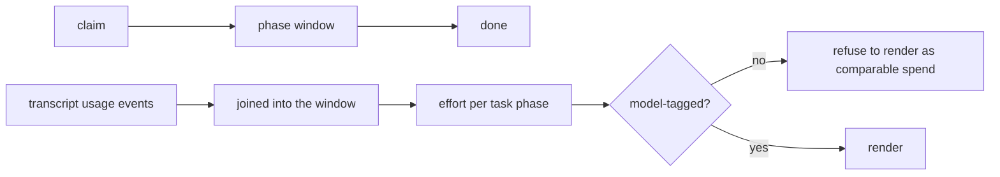
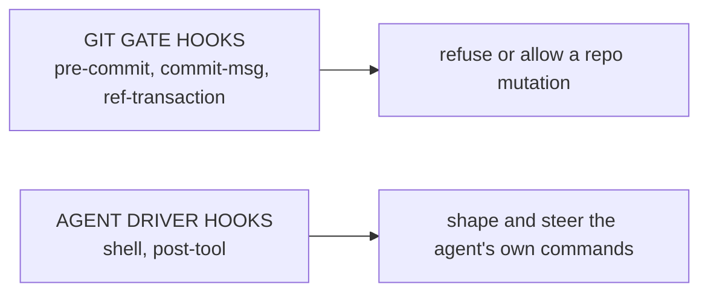
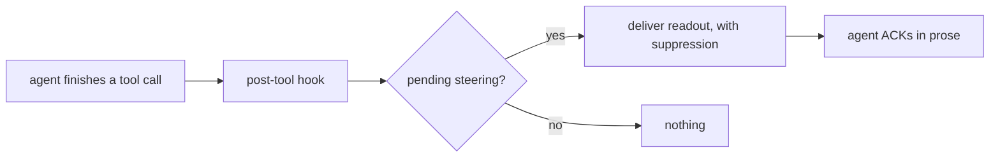
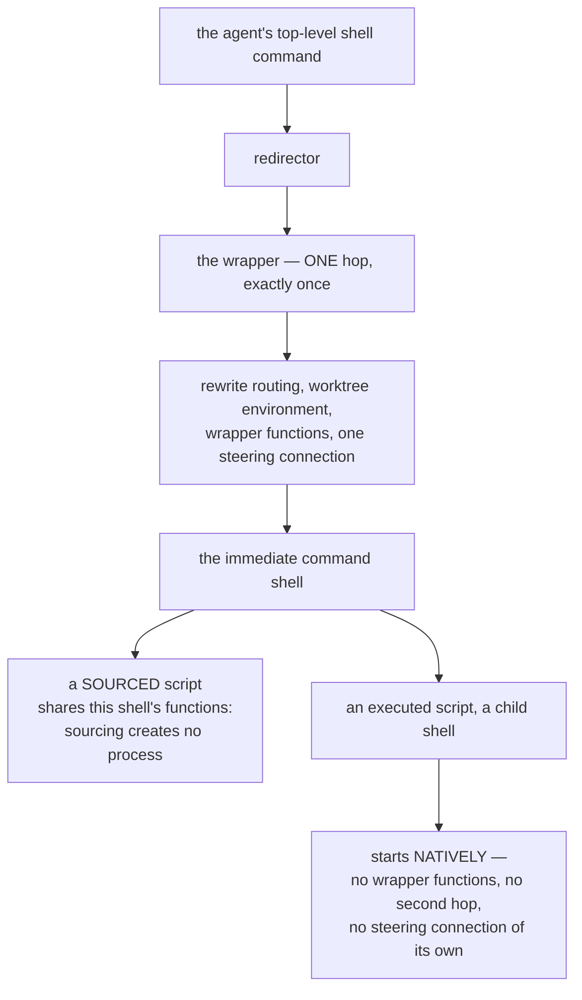
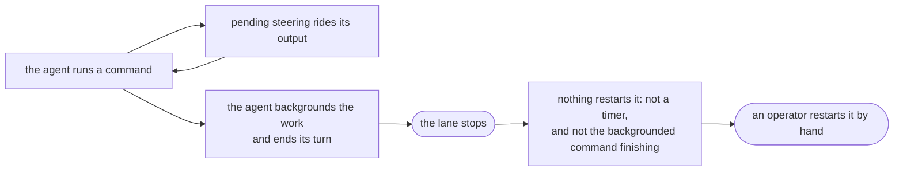
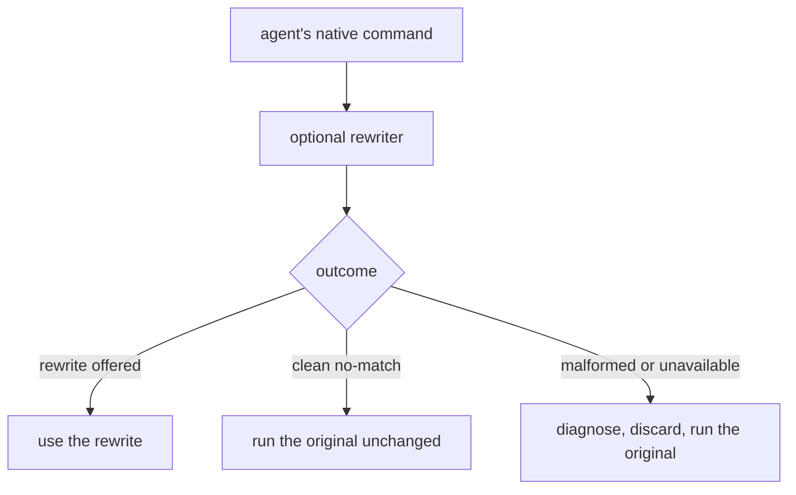
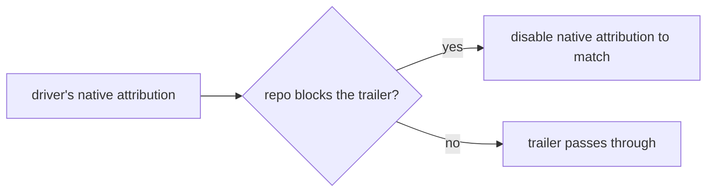

# Product model — supporting planes — Metrics and hooks

[Product model — supporting planes](../planes.md) · [Spice product model](../README.md)
## Metrics

### Typed facts with a locus

**Invariant —** One line carrying prose, a reasoning summary, and a tool call
contributes **all three**. A one-message-per-line projection that collapses to
whichever block it reached first is wrong by construction.

**Invariant —** Counting reads the **public typed facts**, never a second
private parse of provider JSON.

**Invariant —** Activity is what the agent *produced*. Operator input, token
accounting, and undecodable lines are facts about the lane, not work it did, and
carry no activity.

### Exactly-once ingestion

**Invariant —** Resumption is a **checkpoint, not an offset**. A transcript
replaced under the same path restarts from its first byte instead of resuming
into the middle of a different file.

**Invariant —** The counted facts and the checkpoint they were read to commit
together. A pass that dies before committing leaves neither — so the next pass
reads the same bytes **once**, never twice, never stepping over them unread.

### The three lenses

**Invariant —** Work follows the agent across renewal and lane changes, resolved
through durable membership and renewal history. A renewed agent does not appear
as a new worker with no past.

### The effort ledger

**Invariant —** A partial window is **not sizing evidence**. Incomplete data is
withheld rather than averaged.

**Invariant —** Untagged spend is never presented as comparable to tagged spend.
Two numbers from different models are not the same unit.

---

## Hooks

### Two hook systems, deliberately distinct

**Invariant —** These are different systems with different owners and different
failure semantics, and the product says so out loud. Conflating them is a known
confusion the design specifically resolves.

### Steering delivery through the post-tool hook

**Invariant —** Delivery reaches the agent **inside** non-shell tool spans, not
only at shell boundaries. An agent doing a long edit run is still reachable.

**Invariant —** The readout is suppressed when it would repeat itself. Delivery
is not the same as nagging.

**Invariant —** The hot path must not query the task database. Steering delivery
cannot be allowed to cost what a board read costs.

### The instrumented command boundary

Steering has to reach an agent while it is running shell commands, so something
must sit between the agent and its shell. Exactly where that something sits is
the whole design.

**Invariant —** Instrumentation is **one-shot, at the agent's own command
boundary**. The wrapper runs exactly once per agent command, and nothing beneath
it is instrumented again.

**Invariant —** The gate that guarantees "exactly once" is **structural, not a
counter**: the outer and inner stages are distinct packaged environments, so
there is no marker to read, forge, or lose. Descendants go uninstrumented
because they are pointed at the user's own startup files, not because they were
told to skip a step.

**Invariant —** A descendant process therefore gets the user's shell,
unmodified. A script that assumed a plain shell behaves exactly as it would
outside the agent, which is what makes leaving the instrumentation on safe.

**Invariant —** A *sourced* script is not a descendant, and shares the immediate
shell's functions and options. The boundary being drawn is the **process**
boundary, and sourcing does not cross it.

**Invariant —** Exactly one steering connection exists per agent command, owned
by the wrapper and bound to the immediate child's process identity. It survives
that process forking and waiting, survives it replacing itself, and closes when
it exits — even if a background descendant outlives it.

**Invariant —** Steering is written to the **wrapper's own error stream**, so a
redirection performed inside a descendant cannot capture or silence it.
Redirecting the wrapper itself does, which is the one place an operator would
expect that to work.

**Invariant —** The complete top-level command string is handed to the wrapper
exactly once. That is what makes rewriting possible at all: it is the last point
at which the command still exists as one string rather than as a running
process.

#### Cadence is reachability

Because delivery rides the output of commands, how often an agent runs one is
how often it can be reached. That makes cadence part of the operating contract
rather than a matter of style.

**Invariant —** Command cadence **is** message cadence. An agent that stops
running commands stops being reachable, so live corrections wait for a command
that may never come.

**Invariant —** Ending a turn stops the lane, and a backgrounded command's exit
is **not** a wake signal. Long work runs in the foreground so its own completion
returns control; an already-backgrounded wait is brought forward with a blocking
wait rather than ended on.

**Invariant —** This reaches the agent as a **capability, not a prohibition**:
staying in the foreground is what keeps the operator able to reach it. The
framing matters here more than anywhere else, because the rule costs the agent
something immediate and buys something it cannot observe from inside.

### Command rewriting

The rewriter is an **optional companion tool**, not part of the harness. The
selection logic lives on its side; what follows is the contract spice depends on
and the guarantees spice itself provides around it.

**Invariant —** The rewriter can only ever *help*. Any malformed or unexpected
outcome falls through to the native command unchanged, with a bounded
diagnostic. *(The outcome shape that distinguishes these cases belongs to the companion.)*

**Invariant —** Health reporting is **non-blocking**. An unusable rewriter
degrades loudly and the agent keeps working.

**Invariant —** One trusted executable identity resolves once; every probe and
rewrite invokes exactly that identity. Resolution does no availability lookup.

### Attribution

**Invariant —** Trailer policy is the repository's. The harness makes the driver
agree with it up front rather than contradicting it at commit time.

---
