# Product model — supporting planes — Session forensics

[Product model — supporting planes](../planes.md) · [Spice product model](../README.md)
## Session forensics

Compaction is the defining constraint. An agent's context is finite and its
history is not, so everything an agent knows about its own past is a *derived*
artifact — and the quality of that derivation is the difference between an agent
that resumes and one that restarts.

### The briefing

Answers, mechanically, the four questions a freshly compacted or freshly renewed
agent must not guess at.

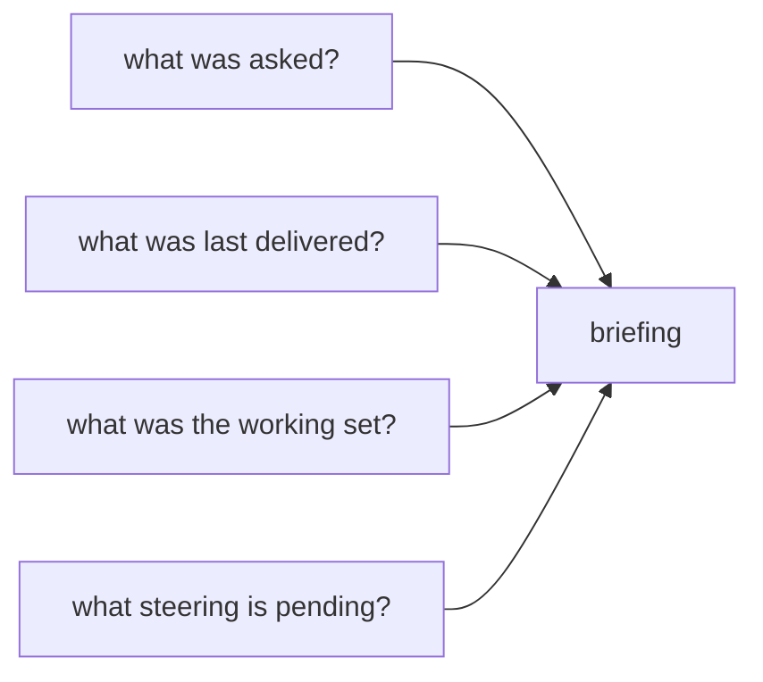

**Invariant —** Asks are sourced from the **steering plane**, not from
transcript user messages. Transcript prose is a secondary source, merged after.

**Invariant —** Recovery shows the *recovered ask*, parsed from compaction
intent — never continuation boilerplate, never an assistant-text fallback
rendered as if the user said it.

**Invariant —** The asks section is **omitted when empty**. A briefing with
nothing to say says nothing rather than emitting a mantra.

### Which plane owns which answer

The transcript is the richest source available, and it is authoritative about
exactly one class of fact: what happened. It is authoritative about nothing that
is *wanted*.

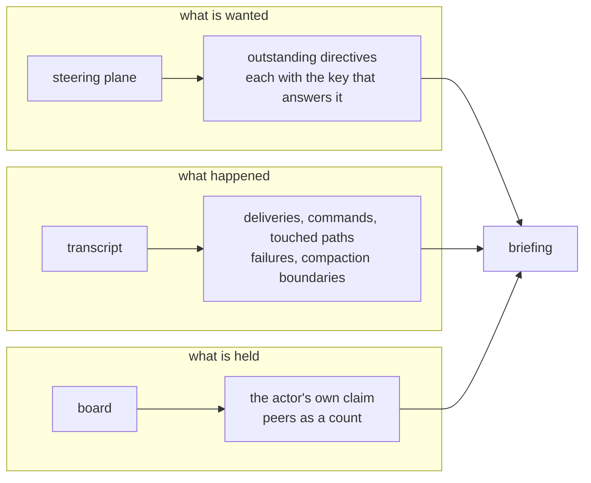

**Invariant —** The transcript never supplies the ask. Reconstructing intent
from prose reads the agent's own restatement of a directive back to it as if it
were the directive.

**Invariant —** A directive is shown only for the thread being briefed, and
carries the key needed to answer it. A directive an agent cannot retire is a
reminder rather than a request.

**Invariant —** A directive whose time cannot be derived from its own identity
is **dropped**, not stamped with a substitute. A guessed timestamp sorts, which
is exactly what makes it dangerous.

**Invariant —** Only the actor's own claim is enumerated; peers' active work is
a count. The briefing orients one agent, and another agent's task is not this
agent's business.

### The window

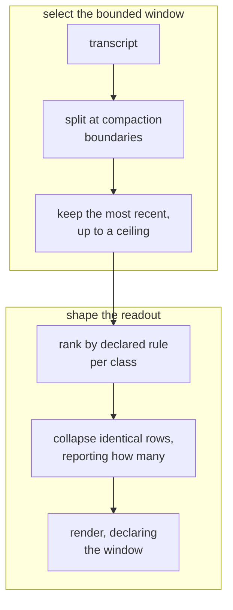

**Invariant —** The window is bounded by a fixed maximum number of recent
boundaries. A larger request is **clamped and says so**, not honoured.

**Invariant —** The briefing declares which rule set its window, where the
window starts, and how many boundaries were requested versus selected. A reader
who cannot tell what was examined cannot tell what the absence of a fact means.

**Invariant —** Recency is measured against the newest activity actually
observed in the material, not against wall-clock now. A transcript examined a
day later has the same shape it had when it was written.

**Invariant —** Where several bounds apply to one selection, the **narrowest**
wins.

**Invariant —** Windows **tile contiguously** through the present, so no
activity falls outside every window. An exchange straddling a boundary belongs
to both adjacent windows; a session that never compacted still yields exactly
one window, labelled with why it has none inside it.

**Invariant —** Only a compaction that actually severed context is a boundary.

**Invariant —** Material read only to establish what preceded a window's start
is excluded from that window's contents. A window holds the same records however
much surrounding material the reader had to consult to place it.

**Invariant —** Boundary discovery reads **backward from the end** and stops as
soon as it has enough, so the cost of recovery scales with the window asked for
rather than with the length of the session.

**Invariant —** Textually identical rows collapse into one that reports how many
times it occurred, and no class of entry may repeat back-to-back. A rehydration
that is all one kind of thing has told the agent nothing.

**Invariant —** Unknowns are **loud**. A window the engine could not read must
not look like a window with nothing in it.

### The budget

A briefing is read by something with a context limit, which makes truncation a
certainty and its *direction* a design decision.

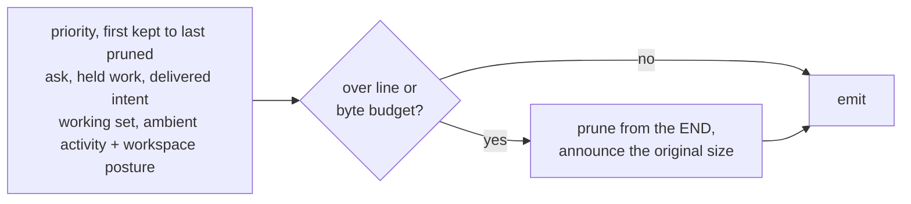

**Invariant —** Because the budget truncates from the end, section order **is**
the priority statement. What the agent must not lose comes first.

**Invariant —** Any list shortened by a limit reports how many rows were
withheld, and any pruning is announced together with the original size. The
notice is itself charged against the budget, so the declared limit is never
exceeded by the act of declaring it.

**Invariant —** Sections carrying evidence are omitted when they have no rows.
Sections establishing *what was examined* — sources, window, workspace posture,
totals, mailbox depth — are emitted even when every number in them is zero,
because those are the sections that make an empty answer meaningful.

**Invariant —** Absent facts render as explicit **unknowns**, distinct from
zero. A pressure scan that failed reports unknown severity carrying its error;
it never reports clean.

**Invariant —** Every external probe is time-bounded, and no single unavailable
subsystem prevents a briefing from being produced. A briefing that cannot be
produced is worse than a briefing with a hole in it, provided the hole is
visible.

### The unit of the record

Forensics needs an atom. The atom is one operator ask, and everything observed
is attributed to whichever ask was open when it happened.

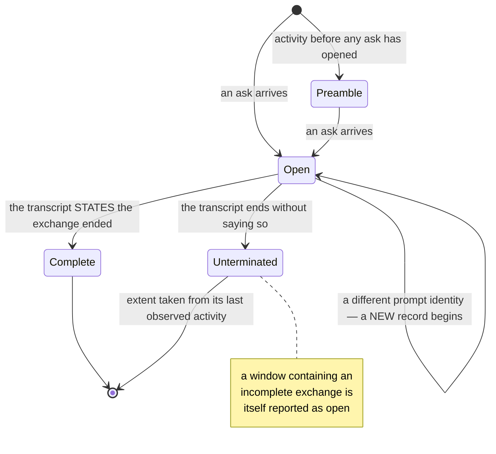

**Invariant —** Activity observed before any ask has opened gets a record of its
own rather than being discarded. Startup work is work.

**Invariant —** An exchange is complete only when the transcript **states** that
it ended. Inferring completion from the end of the file makes every truncated
transcript look finished.

**Invariant —** A record preserves the original interleaving of operator
messages, assistant commentary, and final answers — not just separate buckets.
Order is most of the meaning.

**Invariant —** Records merged from several transcripts order by time with
source identity breaking ties, and the differing timestamp spellings of
different drivers compare as the same instant. Identical inputs always yield an
identical sequence.

**Invariant —** Recorded text is exactly what the transcript held; only
explicitly derived fields are reformatted. A transcript's display echo of a
message is not a second occurrence of it, and a final answer restated at close
is recorded once.

**Invariant —** An invocation and its outcome are **separate facts**. A command
whose outcome was never observed is neither successful nor failed, and an
outcome attaches to the invocation it names rather than to whichever one ran
most recently.

**Invariant —** A fact whose classification disagrees with the evidence backing
it **aborts the projection**. A degraded record is worse than no record, because
it is indistinguishable from a good one.

**Invariant —** A filter the material can never satisfy is refused with the
workable alternatives named, rather than answered with an empty result.

### Message-shape classification

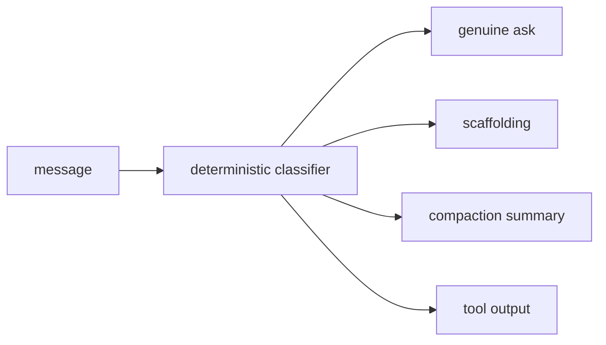

**Invariant —** Classification is deterministic and structural, never a prefix
sniff. Everything downstream — briefing, learnings, maxims, metrics — depends on
telling authored prose from generated text.

**Invariant —** Every operator-role message gets **exactly one** shape, decided
from that message's own text alone, so the same text always classifies the same
way regardless of where it appears.

**Invariant —** Rehydration summaries, harness retry nudges, session scaffolding,
background-task notices, and bootstrap prompts are generated text, never
authored prose. Text consisting wholly of one machine envelope is generated even
when the envelope's tag is unrecognized — the shape is the evidence, not the
vocabulary.

**Invariant —** An intent that cannot be recovered from a rehydration summary is
represented by an explicit marker, distinguishable from a genuinely empty
intent.

**Invariant —** Judge text and maxim scanning **exclude** generated diff, patch,
and tool-output bodies. The system judges what the agent wrote, not what it read.

### Resolving the subject

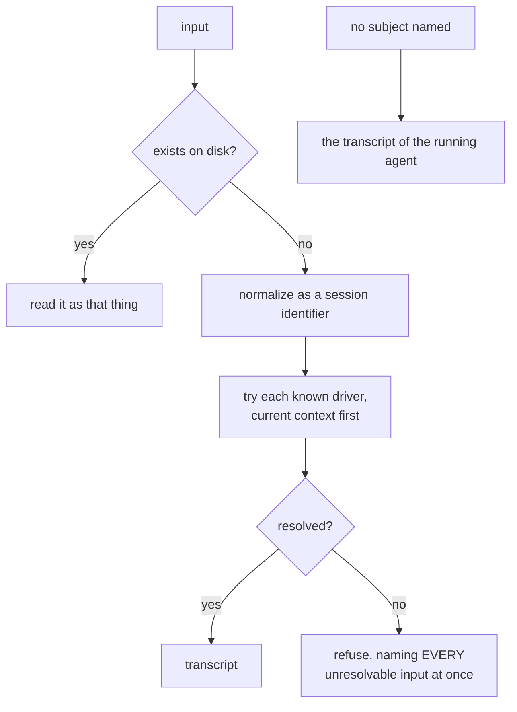

**Invariant —** Resolving to nothing is a **loud refusal**, never an empty
report, and it names every unresolvable input at once rather than one per run.

**Invariant —** An agent identity counts as current only while it is in the
running process's environment. An identity merely persisted in the tree from an
earlier session is history, not context.

**Invariant —** Every spelling of an identifier normalizes to one canonical
form, and a transcript named more than once contributes exactly once.

### The working-state meter

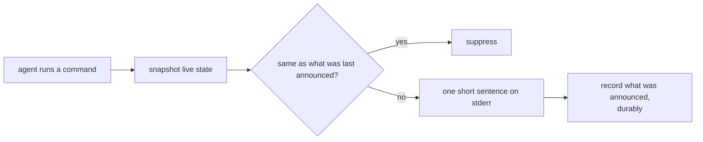

**Invariant —** One line, high signal, repeat-suppressed, on the agent's own
command stderr. It rides a channel the agent already reads.

**Invariant —** It reflects **actual state**. A constant encouragement is worse
than silence: it trains the reader to skip the channel.

**Invariant —** The record of what was last announced survives process exit, so
a run of short commands in one session does not re-announce the same facts once
per command.

**Invariant —** The urgency tier of an expiring claim is **part of the identity**
of what was displayed, so crossing into a more urgent tier speaks immediately
even when every other fact is unchanged. Expiry is the only thing the meter
repeats on a timer, and the interval shortens as expiry approaches.

**Invariant —** When the record of the last announcement is missing, unusable,
or not strictly older than now, the meter **speaks**. Suppression is a claim
about what the reader already knows, and an unusable record supports no such
claim.

**Invariant —** Failing to collect working state degrades to silence and never
changes the outcome of the command being decorated. A status line that can break
a command is not a status line.

**Invariant —** A meter with nothing true to report emits nothing, rather than an
empty frame.

### Closed loop: Learning distillation

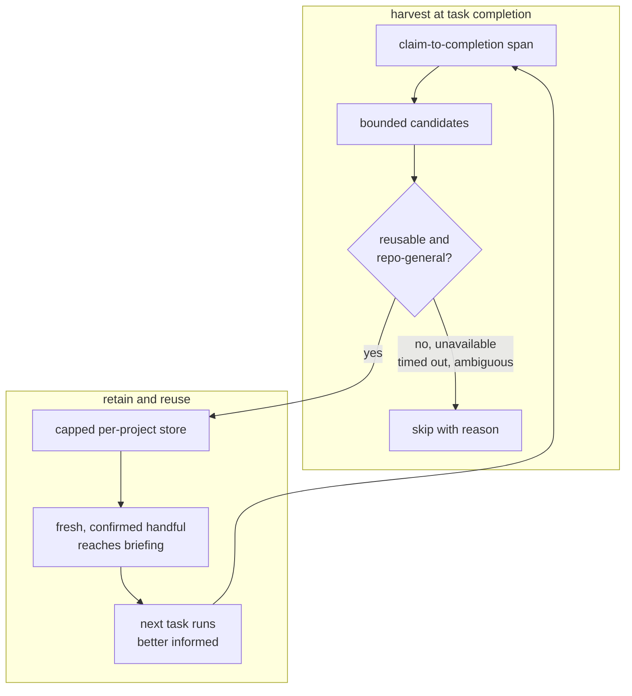

**Invariant —** Learnings are distilled **at task completion**, when the evidence
is complete and the agent is about to forget it — harvested only from the span
between claim and completion. A missing or out-of-order span yields nothing
rather than a wider guess.

**Invariant —** The store is bounded and partitioned per project. A learning set
that only grows is a second context problem; overflow evicts the least recently
confirmed first.

**Invariant —** Nothing becomes durable on an unproven verdict. Any failure of
the judgment — unavailable, timed out, ambiguous, erroring — **skips**, and the
skip is reported with its reason, so a broken pipeline is distinguishable from a
task that genuinely had nothing to teach.

**Invariant —** Every stored learning carries the task, the transcript slice, and
the excerpt it was drawn from. A claim with no provenance cannot be re-judged
when it turns out to be wrong.

**Invariant —** Re-observing a stored learning refreshes recency and confirmation
while keeping the original wording and provenance. Confirmation is a count, not
a rewrite.

**Invariant —** The store is replaced atomically as a whole, and a record that
cannot be parsed stops the load **loudly** rather than being skipped past.

**Invariant —** Distillation never turns a completed task into a failure. The
work is done; harvesting from it is opportunistic.

### One turn through the plane

The live path persists intent before attempting delivery, then uses the agent's
own post-tool boundary to pick it up.

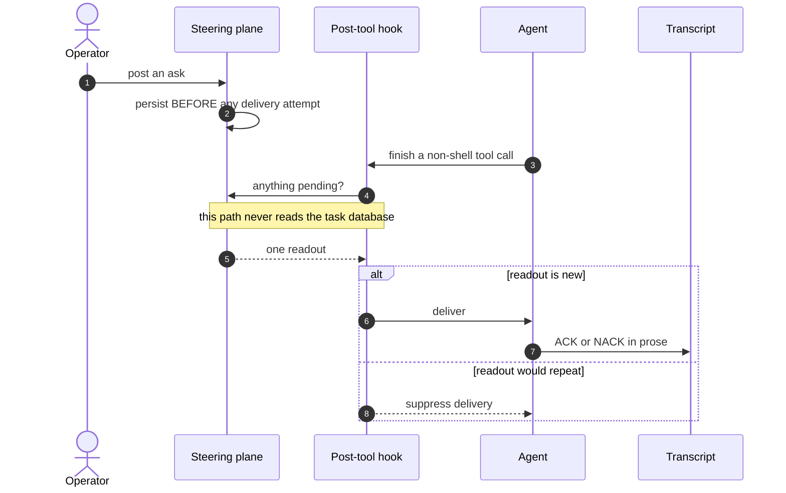

Renewal reconstructs the briefing from durable asks and transcript evidence.

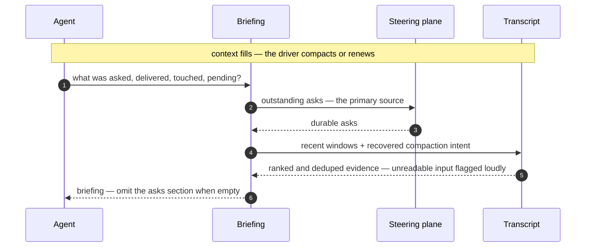

Ordinary command feedback is repeat-suppressed; completion harvests learning
only after the work is settled.

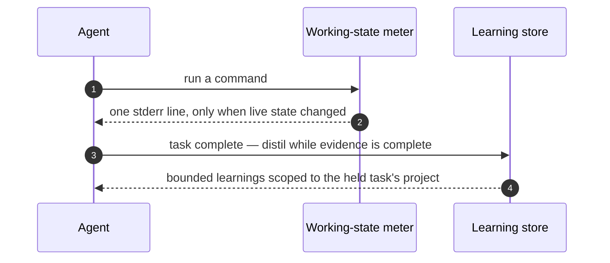

---
