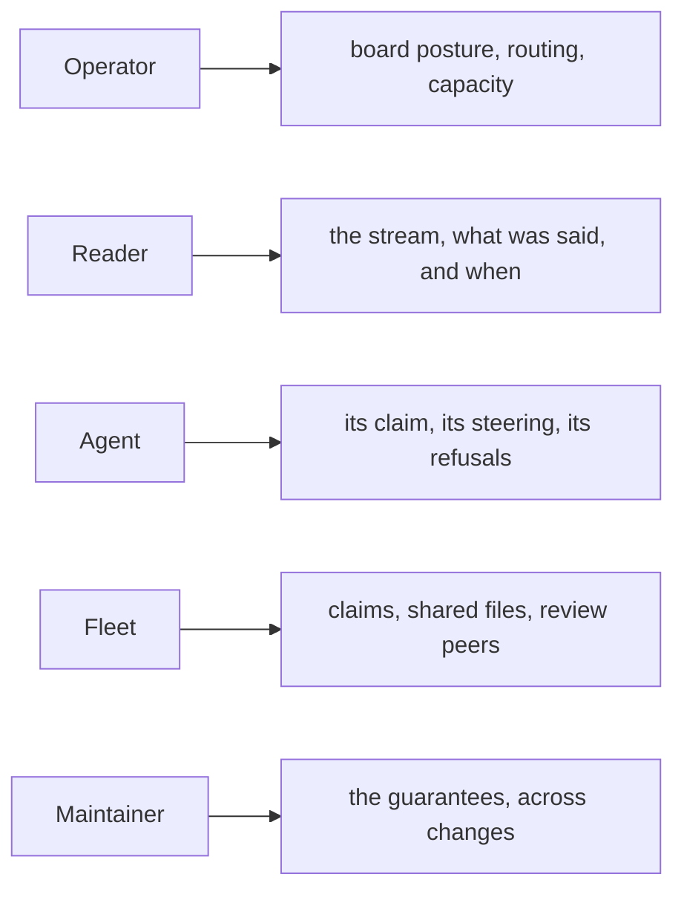
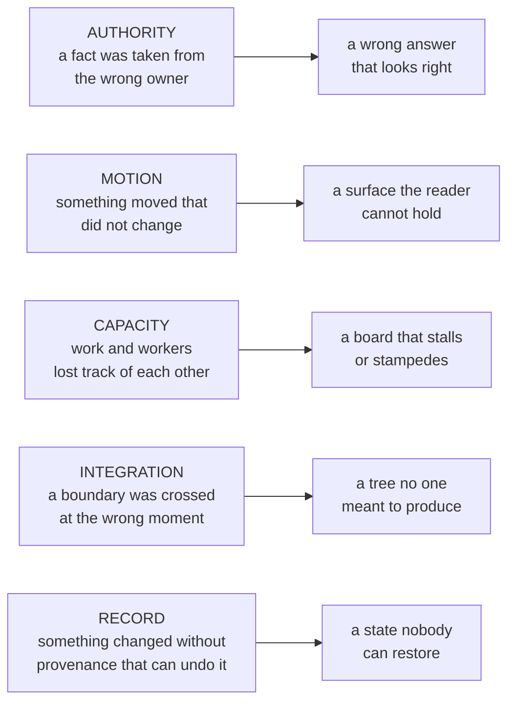

# Stories and failure modes

Who each guarantee serves, and the failure mode each one answers.

---

## Cast

**The Operator** — runs a fleet from one console and never types in a lane.
*A lane is an operator-owned container over one worktree; an agent is an
occupant of the lane, not the lane itself.*

**The Reader** — the same person in reading mode, and a distinct role because
the motion rules exist for them specifically. Every rule about what may move,
when, and by how much serves the reader's ability to hold their place.

**The Agent** — a supervised coding process in a worktree, and a first-class
user with its own surface: a briefing on arrival, a live state line on its own
command output, reminders while it works, refusals that tell it what to run
next. That surface has a required tone — capability, not restriction.

**The Fleet** — emergent rather than personal: teams, allocation, cross-worktree
claims, coordinated pressure on shared files. Its stories are about agents not
colliding.

**The Maintainer** — whoever must keep the guarantees true while the code
changes underneath them.

Each role's attention rests on a different surface, and the surfaces are
deliberately separate so that one role's noise is not another's signal.

---

## Stories

### Steering

*As the operator, I want my message written durably the moment I send it, so a
crash on either side loses nothing.* — Publish is atomic and precedes delivery.

*As the operator, I want an item retired only when the agent acknowledges it, so
"delivered" and "taken" stay different facts.* — A read never retires.

*As the agent, I want refusal to be as reachable as acceptance, so I am not
forced to fake agreement.* — Refusal is a first-class terminal disposition,
recorded distinctly and surfaced wherever acceptance is.

*As the operator, I want silence to escalate rather than pass as consent.* —
Escalation is time-since-publication on a stable lineage key, so a resend reads
as one intent insisting rather than a pile of duplicates.

*As the operator, I want sending to stay fast no matter how deep the backlog
is.* — Identity is derived from names and stat metadata, never by reading queued
bodies.

*As the agent, I want to be reachable during long work, not only between
commands.* — Delivery reaches non-shell tool spans.

### Work

*As the fleet, I want at most one agent on any task.* — One active claim per
actor, atomically taken.

*As the fleet, I want a dead agent's work to return without an operator sweep.*
— Leases lapse; a peer may take over; the displaced claimant is told through its
own steering channel rather than discovering it silently.

*As the fleet, I want a stopped lane that still holds work to come back on its
own.* — A claimed row is not available work, so nothing else would ever wake it.
The claim stays put and the agent decides whether to continue or release it.

*As the operator, I want a critical task not to wait behind its own trivial
blocker.* — A prerequisite inherits the highest priority it transitively
unblocks.

*As the operator, I want review by someone other than the author, without ever
deadlocking on it.* — Self-authored review ranks last, never excluded.

*As the agent, I want admitting a mistake to be cheap.* — Hidden channels take
the admission without putting it on the public board.

*As the agent, I want an empty board to read as success.* — A dry allocator
reports what is parked and why, and states that a populated board is the
expected answer here rather than work that was missed.

### Place

*As the operator, I want the lane to be mine, so replacing the agent costs me
nothing.* — Renewal swaps the occupant; history, drafts, filters, and scroll
survive.

*As the operator, I want to compose agents into one surface by direct
manipulation.* — Fusing lanes merges teams; the merged stream is attributed per
agent while every member remains its own send address.

*As the operator, I want two browsers to agree.* — Topology is server truth;
local storage holds presentation preferences only.

### Reading

*As the reader, I want to watch several agents at once without chasing the
board.* — New content places without moving what is already placed.

*As the reader, I want to know what was asked without leaving the answer.* —
Steering renders as a quote inside the reply that acknowledges it.

*As the reader, I want to hear what arrives while I am looking elsewhere.* —
Speech is a third channel, best-effort, and never blocks the record.

### Memory

*As the agent, I want to come back from a compaction knowing what was asked, not
what I said about it.* — Directives come from the steering plane; the transcript
supplies only what happened.

*As the agent, I want to be told when the briefing could not see something.* — A
window that could not be read is loud, an unavailable probe leaves a visible
hole, and an absent fact renders as unknown rather than zero.

*As the agent, I want the important part of a briefing to survive truncation.* —
Sections are emitted in decision-priority order, because the budget cuts from
the end.

*As the agent, I want what I learned on one task to be there on the next.* —
Learnings distil at completion from the claim-to-completion span, and reach the
store only through an independent judgment that they are reusable.

*As the agent, I want the state line to mean something.* — It speaks on change,
stays silent otherwise, and can never alter the outcome of the command it
decorates.

### Shipping

*As the maintainer, I want to read exactly what a release will do before any of
it happens.* — Every mutating verb previews its ordered plan, and execution can
be pinned to the digest of the plan that was read.

*As the maintainer, I want the gates to be evidence about what the fleet runs,
not about the tree I am standing in.* — Release evidence comes from an
independently installed deployment, probed in isolation from the candidate.

*As the maintainer, I want an interrupted release to be finishable.* — Every
publication step converges, and a separate verb finishes a release whose package
already shipped without rebuilding anything.

*As someone reading a release, I want to know what changed, not how it was
built.* — Notes come from first-parent landings, with reverted work suppressed
and repeated landings collapsed to one entry.

*As the operator, I want to uninstall and get my repository back.* — Every
mutation records the complete prior state, reversal restores only what still
matches it, and everything declined is reported as residue.

---

## Failure modes

Each is a real way the system can be wrong, the mechanism behind it, and the
rule that answers it. They are ordered by how quietly they fail.

Nearly all of them fall into a few families, and knowing the family is usually
enough to find the mechanism.

| Failure the operator sees | Mechanism | Rule |
| --- | --- | --- |
| The gates pass on a release nobody ever built | the identity probe imported the candidate through an inherited path | evidence comes from an independently installed deployment, probed in isolation |
| An uninstall restores the installer's own output | a repeat install re-derived prior state from what it had already written | prior state is captured once, at first application |
| A refresh starts every stopped agent | a read path was allowed to ensure an agent | only the lifecycle authority transitions an agent |
| Cards jitter sideways as content resolves | still-settling cards re-chose their column | column and span are decided once; only vertical position settles |
| A whole batch of cards is removed and reinserted | the container was rebuilt rather than reconciled | never touch a node already placed |
| Cards flash one by one when an agent joins | member count entered the identity that forces re-measure | presentation-only facts stay out of identity |
| A card is buried under its neighbours | a reservation counted a placeholder without the body around it | measure the whole card, placeholder included |
| A failed lookup shimmers forever | there was no confirmed-missing state | confirmed-missing is distinct, at the same footprint |
| The board slides in by its own height on open | a fresh surface animated from a synthetic origin | first paint writes the real target with motion suppressed |
| The board rewrites itself whenever a pane flaps | reveal rebuilt an untouched surface | an unmeasurable surface renders nothing; reveal is a correction |
| A wide card is jammed into a narrow slot | measurement mutated nodes the position memo could not see | a measured, unmoved card is force-rewritten to its committed style |
| Scrollbars oscillate during a drag | hit-testing read live geometry and fed its own reflow | measure the drag surface once, at the start |
| A promised drag lands on nothing | the drop re-resolved against release coordinates | the drop commits exactly what the preview showed |
| Live lanes vanish on a transient error | an empty enumeration was read as absence | a failed enumeration is not evidence |
| Messages arrive minutes late under load | interactive replies queued behind bulk work | interactive and bulk paths never share a queue |
| Background lanes saturate the transport | every offscreen lane pushed full payloads | offscreen changes coalesce into one aggregate signal |
| One client starves another | a cursor was shared across connections | per-connection read state |
| Teams explode into singletons | topology was mutated from the interface | topology is a server transition the interface renders |
| A render aborts mid-board | an index grew past a fixed palette | reduce indices into range at their source |
| A held task sits forever after an agent stops | no wake arm could see a claimed row | restart the lane onto the task it already holds |
| An agent hunts for work that is not there | a dry allocator pointed at a populated board | report the board, and name a populated board as expected |
| Git advances mid-session | a replayed path performed a launch-time advance | integration touches git at exactly three boundaries |
| An agent resumes from its own summary of the ask | intent was reconstructed from transcript prose | directives come from the steering plane; the transcript never supplies the ask |
| A briefing looks clean because nothing could be read | an unreadable window rendered as an empty one | a window that could not be read is loud |
| An uninstall leaves an empty file where nothing had been | the record kept the new state and not the absence | each record carries whether the thing existed at all |
| Release notes credit a feature nobody can find | an add-and-revert pair was counted as one shipped change | pairs inside one window are suppressed on both sides |
| A published version points at source no one can fetch | the package was uploaded before the commit was pushed | the commit reaches the shared remote first |

---

## Anti-stories

Requirements stated as refusals. Satisfying these by other means changes the
product.

**No polling, sleeps, or retry loops.** Respond to the real event through a
blocking call, a watcher, or a callback — or restructure so nothing remains to
be awaited.

**No fallbacks.** Commit to one deterministic path and let violated assumptions
fail loudly.

**No shims, aliases, or legacy branches.** One tested, visible, current path.
Durable data gets exactly one forward migration.

**Not an IDE.** Something the operator overhears and steers.

**Not driven by an upfront specification.** The product model is the loop's
fixed point, read from transcript and steering rather than authored ahead of
the work.

**The interface never originates topology.** Local storage holds narration and
view preferences; nothing else.

**No test-only public symbols.** A symbol referenced only by tests is not part
of the interface.

**Assert present properties, not absence.** A comparison between two real
produced outputs asserts a real differentiation; an assertion that something is
missing usually does not.

**Never weaken a gate to pass it.** File the admission and fix the source.

**Never make the agent's surface scary or nagging.** The tone is a requirement,
not a preference.
