# Why this is valuable

Not the code constraints — the *workflow* guarantees and the *interface
vocabulary* that make supervising a fleet of coding agents tractable for one
person.

---

## The thesis

Running one coding agent is a chat problem. Running six is an **operations**
problem, and operations needs three things chat does not have.

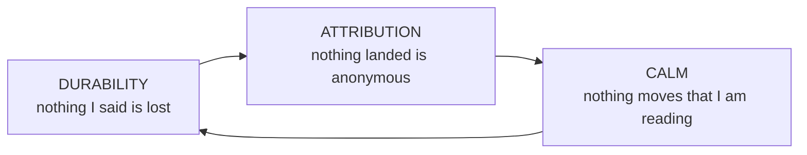

**Durability** turns *"I told it to"* from a memory exercise into a fact the
system holds. **Attribution** turns *"who did this and why"* from a reading
exercise into a query. **Calm** turns six live streams into something one pair
of eyes can actually track. Remove any one and the other two stop paying: an
un-attributed fleet can't be trusted, an un-durable one can't be steered, and a
jittering one caps throughput at the operator's ability to re-find their place.

Every model in this document serves exactly one of these three.

---

## Workflow invariants

The invariant register owns every cross-document label; the headings here carry
their own meaning.

### Steering is durable and retired only by acknowledgement

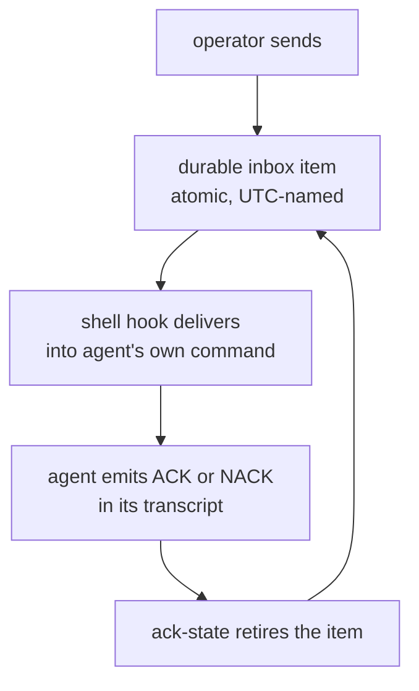

The item is written before it is delivered, and a *read* never retires it —
only a semantic acknowledgement in the transcript does. That single asymmetry is
what makes supervision auditable: "delivered" and "taken" are separate facts,
and the gap between them is visible as a pending count.

**Value:** you can walk away mid-instruction. **Without it:** steering becomes
fire-and-hope, and the operator becomes the durable store.

### Refusal is a first-class answer

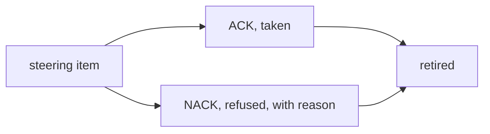

Both dispositions retire the item; only NACK records *refused*. Refusal is
advertised everywhere ACK is taught — inbox readouts, the worktree skill, the
UI — and renders warn-coloured but otherwise identical to an ACK.

**Value:** an agent that disagrees says so instead of complying badly. **Without
it:** the only cheap path is fake agreement, and the transcript stops being
evidence.

### Silence is not consent

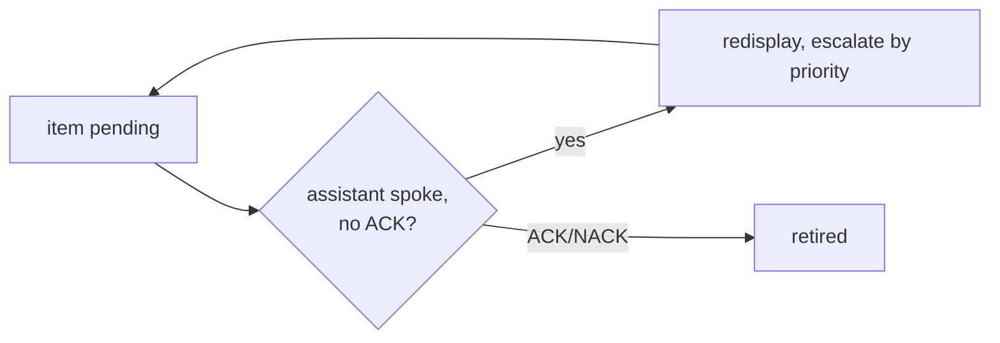

Unacknowledged steering re-surfaces on shell interaction and escalates after
repeated silent assistant messages, on a stable lineage key so a resend reads as
one thread of insistence rather than a pile of duplicates.

**Value:** the failure mode of a busy agent is *delay*, not *loss*.

### One actor, one claim, bounded

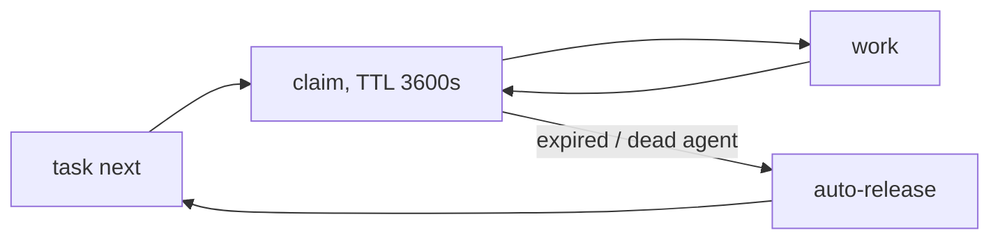

An actor holds at most one active claim; claims expire and are reclaimed, so a
dead agent parks nothing permanently. Claim context links cover the surrounding
300 seconds, which is what lets a claim be reconstructed from the transcript.

**Value:** six agents on one board never collide, and the board self-heals from
crashes without an operator sweep.

### The phase ladder, and who may advance it

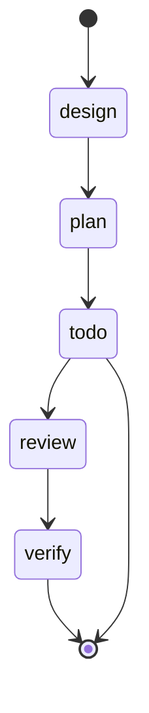

The approved phases are a **set** of names — `design`, `plan`, `todo`, `review`,
and `verify` — not a ladder. Order belongs to a task's *flow*, and the phase model
draws one flow rather than a fixed progression: the public default flow is
`todo` to `review`, and private work defaults to `todo` alone.
Each phase advance is its own landing, so a task's history is a sequence of
merges rather than a mutable row.

**Review coverage is universal, and history hides it.** A review that finds
nothing advances the phase without producing a commit, so it lands no merge and
leaves no trace in a first-parent walk. The channel is readable from the project
stem: the private channel is keyed by agent, everything else is public and
carries review.

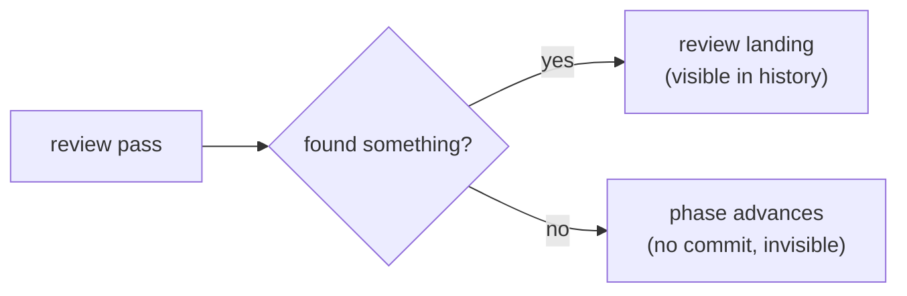

What history measures is therefore the review **change** rate, not review
coverage. Counting merges understates the work by every clean review.

### Cross-review is preferred, never required

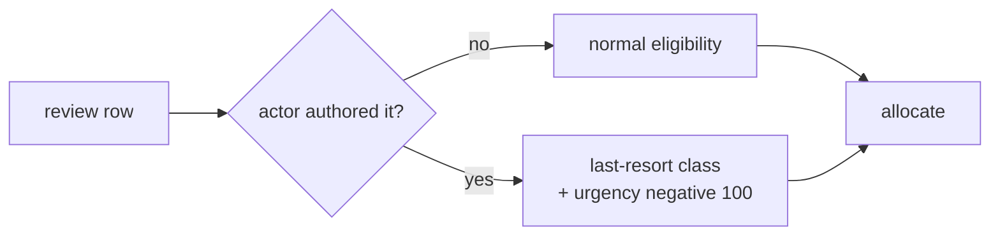

This is a **soft** guarantee with a hard tiebreak, not a refusal. Self-authored
reviews sort into a last-resort eligibility class and carry a negative 100 urgency
coefficient, so any other eligible reviewer wins — but a solo agent is never
deadlocked by having no peer.

**Value:** the fleet gets independent review whenever it *can*, and degrades to
progress rather than stalling when it can't. This is the sharpest example of the
system's general posture: prefer the good property, never let it stop the work.

### Work lands as one attested merge

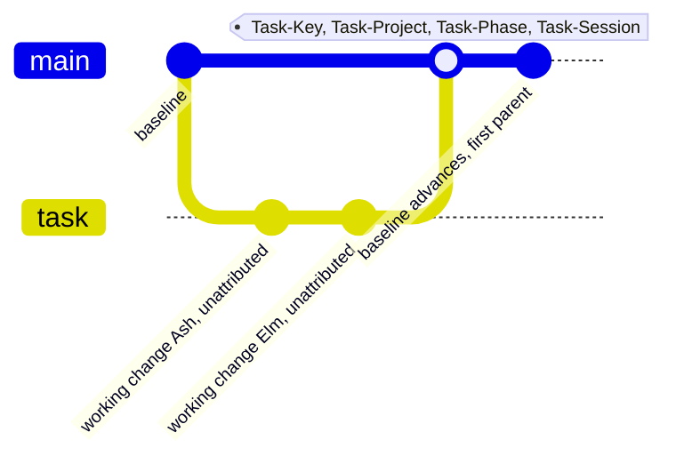

Git integration happens only at task boundaries. The merge is computed before the
checked-out repo is mutated, so the visible terminal state is either the
untouched pre-merge tree or a recoverable merge — never stranded conflict
markers. The trailers ride the merge, not the working commits.

**Value:** `--first-parent` *is* the ledger. Every landed unit of work carries
its task, project, phase, and the agent session that did it — which is what
makes release notes, the effort ledger, and fleet forensics queries instead of
archaeology.

### Every task says where it came from

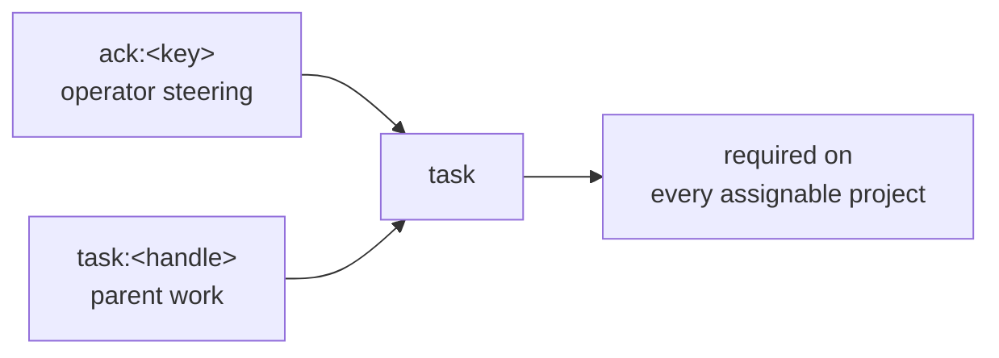

Origin is a required field with two realms, and the requirement reaches every
channel a task can be filed on. Only infallible system surfaces are exempt.

**Value:** you can always answer *"why does this task exist?"* without reading a
transcript. In a fleet that files its own follow-ups, this is the difference
between a board and a landfill.

### The lane outlives the agent

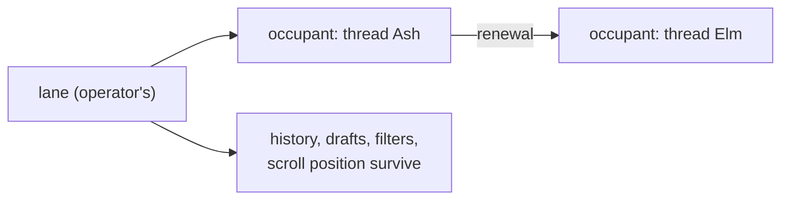

A lane is an operator-owned container over a worktree; the agent is a tenant.
Renewal is ordinary steering, not a forced termination, and hands the lane to a
new thread while the message stream stays readable.

**Value:** agents become *disposable*. If the agent were the lane, every renewal
would cost the operator their context, and the rational move would be to hoard
long-lived agents — exactly the thing that makes context rot.

### The taste rules revise themselves

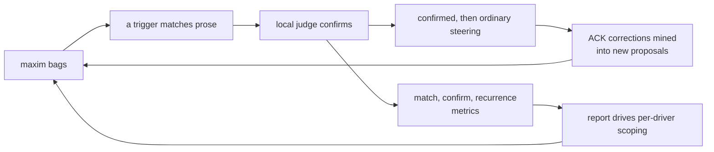

Two loops close here. Maxim *effectiveness* is measured per bag per driver and
that report is what decides which bags apply to whom; separately, recurring ACK
corrections are clustered into proposed new maxims filed on a hidden board.

**Value:** taste arrives early — while the agent is still speaking, not at
review — and the taste set is evidence-driven rather than accumulated by
opinion. **Without it:** a maxim list only ever grows, and false positives
quietly train agents to ignore it.

### An agent's past is derived, never assumed

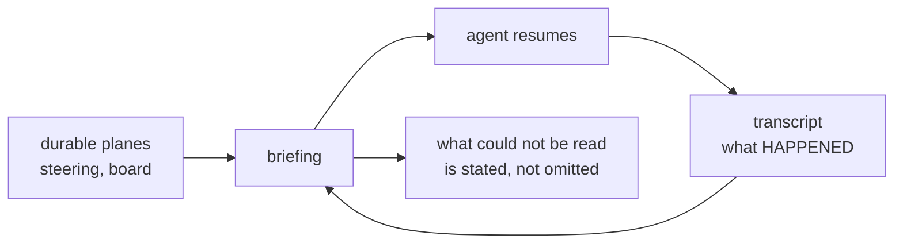

Context is finite and history is not, so everything an agent knows about its own
past after a compaction is reconstructed. The reconstruction reads intent from
the durable planes and evidence from the transcript, and never lets one stand in
for the other — a transcript is authoritative about what happened and about
nothing that is wanted.

**Value:** an agent resumes instead of restarting, and renewal costs nothing,
which is what makes disposable agents affordable in practice. **Without it:** the agent's own
restatement of a directive becomes the directive, and every compaction is a
small game of telephone with the operator.

### Nothing irreversible happens without a plan the operator read

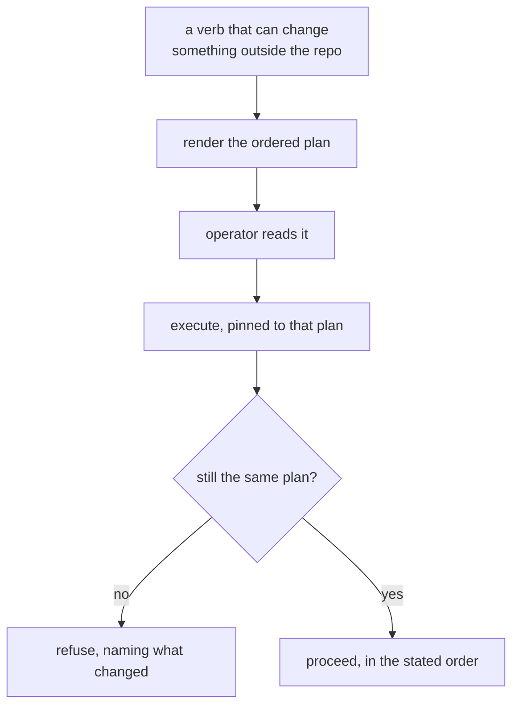

Publishing a package, pushing a tag, and writing into someone else's repository
are the only things the system does that it cannot take back. *Moving* a tag is
not on the list because the system refuses to do it at all ([A version names
exactly one commit](invariants/distribution.md#distribution-a-version-names-exactly-one-commit)) — a
published version names one commit forever. Each is expressed
as a plan first: resolved by observation, rendered in full, and executed only
against the plan that was actually read.

This is the durable-steering guarantee pointed at decisions rather than
instructions: the operator's
approval is made durable and binding in exactly the way their steering is.

**Value:** approval covers a specific set of operations rather than an
intention, so the gap between reading and authorizing carries no risk.
**Without it:** consent is given for a summary while something else runs, and
the discovery happens after the one step that cannot be undone.

---

## UI components

### The lane

One column per worktree, and every row of it answers a question the operator
would otherwise have to go and ask.

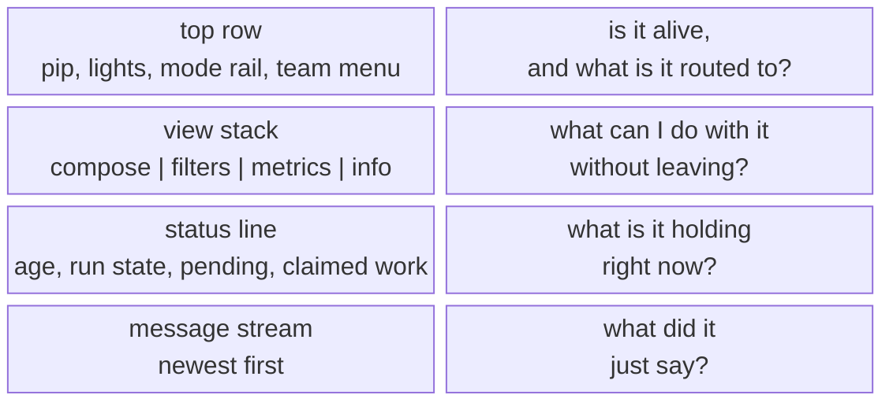

The whole strip is scannable top to bottom in about a second, and the order is
deliberate: liveness before routing, routing before state, state before words.
An operator sweeping six lanes reads the first two rows of each and stops at
whichever one needs attention.

**Why it's the right unit:** it maps 1:1 to a worktree, which is the only unit
git and the filesystem agree on. Lanes tile, and tiling is what makes six agents
a *board* rather than six tabs.

### Lane, team, occupant

Three objects that are easy to conflate and expensive to conflate. The thing
that separates them is not what they contain — it is **how long each one
lives**.

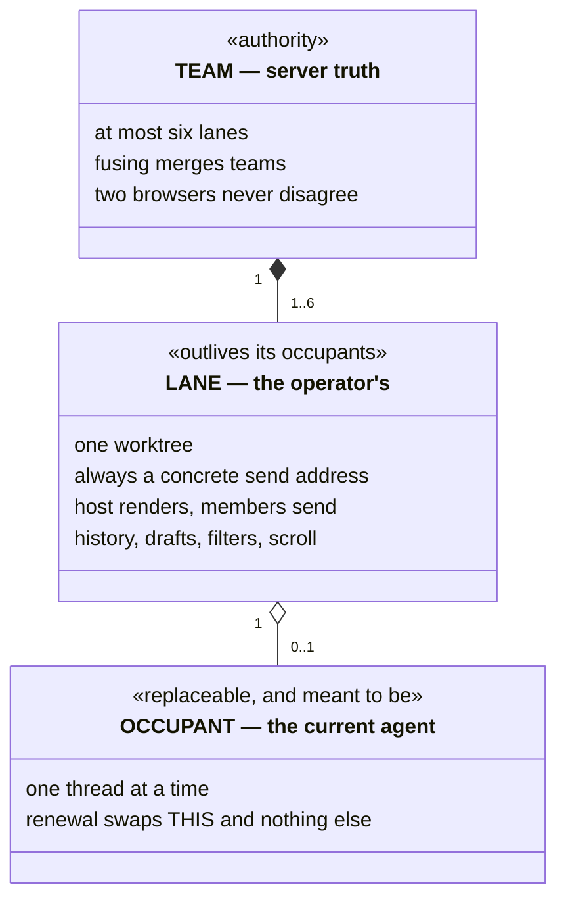

Read the two relationships as lifetimes. A lane belongs to exactly one team
throughout its lifetime, so the team is the unit that closes. An occupant is held
loosely and may be absent entirely — that absence is precisely what a stopped
lane is, and why a stopped lane is still a lane. A fused host renders one merged
newest-first stream while every member stays its own concrete send address.

**Value:** the operator manipulates topology directly — drag a lane onto
another's edge to fuse — and the server is always the authority, so two browsers
never disagree. Because the occupant is the only replaceable part, replacing it
is cheap enough to do casually, which is the entire point of the separation.

### Closed loop: The fused composer

A team presents as one control surface: a **stack of shards**, one per member,
in member order. It is a band the operator reads down, not a set of tabs they
switch between.

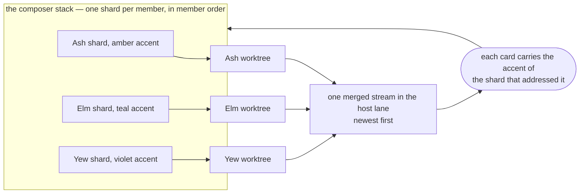

The loop is the point. **One ordering does three jobs**: it lays out the shards,
it assigns the accents, and it attributes the cards coming back — so a colour
seen in the stream resolves to a position in the stack without a label, a
lookup, or a hover. Drag a shard to reorder within the team; drag it out to move
that agent to another. A member that momentarily fails to resolve keeps its
seat rather than being dropped from the stack.

**Value:** addressing three agents is one surface instead of three, and nothing
is broadcast — every message still goes to exactly one worktree, through that
member's own concrete address. The merged stream is a reading convenience laid
over unchanged addressing, never a shared mailbox.

**Without it:** a team is either three separate surfaces the operator switches
between, or one surface that broadcasts. The first does not scale past a couple
of agents; the second makes every message everyone's problem.

### The autonomy dial

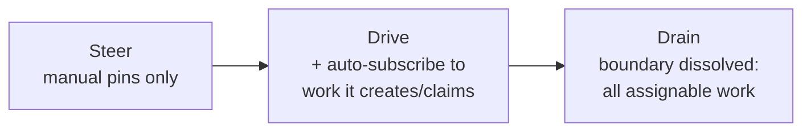

Three values, no more. It is a **server-side lens**: the client renders the
effective filter set as the allocator resolved it and never re-derives the
policy. The same control labels the submit button, so you cannot send without
seeing the autonomy you are sending under.

**Value:** this is the product's most important control — the knob between "I
approve each thing" and "go find work". Making it a server lens means the UI
physically cannot lie about how autonomous an agent currently is.

### The mode rail and the shared pane

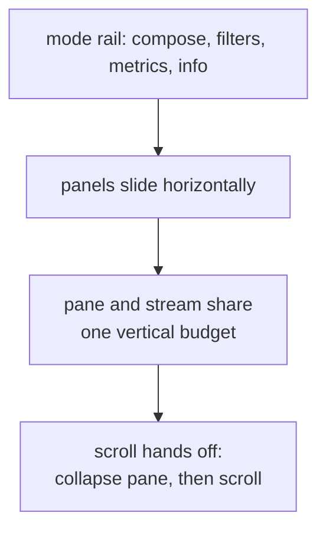

Four views per lane on a horizontal rail, and the pane trades vertical space
with the message stream through a single continuous scroll gesture — scroll down
and the composer collapses before the stream starts moving.

**Value:** a lane is narrow by construction (six across a monitor). Sharing one
budget instead of nesting scrollbars is what keeps it usable at that width, and
it is why the same layout survives a phone viewport.

### The reading contract

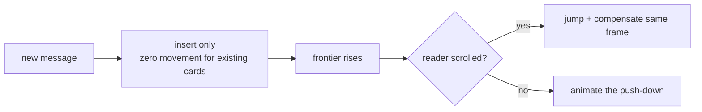

Newest-first masonry where a card that did not change gets **no style write at
all**. New content places by insert, never by repacking; a scrolled reader is
compensated in the same frame so the shift is invisible; a reader at the top
sees the push-down because there it is the signal.

**Value:** this is what "calm" actually costs, and it is the most exacting
requirement in the product. Reading six live agents at once is impossible if the
board reflows, so every reading-contract rule is load-bearing on its own.

### One saturation language

```mermaid
flowchart LR
  P["status pip<br/>per agent liveness"] --> L["saturation = recency"]
  G["lane lights<br/>per member in a team"] --> L
  F["filter pills<br/>per board stem"] --> V["saturation = agent coverage"]
  V --> T["idle, dormant, assigned, active, saturated"]
```

Colour means one thing everywhere: **saturation is engagement**. On a pip it
decays with silence; on a stem pill it encodes whether an agent is actually
covering that work, layered with whether the work is moving. Idle is the
deliberate neutral endpoint — it alone means *handleable work is waiting for an
agent*.

**Value:** the operator learns one visual rule and reads three different surfaces
with it. The pill triple (`ready, in-flight, and unavailable`) has a fixed footprint so
counts moving between slots never jitter the strip.

### Steering rendered inside the reply

```mermaid
flowchart TD
  A["assistant message"] --> Q["ACK quote block<br/>(what was asked)"]
  Q --> B["the response to it"]
  B --> NextQuote["next ACK quote"]
  NextQuote --> NextResponse["its response"]
```

Messages lay out in the agent's own order: leading prose, then each
acknowledgement as its steering quote followed by that ACK's response. A refusal
takes the warn accent through the identical path.

**Value:** you never have to hold "what did I ask?" in your head while reading
the answer. In a fleet where you sent that instruction twenty minutes and four
lanes ago, this is the difference between reading and re-deriving.

### Three attention channels

```mermaid
flowchart LR
  E["EYE, the board<br/>pips, pills, mosaic"] --> OP["operator"]
  A["EAR, speech<br/>quiet | speak | narrate"] --> OP
  G["GLANCE, badges<br/>pending counts, mode rail"] --> OP
```

Deliberately three, with different bandwidth. Speech speaks *edges* — explicit
ACK utterances win; narration reads first and last paragraphs; nothing older
than the moment you opened the lane ever auto-plays.

**Value:** the ear is the only channel that works while you are looking
somewhere else, which is what lets one operator hold more lanes than they can
watch. It is best-effort by contract — audio never blocks the stream, because
the transcript remains the record.

---

## Why it composes

Each guarantee is cheap alone and compounding together.

```mermaid
flowchart LR
  DurableSteering["durable steering"] --> WalkAway["walk away mid-instruction"]
  Claims["claims + TTL"] --> AddAgent["add an agent without a conversation"]
  AttestedMerges["attested merges"] --> TrustOutput["trust output without reading it"]
  DisposableAgents["disposable agents"] --> Renew["renew instead of hoarding context"]
  DerivedMemory["derived memory"] --> Renew
  CalmBoard["calm board"] --> WatchFleet["watch six at once"]
  WalkAway --> S["supervision scales past<br/>what one person can read"]
  AddAgent --> S
  TrustOutput --> S
  Renew --> S
  WatchFleet --> S
```

The result of that composition is a supervision rate one person cannot reach by
reading: many tasks a day, each reviewed by a second actor, across a fleet whose
size the operator never manages directly.

---

## The posture

One disposition recurs everywhere, and it is the easiest thing to lose.

Cross-review is preferred but never required. The launch-time advance is
attempted but never raises. Command rewriting helps when it can and falls
through when it cannot. Adjudication sharpens the counsel when a judge is
present and is skipped when one is not.

Each of these is a good property the system reaches for and declines to depend
on. The natural implementation of every one of them is a hard rule — "no agent
reviews its own work", "refuse to start on a stale tree", "require the
optimizer" — and each hard version deadlocks something. A solo agent cannot
review. A lane with an unreachable remote cannot start. An installation without
the optional companion cannot run a command.

**Prefer the good property; never let it stop the work.** Where that reads as
laxity, it is the opposite: it is what lets the strict properties elsewhere —
durability, exclusivity, atomic landing — be strict without ever stranding
anyone.
